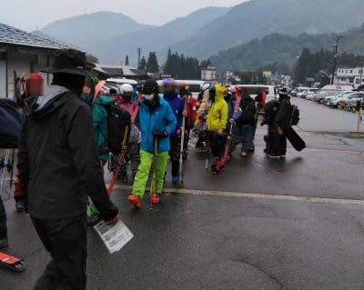
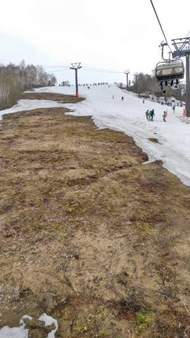
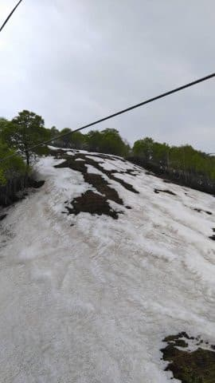
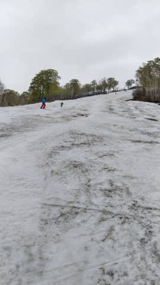
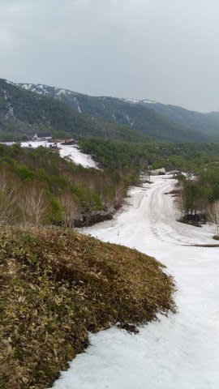

# 5月21日（土）のかぐらスキー場，特派員のゲレンデ・積雪情報！…そして私は明日ファイナルかぐらへ行く予定

📅 投稿日時: 2022-05-21 21:49:08

ってなことで．

今日もスキーに行ってないSkier_Sなのですが…

本日21日土曜日のかぐらから，特派員情報が

送られてきました～！

今日は朝から雨だったのもあり，先週に比べると

混まなかったようです…！

朝イチ，7:30のロープウェー営業開始10分前で

このくらいしか待ってないので，先週とは

えらい違いですね…

メインバーンは雪が減ったものの…

先週と比べ，そこまでひどく減ってないかな．

午後3時頃でもこの程度で，多少凸凹

しているもののひどく土が出てる気配は

ないし．

5月20日過ぎとしてはコンディションいい

ですね～！！

ただ，テクニカル下半分はもう終わったようです．

上半分は，まだ何とか滑れるようですが…

そして，ジャイアントもクローズになった

ようです…

まだ雪があるように見えますが，残念…

今日は朝10時ごろにクワッドが2分程度の

待ちになったのがピーク．

それほど待ちが無かったようで．

クワッドの列も見えませんし，ゲレンデも

そんなに混んでない感じですね…

天気は，朝は雨がぽつぽつ降ったものの

お昼前に止んで，またその後ぽつぽつと，

そして3時過ぎにちょっと強くなったという

ことで．

一日ずっと降りっぱなしじゃなく，それほど

雨も強くなかったらしく．

リフトも空いてみたいだし，雨で板の滑りも

悪くないし．

意外といい一日だったみたいですね…

あぁ…

今日，娘の行事が無ければ滑りに行きたかった…

でも，どちらにしろ土日どっちかは家で

宿題やらなきゃならなかったから，

仕方ないかな．

明日のかぐらは昨日までの予想通り，

朝は雨が残りそうだけど，昼前には

止んで，あとは曇り空．

午後は日も射すかも…

って天気でしょうか．

明日はファイナルかぐらに行く予定！！

## 💬 コメント一覧

### 💬 コメント by (アツシ)
**タイトル**: Unknown
**投稿日**: 2022-05-23 00:00:50

いよいよ21-22シーズンも終わりに近づいてきた感じですね(ほとんどの人は既に終わってますが)。最後まで怪我なく楽しくお過ごしください。

さて、私もSさまのマネをして時計はAmazfit Paceを愛用しておりますが、最近、電池の減りが早くなってきたようです。Sさまの方はどうですか？

### 💬 コメント by (Skier_S)
**タイトル**: ＞アツシさま
**投稿日**: 2022-05-24 01:43:05

コメント回答遅れました…すみません．

大変寂しいことに，シーズンももう終盤です…

私のAmazfit Pace君，基本的にスキーやるときと登山する時にしか使ってないので，

幸い電池もちは悪化してないです．

Amazfit GTR君は毎日使ってますが，そもそも2週間に1回，月に2回ほどしか充電しないので，

こちらもそれほど電池もちが悪くなった感じは無いです…

リチウムイオン電池の特性として，満充電にすると劣化が進むので

100%充電はせず，80~90％で充電を止めているのも効いてるかも…？？

