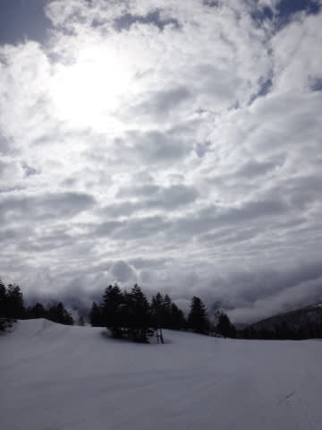

# 4月4日の志賀高原は…雲が多かったものの晴天…でも，暑いよ

📅 投稿日時: 2015-04-04 20:40:33

🏷️ カテゴリ: [2015スキー滑走日記](c09ea645cfc085f86dfcd80f49599dd89.md)

えー．

本日も，いつもどおり志賀高原に来ていますが，

どうやら．

私はいろいろ終わった人間だったらしく←みんな知ってるって

なぜか，今朝(というか，深夜？）2時過ぎに家を出て．

早朝スキーに来ちゃっている自分に気がつきました…

気のせいでなければ，今日もほとんど寝ていない気がするのだが！？？

って感じで．

まずは曇り空で始まった，早朝営業なんですが…

しかし，

朝6時半というのに…

なんだ？？？これは？？？

気温プラス8度って…

GWよりもずっと気温が高いんですけど…っ！（涙）

とても4月第1週の焼額山頂の気温と思えないんですが…（泣）

とりあえず．

早朝開始時の雪はシマシマだったけど…

当然，気温が高いということは．

…かなり残念なことに．

早朝営業開始時には，すでにもう，やわらかい

ズブズブした感じの雪になっています…（悲）．

でも．

まぁ．

やわらかくても，ほとんど人が滑っていない早朝は，

そこそこ気持ちよくはありますな．

って感じで．

早朝を滑っていると．

雲がだんだん切れ始め…

そして，通常営業開始のころには，すっきりと晴れあがりました！

ってことで，通常営業開始と同時に，ピーカンの

ジャイアントスラロームコースへ飛び込みっ！

まだシュプールが1本もついてない，一番乗りっ！

晴天の，誰も跡をつけてない，まっさらのシマシマバーンを

滑る快感！

自分のシュプールしかついてないよ～！！

…雪はズブズブにやわらかいけど…（ぼそ）

そして，朝は9時半ごろまで，ゲレンデの人も少なく．

いや，雪はやわらかいけど，暖かいし．

天気もいいし．

結構気持ちいいねぇ…

と，喜んでいたのもつかの間．

ああ．やっぱり…

…10時には，

雪が完全に緩んじゃいました…

ゲレンデの人はそれほど多くなく，ゴンドラ待ちも

なかったのですが．

人が少なくても，雪がやわらかすぎるので．

ゲレンデは見る見る荒れていきます…（涙）

うーむ．

雪がざぶざぶに荒れてくると．

この日差しが憎らしい…

昼間の気温は，予想通りプラス10度を越えてきてます…

山麓の温度は，リフトストップになっても14度くらいを指していて．

…もう，暑いってレベル（涙）

この暑さのおかげで．

雪は…

しっとりとしたザラメ状．

ゲレンデも，見る見る荒れていく…（激涙）

でも．

人が割りと少なめだったし．

（ほとんど人がいない…）

雪も，溶け溶けザラメとはいえ．

汚れがすごく浮いているとか，

水溜りみたいになっているとか．

ストップスノーになっているとかいうわけではないので．

まぁ，

天気が良い4月の春スキーと考えれば，

何とか納得できるレベルかな…

って感じで．

夕方になってもまったく気温が冷える気配はなく．

雪はしっとりとしたままだったけど…

予想を上回る，しっかり気持ちよい天気が4時ごろまで続き．

（ゲレンデは結構ボコボコですが…）

夕方にまた雲が増え始め，太陽が隠れ始めたものの．

すごい気温が上がって，どうしようもなく雨が

降り続けるかも…

と，水曜の予想時に危惧していた状況に比べれば．

太陽の下滑れて，良かった…

と，胸をなでおろしたSkier_Sなのだった…

PS．でも．明日日曜は朝から雨になりそうなんですが…（激烈涙）
