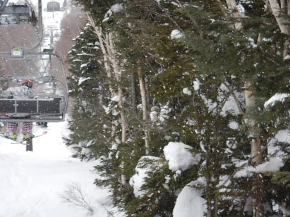
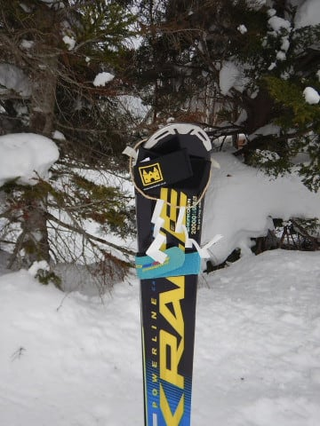
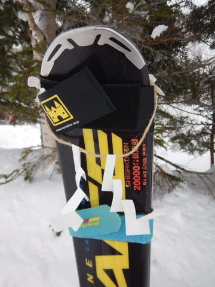

# 2019/2/3(日)の志賀高原の状況，速報モード…朝は晴天！最高のコンディションながら，昼からは曇り空．夕方は雪

📅 投稿日時: 2019-02-04 02:01:43

🏷️ カテゴリ: [2019スキー滑走日記](c3e4496fc0fb7f9c17ff21214a35b1ace.md)

えー．

本日も．

言うまでもなく営業終了まで滑り．

さらに帰り道に渋滞に巻き込まれ．

帰宅は日付が変わってからでした…（涙）

ってなことで．

今日の志賀高原の状況ですが．

日曜深夜定番の，速報モードにて…

えー．

まず．

朝は予想通り，すっきり晴天でスタート！

そして．

焼額のゲレンデは．

今シーズン最高の，これ以上の官能が

この世にあるのかと思わせる，

超快楽シマシマバーン！！！

神様，ありがとう～！！！

天気は最高，雪も最高．

そして，人も少ないとあれば…

もう，これは．

今シーズン最高の一日ではなかろうか！？？

昼間，気温は予想通りプラスにまで上がったけど．

雪は日差しが当たる部分で，ちょっとダマっぽく

なった程度で，基本的には終日いいバーンコンディションを

キープ！

…だけど．

昼から雲が増えだして…

あうーーーん．

午後1時ごろには，完全曇り空（涙）

なぜ…

なぜ，最高の天気が一日もってくれないのか…（泣）．

そして．

夕方，リフトストップ直前は，雪がぱらついてきました…

まぁ，雨じゃないだけ良かったかな，

と思ってましたが．

車で下山中は，結構な雨になってました（涙）

うーん．

滑っている間に雨にならなくて良かった…

…そして，日曜深夜の1:30現在．

志賀高原の蓮池の気温が…

なぬ！7.8℃！！！！？？？？

…そして．

雨が降ってるようです（泣）

ダメだ．

これだけ気温が高いと，スキー場山頂でも…

降っているのは，液体ですね…（激涙）

気温のピークは明日の朝9時ごろまで．

それまでは，雨が降り．

明日の朝9時過ぎに気温が下がり出し，

雪になるのかと思ってますが．

…でも．

また，2月6日の水曜に…

何だこりゃ？

また，0℃線が志賀より北に上がっちゃうの？

そして，この日は降水がありそうなので…

運が悪ければ，また雨です（泣）

なんてこった…

今週，2回も雨に祟られるなんて…

確か，長期予想では2月は冷えるはずだけど？？

と，

最新の一か月予想を見てみると．

…なに！？？

2月，まるまる一か月，平年気温より高い

予想に変わってるんですけど…っ！？？

いや，[1月25日の予想](e0b8d98d13ea0fb59a7ec6f5e558bfe56.md)では．

2月はこんな感じで，赤矢印で示した

2日から15日ごろまで，平年より冷える

予想だったじゃないですか！

…なぜだ．

なぜだか分からないけど…

何か呪われている．

冷え冷えの2月予想で安心させておいて．

知らぬ間に高温の予想に変わってるなんて…

一体だれの陰謀だ？？？（激涙）．

これは．

お祓いをせねばなるまい…

…

…と，思っていた本日．

帰り際に，いつも通り，ゴンドラ横に

立ててある板を回収するために

近づいてみると…

なぬ！？？

なぜか，私の板に注連縄が！？？

…誰かが，呪われている私のために，

災いを祓う注連縄をつけて行ってくれた

ようです…

一体，誰が取り付けていったのか…

とりあえず，私の呪いを祓うために

着けて行ってくれたと，自分に都合のいいように

解釈していますが．

私の板をご神体か何かと勘違いして．

私の板を祀り，拝んで行ったのであれば．

それは，大いなる間違いだと指摘しておきたい，

Skier_Sなのだった…

## 💬 コメント一覧

### 💬 コメント by (Goku)
**タイトル**: もはや…神
**投稿日**: 2019-02-04 09:02:52

昨日はお疲れ様でした～✨

それにしても、板のアレはすごすぎですね‼

いっそのこと、古い使わなくなった板で鳥居を作って、Sさんに会えなかった方は、そこで参拝してもらうってのはどうでしょう。

### 💬 コメント by (michi)
**タイトル**: Unknown
**投稿日**: 2019-02-04 10:26:40

土曜日はありがとうございました😊

昨日も良い天気で羨ましかったです。

麓にも皆さんの「最高❗️」の声が聞こえてきましたよ（笑）

しかし注連縄とはまた新たな伝説が（爆）

一瞬、Sさんの自作自演❓かと思いましたがどうやらそうではなさそうですね。凄すぎです…

### 💬 コメント by (若杉勲71)
**タイトル**: 心おきなくお仕事を
**投稿日**: 2019-02-04 12:02:55

予報通り朝のヤケビは大雨。5時に登った人によると、大雨で道路が川になっていたとか。

朝一番はオリンピック二本。視界不良のうえアラレが顔に当たって痛い。でも、久々のアイスバーンを体験できて満足。GSは荒れてカチカチ山で最悪。白樺は視界不良でも安全なので、スピードをいかに落として滑るかを争いました。カラ松はパリンパリンだけど平ら。

昼になってようやく晴れ間が出てきたので、なんとかレインボーまで気持ちが持ちそうです。土日が良かっただけに今日はおとなしく仕事をするのが正解の日です。あのしめ縄の効果ですよ。心置きなく仕事してください。

### 💬 コメント by (はっち)
**タイトル**: 2日間お疲れ様でした。
**投稿日**: 2019-02-04 19:47:43

とは言え、土曜はお会いできず(妻とは挨拶して頂いたようですが)、日曜は最初と最後にまともな挨拶もできず、すみませんでした。

ヤケビや奥志賀のFBでは朝まで雨とありましたが、滑っている間は水滴でなくてよかったということにしましょう。　（注連縄のご利益？！）

### 💬 コメント by (komu)
**タイトル**: 注連縄！！
**投稿日**: 2019-02-04 20:31:33

（笑）（笑）（笑）

このセンス、大好きです。

### 💬 コメント by (しんちゃん)
**タイトル**: 神様
**投稿日**: 2019-02-04 23:43:47

人から神様になったのは、徳川家康公か、Ｓ様ぐらいでは(笑)

これでヤケビに来ない日に雪が降り、登場する日は一日中晴天・冷え冷えとなったりして。

### 💬 コメント by (もりや)
**タイトル**: Unknown
**投稿日**: 2019-02-05 00:55:53

熊の湯へ息子のバッチテスト1級を受験しに行きましたが、横滑りが減点で、ダメでした！今週末からヤケビへ戻りますので、また、宜しくお願いします！

### 💬 コメント by (Skier_S)
**タイトル**: 志賀は全山アイスバーン祭り（涙）
**投稿日**: 2019-02-05 01:56:37

＞Gokuさま

あの注連縄，これから板を置いておく時に

いつもかけておこうかと思ってしまいました…

板で鳥居を作るより，賽銭箱を置いておきたいです(笑)．

＞michiさま

土曜はお世話になりました～！

日曜の朝は最高でしたよ！

また朝＆夕方に，集団爆走してしまいました．

注連縄は，見つけてびっくりのサプライズでした．

こういうことをするセンス，大好きです…

＞若杉さま

あら…

やっぱりアイスバーンですか（涙）

崩れたのが日曜夜からで，土日はいいコンディションで

滑れたのはラッキーでした．

今週末までに，バーンコンディション回復してくれると

いいんですが…

…もしかするとあの注連縄，若杉さんがつけてくれたんですか？？

＞はっちさま

何回かお見かけしていたのですが．

どうやら，ニューウェアなので，私と認識してもらえなかった

らしく…

でも，この週末，ギリギリ天気がもってくれて，

よかったですね！

注連縄のご利益かも…

＞komuさま

私も大好きです．このセンス…

いやーーー．

見つけた時は，

「こんな面白いことする人，誰だろう？？？」

と，感動しました．

＞しんちゃんさま

日曜も，注連縄効果でリフト営業終了まで天気がもったのだったら．

これから焼額で板を立てておく時に，毎回あの注連縄を

つけて置いておこうか…

と思っちゃいました(笑)．

＞もりやさま

あらーー．

横滑りで落ちましたか…

でも，大回り，小回り，不整地が合格点って，すごいですね…

また今シーズン中にリベンジでしょうか．

今週末，また焼額でお会いしましょう！

