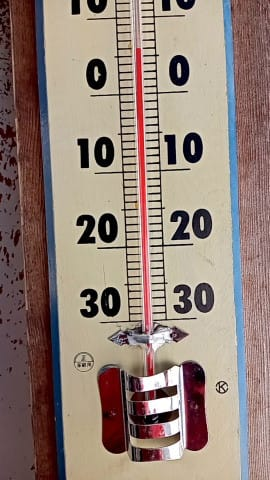
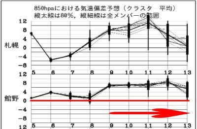

# 今日も朝に更新…

📅 投稿日時: 2022-04-06 08:36:45

なんというか．

昨日も夜中12時過ぎに在宅の仕事が終わった後，

倒れたように寝てしまい．

起きたら朝でした…

久しぶりに7時間以上布団で寝た気がする…

ってなことで．

今日も朝更新ですが．

特派員情報によれば，昨日の志賀高原．

朝から気温は高く…

さらに強い日差しで，朝から雪は

ザブザブだったようです…（涙）

うーん．

7日にはちょっとだけ冷えて，

雪もぱらつきそうですが…

気温はプラスだし，かなり湿った

雪で．

それ以降は気温が高くて晴れる日が

続きそう…

なんてったって．

1週間の850hpa予想気温をみると…

うぎゃーーー！！

なんだこりゃ！！！

4月9日以降，閉ね日+6℃～+8℃の日が

5日以上続きそうです…（激涙）

あぁ…1，2月はそんなに冷えなくていいから．

4月にひえてほしかった…

すみません．コメント回答はまた後程！
