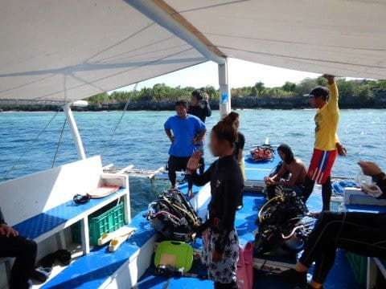

# 2019年8月，4度目のモアルボアル・小6の娘Cカード取得1周年！その11…今日の1本目はまったりダイビング

📅 投稿日時: 2020-08-08 01:04:13

えー．

アクセス数の推移を見てみると．

このスキーヤーBlogに求めらている

ネタは，車ネタだ

ということが分かりつつある今日この頃．

皆様におかれましてはご健勝のことと

お慶び申し上げます←この出だし，数日前に見た気が…

いや．

しかし．

車試乗ネタは，やっぱり宇宙ネタや

ダイビングネタより人気がありますね…

でも．何度も何度も何度も繰り返しますが．

このBlog．

スキーヤーBlogなんですけど…（涙）

ってなことで．

今日もダイビング日記です！←いつもの矛盾

---

という感じで．

出航から20分弱で，ボートは本日1本目の

ポイント，「トブレサンクチュアリ」

に到着！

到着後，ガイドのアイさんによる

ダイビング前のブリーフィングが

始まりますが…

今日も，12歳未満の娘の最大深度12m

制限を考慮して，我が家3人で浅めコースの

1チームとしてくれました！

でも，今日のわがチームのガイド．

昨日ガイドしてくれたアサミさん

ではなく，店長の小見山さんが

ガイドですか…！

このショップで，昨年娘に講習してくれた

アサミさん以外が娘をガイドするのは

初めてですね…

ということで．

1本目のダイビングの準備をして．

いざ，エントリー！

先頭を行くガイドの小見山さんに続いて，

ドロップオフ沿いを，深度を落として

行きますが…

ぺスカドール島ほどではないとはいえ，

昨日の1本目同様，ハナダイ・ハナゴイ系が

群れていて，いい感じ…！

で．

ガイドの小見山さんが最初に見せてくれたのは…

この赤色のヤギ．

何がいるか分かりますか？

カメラで寄ってみると…

ちっちゃいピグミーシーホースが着いてます！

…向こうをむいちゃってしまっており，

顔が拝めないのが残念ですが…

ちなみに，前の写真を見返してみると，

ここに写ってます（笑）．

ピグミーシーホースを見た後は，

またしばらくドロップオフ沿いを

流していきますが…

岩陰にミノカサゴのペアがいたり

昨日と同じように，アオウミガメさんが

くつろいだりしています…

…しかし．

ホントにここのウミガメ，ダイバーを

恐れないなぁ…

さらに流していくと…

今度は「スミツキアトヒキテンジクダイ」

…確かに，名前が長い…

さらに進んで行きますが…

今日は天気がよく，日が射すので

海の中もきれいです！

おっと．

また，何か見つけたのかな？

今回は，娘もカメラを持って

潜ってるんですけど．

岩の奥にいる何かを

撮ってますね…

…って，またウミガメさんですか…

でも，今度はアオウミガメじゃなく，

甲羅の後ろがギザギザになってる

タイマイさんですね！

今回，タイマイは初めてです…

さらに景色のいい中を流していきますが

目の前をパープルビューティーの群れが

通り過ぎていったり．

あぁ…癒される…

そんな中，イソギンチャクに着く

ハナビラクマノミがいましたが．

このイソギンチャク，ちょっと白化気味

ですね…

白い中のクマノミは，写真映えして

いいんですけど，気になります…

まさか，珊瑚の白化が始まったのか！？？

と，ちょっと心配．

まぁ，まわりの珊瑚や他のイソギンチャクは

白化してなかったので，この固体の問題かな？

ってなことで．

いい感じに癒されるダイビングも，

ダイブタイム45分で，そろそろ終了時間．

ボートの下でしばしの遊びを兼ねた，

3分間の安全停止後にExit！

…最近，娘と付き合って最大深度12mの，

比較的浅めのダイビングが続いてますが．

浅いところの方が日がいっぱい射すので，

特にワイドでは，きれいな写真がたくさん

撮れて．

あぁ…私はShallow divingが好きなんだなぁ…と，

改めて気づかされてきたのでした…

## 💬 コメント一覧

### 💬 コメント by (マルハバ)
**タイトル**: アクセス数を考えたら・・
**投稿日**: 2020-08-08 07:44:36

ダイビングネタ

マクロだけはやめたほうがいいです

ますます遠のくんじゃ？（笑）

「わー！すごい！」「わー！キレイ！」

だけにしておいたほうが無難かと・・

### 💬 コメント by (Skier_S)
**タイトル**: ＞マルハバさま
**投稿日**: 2020-08-09 05:35:14

…私はマクロ写真が苦手なので，元々マクロ写真は恥ずかしくて

ほとんど載せてません（笑）．

今回のハナビラクマノミはギリギリセーフかな？

