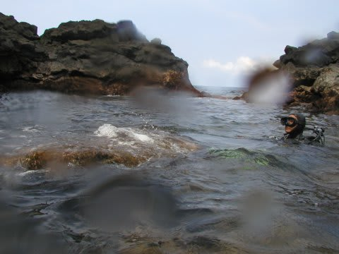

# 2007年8月　三宅島ドルフィンスイム＆ダイビング旅行記　その10

📅 投稿日時: 2013-09-22 01:04:53

なんだか．

3連休というのに．

普通だったら，3連休，確実にどこかに行っているのに．

…タイから帰ってきたばっかりで，仕事が溜まっており．

今日はどこにも行っておりません…(涙)．←海外から帰ってきたばっかりなのに，またどっかに行くつもりだったのか？

せっかくの3連休だから，どこか遠くにぱーっと行きたかった～っ！！←行ってきたばかりでしょ！（自己突っ込み)

ってことで．

三宅島レポート，ラストスパート！

---

さて．

1本目のボートダイブの後．

2本目のダイビングはビーチポイントです．

1本目の港から車で10分．

その名も「学校下」というところ．

＃今度はちゃんとDIVI「N」Gになっていて一安心

ポイントの名前の通り，目の前に学校が建っている海岸沿いで．

学校のすぐ下の岩場の浜からエントリーするんですが．

…でも，この学校，今は使われてないんです．

廃校です．

なぜかって？

…見てのとおり，溶岩で半分埋まっちゃってるから．

昭和58年に噴火した際，流れてきた溶岩で半分押しつぶされて，

そのまま撤去するにも撤去できず，廃墟となって残っている

という…．

実際に溶岩に埋まった校舎を見てみるとすごいインパクト．

校舎の海側はなんともなっておらず，きれいなままなのに，

その窓から見える校舎の中には，溶岩が流れ込んで固まってます．

体育館も海側の壁の外は比較的きれいなのに…

その壁の内側がダムのようになって溶岩をせき止めたらしく，マスに砂を

盛り上げたように，体育館の内側には溶岩があふれています．

金属製の屋根は溶けてしまって，完全に抜け落ちています．

……すごい．

噴火の時に逃げ遅れて，こんな溶岩が流れている現場に

残されたら，たまらないだろうなぁ…．

でも，これだけの噴火に関わらず．

普段からの警戒や準備が功を奏して．

昭和58年の噴火の時も，2000年の噴火のときも．

避難がうまく進み，住民の犠牲者を出すことが無かったそうです．

さて．気をとり直して，ダイビングへ向かいます．

溶岩が固まった，ゴロゴロした岩場を歩いていくので

非常に辛い…

大きなカメラを持ってエントリーは無理でしょうなぁ…．

とりあえず，何とかエントリー！

いざ，2本目へ！
