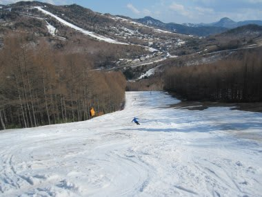

# 5月5日の志賀高原のゲレンデ状況はこんな感じ

📅 投稿日時: 2012-05-05 21:09:46

で．

今朝．

関西某所から，志賀高原へ舞い戻ってきました…

途中はところどころ雨が降っていましたが…

志賀高原に到着した9時ごろには青空が！

でも…

一の瀬の雪，さらに融けましたね～．

とはいえ，ファミリー下半分は昨日から雪だししたみたいで，

コース幅は狭くなったものの，なんとか最終日まで

コースは途切れなさそうな状況．

あー．

こんな状況ですので，ナイターと早朝は中止になりました(涙)

一の瀬正面バーン上半分は，ところどころ土が出てきたけど，

ぎりぎり明日まで持つでしょう．

パノラマコースは今日で終わりかな．

あ，天狗コースは明日まで十分持ちますね．

高天ヶ原は，NHKバーンはコンディションよさそうです．

NHKバーンだけなら，雪は十分．

…残念ながらNHKバーン以外は壊滅ですが．

あ，タンネの森も雪不足で一昨日で終了したので，

一の瀬～高天ヶ原の連絡路，行きも帰りもついに途切れて

両者は孤立ゲレンデとなりました．

うーん．あと3日だったのに…惜しい！

焼額は…

ゴンドラコースはしっかり雪だしされていて，雪が薄くなりそうな

ところはコース幅を狭めて雪を盛ってあるので，結構

大丈夫な感じです．

…あ，でもところどころ穴があいてます．

圧雪したての朝イチは問題ないですが，

昼過ぎからちょっと土が顔を出すところも…

第2高速沿いのコースは，真ん中に一箇所大きな穴が

あいてます…

まぁ，ぎりぎり明日まではそこそこ快適に滑れるでしょう．

という感じで．

今日一日は晴天でしたが．

気温は春スキーらしい暖かさがあったものの，

「暑い！」

というこれまでの数日間とは違って，いかにも春…

というのどかな気候．

おかげで，今日はそんなに雪が減らない一日でした．

…このGW,ずっとこんな天気だったら良かったのに…

とりあえず．

このGWでもっとも快適な天気の一日でした．

あー．

あしたでGWも終わり．

早いなぁ…
