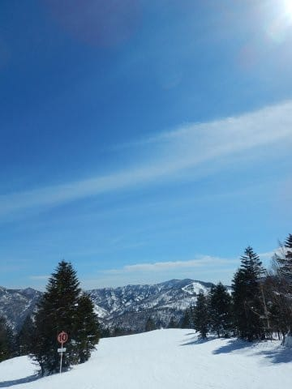

# なんと！初にして唯一の，女性の20000m突破者にお会いしましたよ！

📅 投稿日時: 2018-03-07 00:33:44

🏷️ カテゴリ: [スキー雑談](c1f9d2cb7478308da16419928ea3945e9.md)

えー．

Skilineが無くなってからも，引き続き

活動を続けている20000mクラブ．

20000mクラブの大御所たちは，昨シーズンまでに

比べると滑走量は減っているものの．

コンディションがいい時は，相変わらず一日の

滑走標高差20000mという．

終わった人素晴らしい人しか達成できない，

アホのような滑走量すさまじい滑走量を

達成しているようですね…

…20000mを超えても，何かが得られるわけでもなければ，

何の得にもならないわけですが．

はたして，一体何が彼らを突き動かしているん

でしょうか…？？

そういう私も．

2月24日の土曜日はコンディションが良かったので．

ナイター込みで20000mを超えていたようですね～…←人のこと言えないじゃないか！！

ってな感じの最近ですけど．

そうなんですよ．

ついこの間，志賀高原にて．

KonSukeさんから紹介いただいて．

なんと．

女性で初の，20000m突破者にお会いしました～！

いやーーー，すごいですね～…

現時点で初にして唯一の，女性の20000m突破者です！

…今後，2人目は出なさそうな気もしますが

いや，さすがに昼間だけで20000mは突破は難しかったらしく．

ナイター込みで20000m達成という，

私と同じパターンでの突破者なんですけど．

いや．

それでもすごい…

結構高頻度に志賀にいらっしゃってるようなのですけど，

高天ヶ原エリアをメインに滑っているとのことで．

焼額を居住地とする私と生息地が違うため，

今回初対面となったようなんですが．

しかし，

しばしお話させていただいたところ．

なんと．

　高天ヶ原の宿から一の瀬まで歩いて

　一の瀬ナイターを滑りに来ている

だとか．

　車がないので毎週スキーバスで往復してる

とか．

驚愕の発言が次々飛び出してきたのですが…

いや，

…高天ヶ原から一の瀬って，かなり遠いんですけど！？？？

歩くと15分以上かかるのでは…？？？

そこを歩いてナイターに行くんですか！？？

そして，ナイターが終わった夜中．

疲れ切ったあと，とぼとぼ宿まで15分以上

歩くのか…

ハンパないな…

そしてさらに．

毎回夜行バスで来るってことは．

金曜夜をまるまるバスで過ごして，

ゆっくり寝られないのに…

それで土曜ナイターまで滑ってるのかっ！！？？

おかしい…おかしいよっ！！←人のこと言えないでしょ

やはりお話を聞くと．

20000mを達成する人は，半端じゃないですね

おそらくもう少し話をすれば，もっといろいろ

すごい伝説が出てきそうな予感…

しかし．

この方に限らず，20000mな方々とお話ししていると．

自分がいかに普通の人間か

ということを，強く感じずにいられない，

Skier_Sだったのでした…

みんな，凄すぎ(笑)．

## 💬 コメント一覧

### 💬 コメント by (タカ)
**タイトル**: 普通とはこれいかに
**投稿日**: 2018-03-07 02:02:18

S様、ヤケビの状況最悪そうで心中お察し申し上げます。ただ言わせてください、10月～７月まで毎週滑る人間は普通じゃないので。立派なサイボーグだと思いますよ(笑)

### 💬 コメント by (Goku)
**タイトル**: スキー星人
**投稿日**: 2018-03-07 20:19:56

・志賀に来て、リフトが全滅なのでかぐらに瞬間移動した。

・海外出張から３０時間かけて帰国、そのままイエティーに行った。

・前日に月山で滑り、翌日は志賀で根曲がり竹狩り。

その他いろいろな伝説多数・・・

Ｓさんこそ、伝説のスキーヤーだと思うのは私だけではないはず（笑）

### 💬 コメント by (はっち)
**タイトル**: 2人目はきっと
**投稿日**: 2018-03-07 20:50:12

Sさんの娘さんと確信しています。

うちの嫁は技術も根性も無いので、無理でしょう(笑)

### 💬 コメント by (yasu)
**タイトル**: Unknown
**投稿日**: 2018-03-07 21:26:07

伝説だらけの皆様が登場するこのブログで、あくまでも普通のスキーヤーの私のことを取り上げて頂き、お恥ずかしい限りです…。

私はスキーバスに乗り込むと、志賀に着くまで意識を失ったように爆睡してしまうので、睡眠時間数時間で長距離を運転し、それから滑りまくるSさんの方がスゴイと思うのですが。

それにお昼はちゃんと板をはずして食べますし、ちょびっとのお昼寝もします。ほら、健全なレジャースキーヤーでしょ？？

そして、このブログの読者の方は全員確信していると思うのですが、お嬢様が金の御札を貼るのも時間の問題かと思います(^_^)

### 💬 コメント by (しんちゃん)
**タイトル**: 新造人間
**投稿日**: 2018-03-07 21:44:57

雨でもカッパを着て滑走していたり、

夜中に都会を出発し、ゴンドラ始発からナイターリフトストップまで滑走していたり、

残り15分、と言ってヤケビから一ノ瀬に瞬間移動していたり、

一日の休憩時間が、一般人よりはるかに短い伝説のスキーﾔｰＳさんは新造人間ではないかと思います。(笑)

他の金札の方の伝説に比べると、普通に見えてしまう点も多々ありますけどね(笑)

### 💬 コメント by (KENKEN)
**タイトル**: なんも言えねえ。
**投稿日**: 2018-03-07 22:52:50

皆さんSさんのこと分かり過ぎです。

女性二人目のゴールドステッカー達成者が娘さんなのも激しく同意です(笑)

### 💬 コメント by (べー)
**タイトル**: Unknown
**投稿日**: 2018-03-07 23:29:06

はじめまして。

昨シーズンから楽しく拝見しています。

このブログを見て昨シーズンからスキー復活しました(笑)

しかし皆さんの数々の伝説はスゴイなぁと(笑)

一度、生で伝説の皆さんの滑りを見てみたいなぁと思うのですが…１ゴン前の置き板だけ何回か見ました（汗

### 💬 コメント by (新潟のスキーヤー)
**タイトル**: Unknown
**投稿日**: 2018-03-07 23:45:37

私も皆さまのご意見に同感です！

始めてお会いした時に、ただならぬ殺気にも

似たようなオーラ感じましたよ！笑

### 💬 コメント by (Skier_S)
**タイトル**: 木曜午後から志賀高原も雨…
**投稿日**: 2018-03-08 02:15:23

＞タカさま

いや…10月から7月まで，毎週滑ってるわけじゃないですから．

10月から5月末までは毎週ですが，

6月に入ると毎週は滑ってないです…

と言ってみる（誤差だから）．

＞Gokuさま

うーむ．

関東から志賀高原日帰りを繰り返す某氏や，

ありえない移動距離を見せるくにーさんを見ると．

私は圧倒的に負けてますから…

彼らこそ伝説レベルです（笑）．

＞はっちさま

うちの娘も根性がないので無理かな～…

と思ってます．

ってか，20000m滑るってのは

やっぱりいろんな意味で終わった人なので（笑）

うちの娘はそこまで行かなくていいんだけど…

という願望なのかもしれませんが（^^；

＞yasuさま

勝手にネタにしてすみませんでした～！

いや．

でも．

話を聞かせていただいて，

「さすが20000m行くだけあって，いろんな伝説を築いている方だ…」

と思ったので．

決して普通の人ではありませんから…（笑）

しかし，私も昔は車を持っておらず，スキーバスを愛用していましたが．

あんまり寝れないんですよね…あの狭い椅子では．

熟睡できるとは，すごい…

そうそう，私もちゃんと板を脱いでお昼を食べることもありますし（家族スキーの時は）．

一応私も自称レジャースキーヤーです（笑）

＞しんちゃんさま

いや…

やっぱり，一の瀬ファミリーのクワッドリフト

一日で77本以上乗るとか，

奥志賀ゴンドラを48本乗るとか，

GW5連休で5日連続日帰りとか．

他の20000mな方々の伝説を聞いていると，

私なんてまだまだ普通です…

平凡です（笑）．

そうそう，おそらく20000mゴールドメンバーの

中では，私の滑走速度が最も遅いのじゃないかと

思ってますし．

…みんな速すぎ…

＞KENKENさま

うーむ．

うちの娘，ホントに20000m滑りたいらしくて，

困ってるんですけど…

でも，今のところ最高記録は12000mくらいなので，

まだまだかな～．

＞べーさま

初コメントありがとうございます～！

しょうもないBlogを読んでいただいているようで，

有り難い限りです…

でも，スキー復活の理由がこのBlogってのは…

このBlog，そんなにスキー欲を掻き立てるものが

ありましたでしょうか（笑）．

しかし，20000mゴールドな方々はホントにすごいです．

もし，ゴールドを貼っている人を見かけたら，2-3本ついて行ってみてください．

ってか，2本ついて行けたら大したものです…

そのペースで朝から晩まで休まず滑り続けてますから（笑）．

