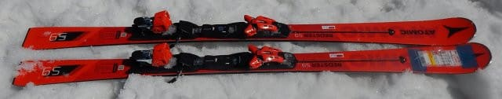
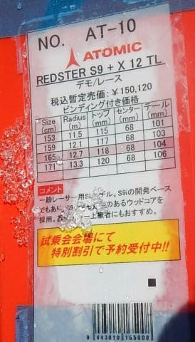
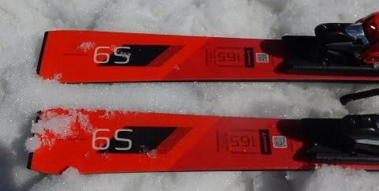
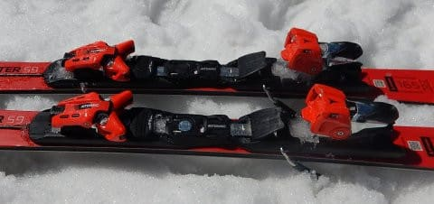
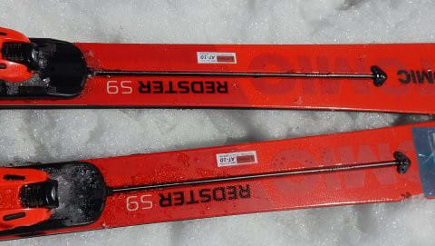

# 2019シーズンのスキー板，試乗レポート第9回…ATOMIC編その2

📅 投稿日時: 2018-05-12 20:59:46

ってなわけで．

明日，日帰りかぐらに行ってくるわけですが．

うーむ．

なんということか．

低気圧の接近が，水曜段階の予想より早くなって

きました…（涙）

日曜の午後は，意外と早くから雨になるかも…

なぜ，私が滑れる日曜に雨になるかなぁ…（涙）

とりあえず，午後4時の営業終了まで，

天気がもつことを祈るばかり…（懇願）

でも．

雨の予報の方が，スキー場が混まなくていいんだい！←自己暗示

ってなわけで．

本日は来シーズンの2019シーズンモデルのスキー試乗レポート．

アトミック編です．

では，どうぞ～！

---

○ATOMIC REDSTER S9 165cm

SL競技用．

この上にS9 FISがあるので，SL競技用

セカンドモデルという位置づけ．

ビンディングは，FISモデルと違って，

VARビンディングではなくTLビンディングがつきます．

さらにこいつには，S9 FISにはない

SERVOTECがついてますね…

で．

履いてみると…

あら！

これはいいのでは…

カルバコアのS9iより重い板ですが．

履いてみるとそんなの気にならない．

…というか，軽快さを感じます．

基本的に，S9iと性格は同じ感じですが．

S9iより多少ばね感が強く，早い返りがあるので

軽さを感じるのかな？

でも，SL競技用と考えると驚異の軽さ．

そして，スピード域が高い，傾きが大きい

小回りで本領発揮．

テールをしっかり使って山回りを仕上げて行けば，

すっと次のターンに板が返っていき．

次のターンの谷回りの好きなところに板を

差し込んで行ける感じ．

トップを抑えに行かなくても，谷回りで

板が回っていきます．

山回りはガッツリグリップですが，

谷回りは軽さもあって，比較的ルーズに動かせて，

狙ったラインをトレースしやすい感じ．

SXとは性格が多少違っているけど．

SXの後継機としては，これを買ってもいいかも…

## 💬 コメント一覧

### 💬 コメント by (Q太郎)
**タイトル**: 志賀高原の麓より
**投稿日**: 2018-05-13 14:10:09

志賀高原の麓に住んでいます。志賀高原の冬の積雪量に興味があるので、冬には何度もアクセスさせてもらいました。

スキーは、いつでも行けると思うと、かえって滑りにいかない・・・・、というより子供の頃にやりすぎて、もうお腹いっぱい・・・。

時々、のぞかせてもらうので、頑張って更新してくださいね。楽しみにしています。

志賀高原の麓に住んでいるので、冬の天気状況でお力になれるかも。

### 💬 コメント by (Skier_S)
**タイトル**: Q太郎さま
**投稿日**: 2018-05-13 23:27:18

志賀高原の麓にお住まいですか！

うらやましいです…

でも，近くに住んでいるとなかなかスキーに

行かないんでしょうね（笑）．

天気が悪かったり，雪が悪かったりすると

「まぁ，今日行かなくてもいいかな」

って感じなんでしょうね～…．

また，志賀の平日の天気レポートなど

お願いします．

今後とも，ご愛読のほどよろしくお願いします～！

