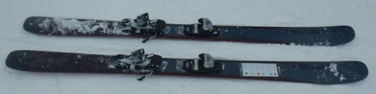
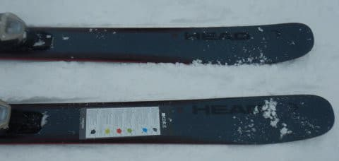
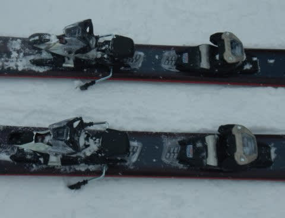
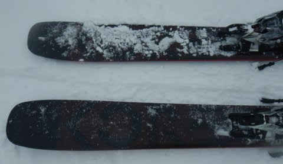
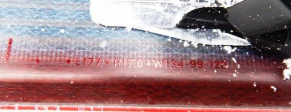

# 2023シーズンモデルのスキー板，試乗レポートその11…HEAD KORE99

📅 投稿日時: 2022-06-10 02:54:19

🏷️ カテゴリ: [スキー板試乗](c0bd8048615710cee890e403a36cc9a2b.md)

えー．

今日も2023シーズンモデルのスキー板試乗

レポートですが．

3月上旬の試乗会では，ファット系の板が

結構多かったので，今回もセミファットの

板になります…

今回と次回の，あと2回のレポートが

どちらもファット系の板になりますが…

3月上旬の冷え冷えのGoodコンディションで

試乗したレポートはその2回で終了．

それ以降は，3月下旬のザブザブ雪での

試乗レポートになります．

…3月下旬の試乗会は，ファット系は

試乗せず，SALOMONやATOMIC，

OGASAKAなどの人気どころも含めて，

基礎・競技系を約20機種ほど試乗して

きたので，また後日お楽しみに…

今日はファット系の残り2本，ヘッド編．

以前乗ったKORE93の太さ違いです．

では，どうぞ～！

○HEAD KORE99 177cm

セミファット

[以前履いたKORE93](eed0a4f90d906e06638dc1fca2f5fce61.md)と同じシリーズ．

今度は，センター幅が99とちょっと広くなった

KORE99を試乗してみました…

KORE93とKORE99，履いた感じはあまり差を

感じないですね．

おんなじシリーズなので，乗った感じは

極めて似ています．

センター99mmというセミファットにも

関わらず，エッジがトップからテールまで

しっかり食いついて，たわみが出て

圧雪バーンできれいにカービングしていく

という，ファットらしからぬ板です．

メタルの張りが強く，スピードを出しても

板のエッジグリップはしっかりしており，

かなりのハイスピードで，普通のゲレンデ用

オールラウンド板の如くカービングして

いきますね～！！

サイドカーブではなくたわみで曲がって

いく板で，まっすぐ落とそうと思えば

まっすぐ落として行けるし，R=17って

比較的小さいサイドカーブってことも

あり，たわませていけば中回りくらい

まで行けます！

硬めのバーンでもガッチリエッジグリップ

してカービングしていくし，スピードを

出しても結構安定感があって…

とてもセンター100mm近い板と思えない，

ゲレンデ用ロングベースのオールラウンド

板みたいな整地での安定感．

それなのに，センター幅が99mmあるので，

荒れた斜面を蹴散らして滑ることも

できるし，新雪に入ればそこそこの浮力を

受けられて，細い板より楽に滑って

行けます！

圧雪バーンでも，センター幅99mmという

太さにもかかわらず，板の返りがいいからか

切替がすごいやりやすくて，

太い板ならではの「よっこらさ」という

切替にはなりません．

圧雪バーンでもKORE93と差がないので．

なら，新雪でより浮力が得られる

KORE99の方がいいかな～．

セミファット板っぽく，荒れた雪でも春雪でも

蹴散らして滑っていけるので，春先でも

使えそうだし．

とりあえず，これ一本で圧雪も新雪も

春雪も…

という板が欲しい人は，こいつが結構

おススメです！

## 💬 コメント一覧

### 💬 コメント by (炎の北海道民)
**タイトル**: Unknown
**投稿日**: 2022-06-10 21:55:00

こんばんは。

Vector glideは試乗しました？

デザインだけで買ってしまいそうです。

### 💬 コメント by (Skier_S)
**タイトル**: ＞炎の北海道民さま
**投稿日**: 2022-06-12 03:14:42

あ，残念ながらVector glideは試乗してないです…

3月上旬の試乗会ではVector glideは来てなかったので…

