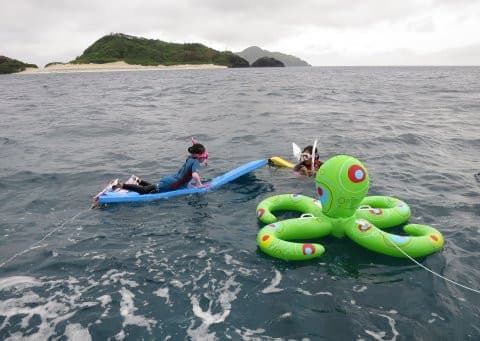
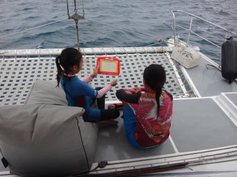
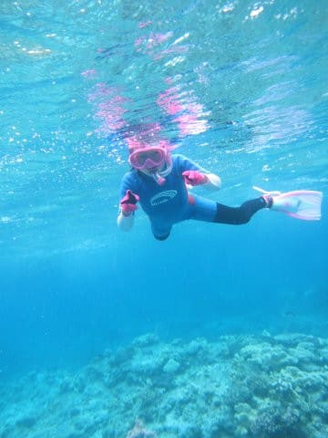
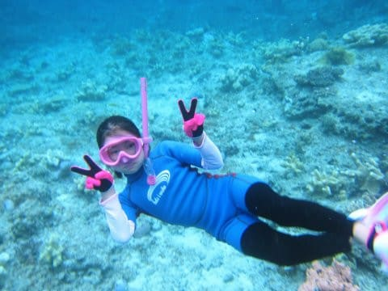
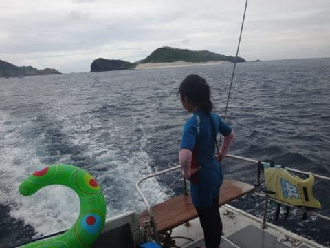
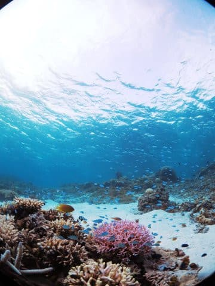
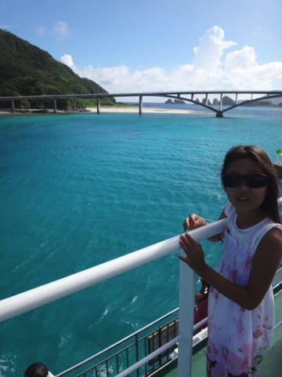
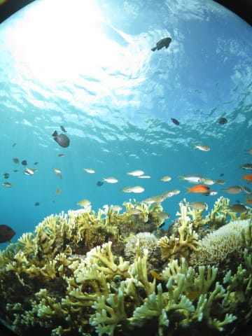

# 2016年8月　子連れ座間味ダイビング旅行記　エピローグ

📅 投稿日時: 2017-07-31 01:39:38

🏷️ カテゴリ: [ダイビング日記](ce3a7a8d424d112fce83ee85c81a0e344.md)

ということで．

最終日早朝に那覇を発ち，昼までに出社するという

かなり無理めのプランで．

強引に取得した1日＋3時間の休みで，

無理やり決行した（？）

今回の座間味ツアーでしたが．

…いや，本来であれば．

この無理めなプランでも，中2日はたっぷり

潜れるはずだったところ，

想定外の高速船欠航により，かなりタイトな

日程になっちゃったけど．

今回．ボートスタッフの方がずっと

娘の面倒見てくれたので．

この少ないダイビングタイムを，

無駄にすることなく，夫婦そろって

潜ることができました…

ザマミセーリングさん，ありがとう～！

しかし，幼稚園時代から，かなりの泳力を誇る

わが娘．

最近では素潜りもかなり潜れるように

なってきたし．

早くダイビングを始めたくて仕方ない

らしいです…

うーん．

娘が生まれたばかりのころは，

「親子でダイビング」

というのは，全く想像できませんでしたが．

もう数年で，親子ダイビングが実現できそうです…！

しかし．

だけど．

もし．

娘がダイビングを始められたら．

嬉しくもあるけど．

ダイビングフィーが3人分かかるようになるので．

ダイビングに行く回数を減らさねば，

家計が破たんするかも…

と．

ちょっと心配になった

Skier_Sだったのでした．

