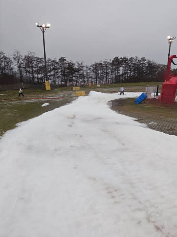

# 10月25日，イエティ2024/2025シーズンオープン日，特派員からスキーレポート！やっぱり例年よりゲレンデの雪は薄く，幅は狭いみたい…

📅 投稿日時: 2024-10-26 01:39:09

えー．

やはりここ数日の天気は読みにくく…

今日のイエティは曇りで雨が降らない

予想だったのに．

終日霧雨っぽい感じだったようで…

うーん．富士山の南斜面に雲がかかって，

ちょうどイエティ付近にガスがかかって

いたようですね…

どちらかというと，昨日修正した予想より，

おとといの最初の予想に近い天気に

なっていたようです（泣）

とりあえず，最新の天気図では，

26日の土曜は終日曇り．一瞬日が射す

ときもあるかも？？

雨は降らなさそうだけど，運が悪いと

ナイター始まるころにガスが出て，

ちょっと霧雨っぽくなる一瞬も

あるかも…

27日の日曜は，なんと．午前中は晴れ間が

出そう…！

昼頃から雲が増え，夕方にかけて雨が降り

出すかどうか…まだ日曜午後の天気は，

正しく予想できない段階です…

という感じで．

本題へ．

ついに本日，イエティがオープンしましたよ～！！！

初日からイエティに繰り出している特派員から

写真が送られてきたので，初日のイエティの

状況を見てみましょう…！！

まず．

朝は曇りというより，完全に霧雨だった

ようですね（涙）

まぁ，ザーザーぶりじゃないだけマシですが．

…さらに，コース幅が狭いため，これまでに

経験のない，スタート位置でコースに流入

する人の制限をしていたみたいで…

だもんで，コース入口で結構渋滞

していたみたいですが…

その代わり，入口で人数を制限していた分，

リフト待ちがなかったようで…

入口で待たされる代わり，コースの人口

密度が低くなり，リフト待ちがないってのなら，

意外といいシステムかも…？？

そして．

コースの雪が薄いため，最後の急斜面で

雪が削られないよう，スピードダウンの

目的で，急斜面の入り口でもあえて

入口を絞っていたようです…

その入り口を絞った効果と，スタッフの

人海戦術での穴埋めのおかげで，雪が薄くて

すぐに穴が開く最後の急斜面，そこまで

壊滅的な状況にならずに済んだようですが．

でも，例年よりはやっぱりコースが狭い

感じ…

とはいえ．

やはり高温と雨がここ数日続いたせいで．

コースの幅と雪の厚みは例年より不足気味で…

午前中から，一部はかなり雪が薄くなって

いたみたいです．

ただ，ゲレンデ状況も良くなく．

コース幅も狭いうえに，終日霧雨が

降ったりやんだりという悪天候もあった

せいか．

午後にはかなりコースがガラガラに

なっていたようで…

なんだか，夕方はリフトもスカスカ

だったようです…！！

オープン初日にここまで人が少ないのは

珍しいかも…？？

しかし，やはりコース幅は狭く．

さらに午後に雪山ができてくると，

もっと滑れるエリアが制限されてくるし．

夕方はかなりコースも荒れたようなので…

ガラガラなのも納得かな…

とはいえ．

この天気，この高温で，よく長さ1kmの

コースをオープンさせたものよ…！！！

…ということで．

予定の25日に何とかオープンできたものの．

ここしばらくの高温のせいで，いつもより

コース幅も雪の厚みも不足気味っぽい

イエティですが．

今日から明日にかけても気温が高いので，

…果たして明日までに，これらの穴が

十分埋まるほど，造雪できるのか…？？

とりあえず，この週末にイエティに行く人は

ある程度覚悟していきましょう…

…ってか，この時期のイエティに行く人は，

それなりの覚悟ができている人だと

思いますが（笑）．

ちなみに，イエティに行くときは，

[https://www.yeti-resort.com/service/mm.html](https://www.yeti-resort.com/service/mm.html)から

メルマガ会員登録をして，会員特典の

ページにログインして，QRコードを

表示すれば．

平日なら400円引き，休日なら500円引き，

さらに2回目，4回目は半額…

という，メルマガ会員特典が使えるので

会員登録してから行くことをおススメ！

ってなことで．

私は明日，イエティで2025シーズンイン

してきます～！！

…なのに，今日ももう深夜1時半なのだが…

また睡眠時間が…（涙）←こんな長いBlogを書いてる場合じゃないだろ

## 💬 コメント一覧

### 💬 コメント by (1kamakura)
**タイトル**: Unknown
**投稿日**: 2024-10-26 06:33:17

江戸の秋

昨日たまたまテレビをつけたら、ニュースでイエティがオープンとやっていました。

コスプレしたスキーヤーかたくさん滑っていて、おもしろーいって見ていました。

今日は行っていらっしゃるのかな。

毎年なかなか厳しそうな天候ですが、始まりましたね！

レポート楽しみにしております。

モアルボアルは？

### 💬 コメント by (ひゃくりん)
**タイトル**: Unknown
**投稿日**: 2024-10-26 10:27:50

イエティ関連のツイッターやらyoutubeを見て、

相方と話し合って、覚悟が出来ずに、

イエティのシーズインはコンディションが良くなるまで見送りになりました。

オープン2日目のレポ楽しみにしております。

例年、イエティのツイッター公式さんは、

コースの細さが分からないのように、

コース圧雪部のアップを写真に撮ってていたんですが、今年は、コース上部から全体が映るように撮ってますね。

イエティのツイッター広報担当者が変わったんでしたっけ？

### 💬 コメント by (Skier_S)
**タイトル**: 無事2025シーズンイン！
**投稿日**: 2024-10-26 23:04:39

＞江戸の秋さま

イエティオープンの日は，コスプレすれば無料で滑れるし，あさイチはコスプレした人から

滑り出せるのでコスプレする人がいっぱいいます～！

今日イエティで初すべりしてきましたよ～！！

…モアルボアルレポートは，シーズンが本格化したら一旦中断して，スキーシーズン後に復活かもです…

＞ひゃくりんさま

いや…今日のイエティを滑ってきて，来なくて正解だと思いました．

今日はまだ空いていたからいいけど，来週3連休まで雪の量が増えるどころか減る可能性が高く，

来週は阿鼻叫喚の週末になりそうな予感…

もうしばらく様子見が正解です！

### 💬 コメント by (ねも)
**タイトル**: Unknown
**投稿日**: 2024-10-27 14:12:21

Ｓさん　始まりましたね⛷️

静岡は地元ゆえか、NHK含めて各局が報道していました。

水を差すようで申し訳ありませんが、こんな細いコースで滑って楽しいの⁉️って、スキー大好き私でも思ってしまいます。

放送は批判的なことを一切言いませんでしたが、普通の人はどうみたんでしょうね？

### 💬 コメント by (Skier_S)
**タイトル**: ＞ねもさま
**投稿日**: 2024-10-27 22:13:27

いや…普通の人は滑っても楽しくないと思います．

スキー中毒で，禁断症状に苦しむ人がやむなく滑りに行く場所で，

お酒を断たれたアル中がメチルアルコールでも飲んでしまう状況に近いかも…（笑）

### 💬 コメント by (ねも)
**タイトル**: Unknown
**投稿日**: 2024-10-28 11:28:32

＞Skier_Sさん　ご返信ありがとうございます。

ちょっとネガティブすぎるコメントだったと反省していました(-_-;)　エチルアルコールじゃなくメチルアルコールとは(笑)

軽妙な切り返しお見事です👍

私もイエティの隣に住んでいたら滑ったと思います✌️

### 💬 コメント by (Skier_S)
**タイトル**: ＞ねもさま
**投稿日**: 2024-10-29 03:27:05

いや…どう考えてもこのコース，普通の人が楽しむにはハードルが高すぎると思います（笑）．

やはり，鍛えられた人じゃないと，ここを楽しむのは無理です．

この時期にイエティに来る人たちは，面構えが違います（笑）．

