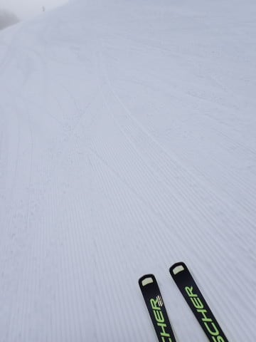
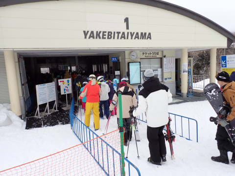

# 2024/2/4(日)の志賀高原焼額山スキー場の詳細レポート！…昼前後はガスで視界が悪かったけど，それほど混まないし夕方は晴れてフラットバーンだったし，満足の一日

📅 投稿日時: 2024-02-06 03:00:06

🏷️ カテゴリ: [2024スキー滑走日記](c453f687e8a0f05679e95831d0a02cd0c.md)

えー．

本日，首都圏ではかなりの雪が積もり

ましたが…

志賀高原でも雪は降っているものの，

思ったほどは積もってないみたいですね…

焼額のライブカメラを見たところ…

まぁ，夕方からの積雪が20cm程度ですか．

（[焼額山スキー場，ライブカメラページ](https://www.princehotels.co.jp/ski/shiga/livecamera/)より）

5日の昼間にも20cmほど積もったよう

なので，まあ合わせて40㎝は積もってる

ことになりますが…

もう少し積もるかと思ったんだけどな～…

まぁ，軽くて風で飛ばされる雪じゃなく，

重くてしっかりと積もる雪なので．

ゲレンデのいい下地になりそうな雪では

ありますが…

うーん．

これからもしばらく雪はパラパラと

降りそうですが．

これから先1週間，どっさり積もる予想は

なさそうな感じですね…

もう，都内に降らなくていいから，もう少し

スキー場に雪が欲しい…（切実な願い）

ってなことで，本題へ．

日曜の志賀高原スキー場，詳細レポートです！

まず．

日曜の朝，志賀高原へ上る道路は…

なんと．一ノ瀬までほぼドライ．

運転するのは楽だけど，2月にしては

積雪量が少なすぎる…（涙）

で，8時半の営業開始前に焼額第1ゴンドラに

並びますが．

そこそこ並んでるけど，列はそこまで

長くなく．今日もそこまで混まなさそう…！

営業開始後のゴンドラに乗って，山頂へ

向かうと…

山頂の気温は，-7℃と，昨日よりちょい

高め．

そして，

あさイチの気温は-6～7℃程度？

というのがぴったり正解！！

朝の山頂は雲の上で，薄日が差していたけど．

まぁ，予想通り曇り空でのスタート．

山頂は薄日も差してるけど，コースの

途中ではちょっとガスも出て，

あさイチのGSコースはコース上のちょうど

おいしいところがガスってた感じ（泣）

とはいえ．

バーンはきれいな締まった感じのシマシマで，

スピードが乗るし，エッジがしっかり効くし．

自分が上手くなったんじゃないか？？

と勘違いできる，勘違いバーン！！

いや…

雪は最高に気持ちいい！

朝のうちは人も少ないし．

これであとは視界さえ良ければ…

そして，朝の9時過ぎくらいまでは，

山頂付近はまだ明るかったものの．

コース中間点付近がガスってたり．

時間によってはガスが山頂付近まで

広がったり，

場所によっては全くガスがなかったり…

という感じで．

コース上にまだらにガスが出てる状況が

昼過ぎまではずっと続き．

ガスがあるところ以外は，基本的に

曇りという感じの天気で．

日が差さないけど，曇り空で風もちょっと

あったので，結構寒さを感じる天気でした…

ただ，ゴンドラも今日はほとんど混雑せず．

10時ごろのピークに，30分ほどゲートのぎりぎり

外まで並ぶという状態になったものの．

それ以外の時間はだいたいこんな感じの

待ち時間で，搬器2-3台待てば乗れる

感じだったし．

第2高速，第3高速もほぼ待ちがなく．

時折ゲートを越えて並ぶことはあっても，

基本的にはそこまで混まない一日でした…

コース上は，そこまでガラガラではなく，

そこそこ人はいたものの…

それほど人口密度は高くなく，

ピークでもこのくらいの人で，

快適に滑れるレベル．

で．

昼間の最高気温も-4℃と，そこまで

上がらなかったので．

雪は午後になっても全く緩まず．

そして，朝からしっかり締まり気味の

雪だったこともあり…

午後になっても，バーンは一部を

除いて完全フラットなまま！

これで，あとは天気さえよければ

最高なんだけど…

昼過ぎになっても，コースのところ

どころにガスが出るし．曇っていて

雪面もちょいと見に行くいしという

天気が続き．

ちょっとがっかりしていた午後3時ごろ．

なんだか，ちょっと青空が見えて

きましたよ！！

そして，日が射して雪面がすっきり

見えるようになって来ましたよ！！

いや…

人が少なくて，午後もほぼフラットバーン

だったとはいえ．

やはり雪面が見えると安心して滑れます…！！

ってなことで．

営業終了前の1時間ちょい．

このころには人も減ってるし，

天気は良くなったし．

それでいて，雪がしっかり締まっていたので

コースはそこまで荒れず．

特に第2高速沿いの唐松コースに至っては，

朝のオープンからまだ1時間たってないん

でしたっけ？？

と思うほどの，最高フラットバーンを

滑ることができ…

いや．

最高！

夕方になって，いい感じのしっかり締まった

雪で，ガラガラの天気のいいバーンを滑れる

なんて，最高なんですけど…！

…という感じで．

夕方は最後まで残った人への神様からの

ご褒美を堪能しまくって．

今日もしっかり営業終了まで，

いつも通り昼休みも取らずに，ひたすら

延々と滑り倒したのでした…

いやー．

この週末も，それほど混まなかったし．

冷え冷えのいい雪で，

それほどバーンが荒れずに営業終了まで

好きなだけひたすらハイスピード大回りを

堪能できた，いい週末だった…

でも．

しばらく雪が降らなかったので，しっかり

踏み固められたハイスピードバーンに

なっている最近．

ハイスピードバーンもいいけど，

そろそろ柔らかい新雪も滑りたい…

というワガママな欲求が湧いてきている，

Skier_Sだったのでした…

このままだと今シーズン，太板の出番が

ないまま終わっちゃうんじゃないかな…？？

## 💬 コメント一覧

### 💬 コメント by (ありが)
**タイトル**: 今年のGWの
**投稿日**: 2024-02-06 11:21:50

今年ゴールデンウィークの残雪やゲレンデの状況は、どんな感じになりそうですか？

長年の勘で良いので、予想していただけますか。

### 💬 コメント by (レインボー76)
**タイトル**: Unknown
**投稿日**: 2024-02-06 15:38:29

火曜日の志賀高原情報

朝のうがいで歯がかけて、歯医者休場。

隊員によると、新雪30cmなれど、湿雪で、非圧雪に行っても板が沈まず楽しくなかったそうな。(何故かほっとしている越後屋がここにいます)

奥志賀のエキスパは硬めで楽しかったらしい。ダウンヒルはガタガタだったとか。

先週の快楽バーンはしばらく望めないのでしょうか？

### 💬 コメント by (アリス)
**タイトル**: Unknown
**投稿日**: 2024-02-07 06:33:48

おはようございます✨

火曜日からヤケビ参戦です。

☃が重いです。

三高稼働してますね。

GSコース午後は荒れています。

### 💬 コメント by (レインボー76)
**タイトル**: Unknown
**投稿日**: 2024-02-07 13:42:01

水曜日の志賀高原情報

朝の上林-2℃　蓮池-6℃。陽も顔を出して快適な日。

まず、ダイヤ、山の神、唐松で、全てファーストget。ふんわか気持ちいい、膝に優しい一日。

そのうち荒れるだろうと、まずはオリンピック。これがまた信じられないくらいの出来。うまく滑れる！いや

、きっと勘違いなんだ。

ヤケビのどのコースも◎。でもだんだんとゲレンデに人があふれてきたので、昼前に終了。明日も快楽日が続きそうな予感がします。

### 💬 コメント by (アリス)
**タイトル**: Unknown
**投稿日**: 2024-02-07 14:54:32

Ｓ様

今週は仕事ズル休みしてスキー三昧です。

ヤケビはやはり朝一ですね。

GS、オリンピック、白樺、唐松と気持ち良く滑れました。

奥志賀のダウンヒルもエキスパもシマシマが残った状態でした。

やはり、10時過ぎると人口密度が増えてきますね。

週末のイーストのナイターは期待出来そうです。

ランチ時間にヤケビを脱出し、一の瀬ファミリー、寺子屋、高天原とこちらも昼時間帯は貸し切りでストレスなく快適です。

### 💬 コメント by (Skier_S)
**タイトル**: コメント回答遅れました
**投稿日**: 2024-02-08 03:48:45

＞ありがさま

このままだと，GWはヤバいです．

3，4月にかなり冷え込まない限り，焼額はGWまでもたないでしょう…

一ノ瀬エリアもGWはヤバそうな予感です．

＞アリスさま

火曜から志賀ですか！

ちょうどいいタイミングで志賀入りですね…

雪もいいし，気温も冷え冷えだし．

今シーズン数少ない，最高雪質のチャンスを満喫してください！

＞レインボー76さま

火曜はちょうど休みでよいタイミングじゃなかったでしょうか．

その代わり，水曜がトップシーズン極上雪質を楽しめたと思います．

すっきり晴れは望めませんが，明日もいいコンディションが続きますよ～！

