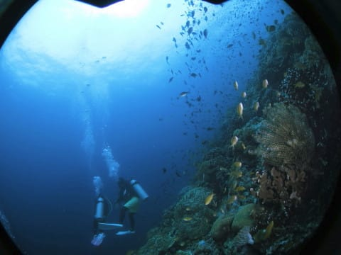

# 2018年8月，モアルボアルで小5の娘をダイバー化！その22…ついに今回の旅行のラストダイブ！

📅 投稿日時: 2019-08-10 06:17:55

🏷️ カテゴリ: [ダイビング日記](ce3a7a8d424d112fce83ee85c81a0e344.md)

この週末から，お盆休みに入る人は

多いと思いますが．

…私はお盆Weekは基本的にお仕事です（涙）．

でも．

お盆期間．

通勤も混まないし．

職場も人が少なくて，会議もないし．

メールや電話もほとんど来ないし．

はっきり言って，仕事がものすごく

効率よく進むので．

毎週お盆休みだったらいいのに

と思っているんですが…←いや，それ，社会全体が停止するから

とりあえず．

今日もダイビング旅行記です～！

---

ということで．

我が家3人で貸し切りの，

本日午後のダイブ，スタート！

…さすが，ぺスカドール島．

エントリー直後から，サンゴに群れる

色とりどりの魚たちが出迎えてくれて…

魚の密度が濃い！

ダイバーの間に入り込む魚たち…

もう，何も言えない．

この魚の密度を，見よ！

娘が魚の向こうに隠れて

見えない…

そして，サンゴと魚が一面を覆う，

ドロップオフの壁からちょっと離れて

沖を見ると…

たまたま目の前を通過していく，

巨大コガネアジ！

娘も，

「でかかったよね…」

とアピール(笑)．

そして，さらにきれいな

景色の中を進んで行きます…

ホントに，最近ではこれだけサンゴが元気で，

魚の密度が高い海は珍しくなってきてる

気がする…

ってな感じで．

最後は船の下に戻ってきて…

安全停止の後，浮上！

…こうして．

今回のモアルボアル遠征の最後の

ダイビングも終わってしまったのでした…

でも．

娘のCカード講習で始まった今回のモアルボアル．

最後は，念願の家族そろってのファンダイブが

できるようになり．

それもラストの1本は家族3人の貸し切りで．

こんなきれいなポイントを潜れて，

かなり満足だったな！！

## 💬 コメント一覧

### 💬 コメント by (マルハバ)
**タイトル**: 中性浮力・・
**投稿日**: 2019-08-10 07:22:47

娘さんすごいですね！

完全にモノにしている・・

200本越えのベテラン並ですよこれは（汗）

ペスカドールの魚密度

モルディブ・アリのフィッシュヘッドみたい・・

### 💬 コメント by (Skier_S)
**タイトル**: ＞マルハバさま
**投稿日**: 2019-08-11 01:43:02

いや．

ホントに親バカと言われそうですが，

わが娘が潜っているのを見ると，とてもCカード取りたての

小学生とは思えない安定感です…

そして，ぺスカドール島は結構いいですよ．

モルディブのフィッシュヘッドほど大きな魚が群れてるわけでは無いですが，

フィッシュヘッドにはないきれいなサンゴがあって，ハナダイ系が

あふれんばかりに泳いでいる姿を見ていると癒されます．

### 💬 コメント by (炎の北海道民)
**タイトル**: Unknown
**投稿日**: 2019-08-20 21:18:37

S様

熱帯には色んな色の魚がいるんですね。いつもシャケばかり見ている(食べている)私には新鮮です。が、ピンク色の魚とかって美味しいのでしょうか？ピンクや青い魚の刺身を一度食べてみたい気がします。

### 💬 コメント by (Skier_S)
**タイトル**: ＞炎の北海道民さま
**投稿日**: 2019-08-21 21:57:42

南の島のお魚は，北の海に比べると大味な魚が多いです…

ピンクとかの派手な魚って，あんまりおいしくないです（笑）．

真っ赤なハタの仲間はおいしいのがありますけど…

