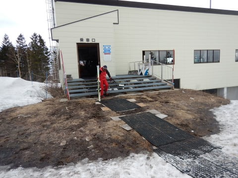
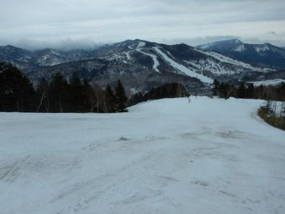

# 4月15日（土），来ないつもりが志賀高原に来ちゃったよ…ラスト1時間半のみだったけど，ガラガラで予想よりましかな

📅 投稿日時: 2018-04-15 02:54:23

えー．

ということで．

昨日の段階で．

今日，滑るつもりは1ミクロンもなかったんですが．

ええ．

昨日は，日曜だけ滑る気100％だったんですが．

本日予定の用事が，朝10時に終わってしまい．

…これは．

今から全力で志賀高原に向かえば，2時半には志賀で

滑れるなぁ…

…2時間は滑れるなぁ…

でも．

普通は今日一日，家族でゆっくりしてから

日曜滑るために出かけるよね．

たった2時間滑るだけのために，今から志賀高原に

向かうってバカだよね．

そんなこと，普通しないよね…

ありえないよね．

絶対ないよね…

と，思っていた，4時間後．

…あれ？？

なんだ，ここは？？？

あれ？？

ここは，焼額第1ゴンドラの山頂じゃないかっ！！！

なんと．

なぜか午後2時半に，焼額第1ゴンドラ山頂に

立っている自分がいたのでした…

どうやらまた，[時空を超越する能力](e1596029153f0601a68bb5a329c1aea75.md)を

発揮してしまったようです！！

…瞬間移動に4時間かかった気がするんだけど…

いやーーー．

まさか，時空超越能力を

また発揮することになろうとは…！！

とりあえず．

時空超越の途中で，こんな景色を通過した

気がするんですが．

もう滑ることはとても無理なサンバレーとか．

雪が解けつつある丸池とか．

全く凍ってなくて，

夏タイヤでも突っ切れそうなトンネルの中とか．

…とりあえず．

今日の午後は，夏タイヤでも全然突っ切れるレベルの

道路でした…

で．

午後2時半の焼額山頂の気温は，+5℃近く…

思ったほどの高温ではないけど．

もう十分緩んだ雪になってます（涙）

そして．

雪が消えましたね…

ゴンドラ降り場も寂しい感じで．

先週は滑れた白樺コースも，

今週はクローズになったようですね…

先週，オリンピックコースとSGSコースがクローズに

なっているので．

これで残るは，GSコースとパノラマ～サウス，そして

唐松の3コースになりますか…

2ゴンは今週から予定通りの営業終了です．

滑れるGSコースも，ところどころ土が

出てるところがありますが．

でも，基本的にはまだまだ雪はたっぷりあります！！

全然大丈夫です！！

そして，超ガラガラ！！

誰も滑ってないよ！←いや，午後3時ごろにはもうみんな帰ってたからだと思う

だもんで，雪は緩いものの．

午後になっても雪はそれほど荒れておらず，

意外と快適！！

で．

今日の天気は，基本的には曇り空．

さらに，風が強かったので…

奥志賀は午前は全面休止だったようです．

奥志賀，昼過ぎにリフトのみ

動き出したようですが…

夕方から強くなり始めた風で，

焼額ゴンドラもかなりの減速運転…（涙）

ただでさえ，午後ちょっとしか滑れないのに．

ゴンドラがこのスピードだと，1時間3本しか

乗れないよ…（泣）

ってか．

それどころか．

ゴンドラ4時15分，リフト4時半までの営業予定が…

うげげげげげげげ！！！

強風のため，どちらも4時終了に

なっちゃったんですけどっ！！

うぎょえーーーーっっっっっ！！

なんてこったっ！！

なーーーーんてこった！！！

2時半到着でも4時半までなら2時間は滑れるな…

ってことで．

いろいろ無理を押して時空超越してきたというのに．

わずか1時間半しか滑れない

結果になるとは…っ！！

あぁ…

なんてこった．

なーーんてこった！！！（超激烈涙）

わずか1時間半のために，

「日曜雨になりそうだから，土曜ちょっとでも滑れるように

　今すぐにスキーに行かせてちょうだい～」

と．

土曜は一緒にゆっくり過ごすと言った家族に

無理を言って出てきたことになるのか～！！！（泣）

と．

涙を流しながら，営業終了の4時まで

全力で滑り続け．

それでも，1時間半しか滑れなかったけど．

ゴンドラ6本乗れたから，良しとしよう…

と，自分を慰めたSkier_Sなのだった…

うーん．

すごく高くついた，ゴンドラ6本だった…（涙）

## 💬 コメント一覧

### 💬 コメント by (Goku)
**タイトル**: 伝説がまたひとつ
**投稿日**: 2018-04-15 07:29:05

昨日はお疲れ様でした！

そして最後は高天ヶ原までありがとうございました

しかし、これくらいのことではもう誰も驚きませんから～（笑）

で、今日は早朝からですか？

### 💬 コメント by (Skier_S)
**タイトル**: Gokuさま
**投稿日**: 2018-04-15 09:13:21

今朝は早朝はゴンドラ強風で動かず…(;_;)

4ロマでやったようですが、雨のなか遅いペアリフトで

早朝を滑る根性はなかったです…

通常営業も強風で開始が遅れています。

搬器を出し始めたので、そろそろ営業しそうですが…

雨が強くなってきたので悲しい感じです(T_T)

### 💬 コメント by (しんちゃん)
**タイトル**: 時空超越の瞬間
**投稿日**: 2018-04-15 11:54:26

～新たな伝説を作ったＳ様へ～

昨日私がお昼過ぎに下山していると、「早くたどり着きたいっ」というオーラを発している車とすれ違いました。

まさに時空超越している瞬間を見ました(笑)

昨日は、液体が降ってなく、ガラガラで、あまり荒れていない状況で少しでも滑れてよかったですね。

今日は雨の中の滑走と思いますが、これくらいの事ではだんだん驚かなくなってきました(笑)

（Ｓさんなら滑るだろうと思えてきました(^^;）

昨日はまたしても志賀高原グルメ売り切れ伝説を作ってしまった（泣）しんちゃんより

### 💬 コメント by (いか)
**タイトル**: Unknown
**投稿日**: 2018-04-15 21:09:22

志賀は夕方までなんとか天気がもったんですね。こちらは、3時過ぎに降り始め一気にコブから人がいなくなりました（笑）それでも最終まで滑ってしまい、ずぶ濡れになりました、、、

本日日曜日も志賀はなんとか営業できていたようで、なによりです。八方は朝から爆風（山麓は平和）で終日運休だったみたいです。私は午後から東京で予定があったので早々に帰りました～

### 💬 コメント by (はなげ親分)
**タイトル**: いや～
**投稿日**: 2018-04-15 23:58:48

まさかの坂を越えてます（驚）

１ゴンの４時終了は残念でしたね。

で、本日は雨中の滑走だったのですか？

昨日、今日と、なにやら哀愁漂う私の平日スキーとよく似ているような・・・（笑）

### 💬 コメント by (Skier_S)
**タイトル**: うーむ．微妙な週末だった…（涙）
**投稿日**: 2018-04-16 01:29:37

＞しんちゃんさま

すれ違ったの，全く気付きませんでした（笑）．

いや，わずか1時間半でしたが，

滑れただけ良かったです．

しかし，さすがの私も今日の早朝は諦めました．

＞いかさま

土曜はリフト営業終了直後からぽつ，ぽつと

雨がぱらつきだした感じです．

日曜は営業開始は遅れましたが，開始以降は

普通に全リフト営業していました．

八方はそんなに荒れたんですね…

＞はなげ親分さま

土曜，何とか滑れて良かったんですが…

でも，4時終了は衝撃でした．

今日は午前中は雨の中の滑走でした（涙）．

でも，午後は雨もやみ，ときどき日も射す

天気だったので，一日中雨に比べれば

まだマシな一日だったと思います…

