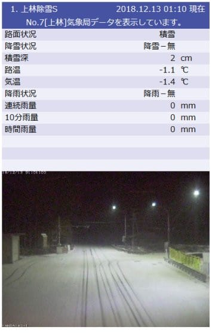
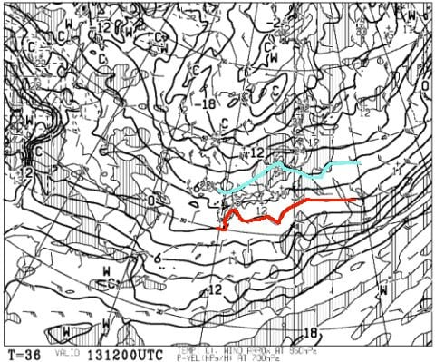
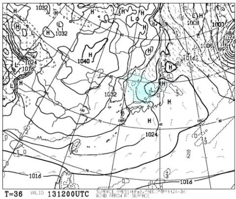
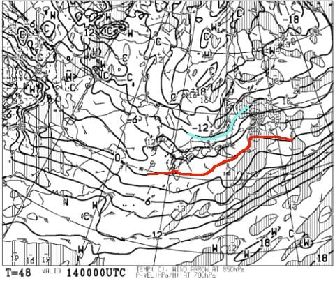
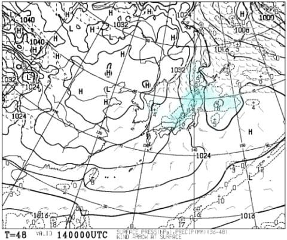
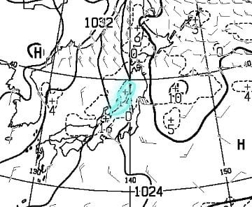
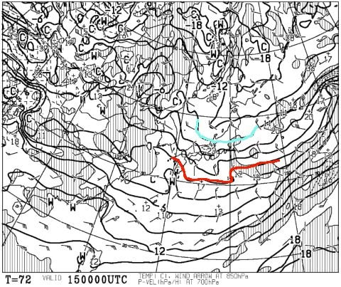
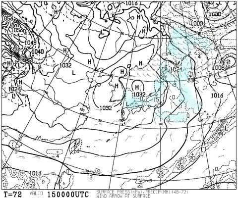
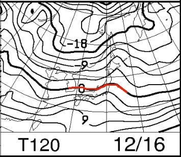
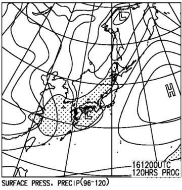

# 12月15，16日の週末の志賀高原スキー場の天気は…土曜は冷え冷えで朝は新雪！日曜は終日晴れそう！

📅 投稿日時: 2018-12-13 02:25:32

🏷️ カテゴリ: [スキー天気予想](c6554f5c3c106093b511a8daae23757e8.md)

おっと．

今日は水曜じゃないか…

ってことなので．

定例の，今週末の志賀高原の天気予想です！

…物欲選手権の続きを待っている人も

ごくわずかいると思うのですが．

明日までお待ちを…

ってことで．

週末の天気予想に行く前に．

この週末までに，スキー場に雪は積もるのか？？？

…ってところを見てみましょうか．

とりあえず，本日，水曜深夜の現在．

志賀高原は，雪が積もっているようです！

ライブカメラを見ると，志賀の麓の

上林チェーンベースまで真っ白になってます！

（[北信建設事務所HP](http://www.q0.ws302.smilestart.ne.jp/index.htm)より）

これは…今週末の期待度が高まるところ！

まずは木曜，13日の850hpa気温を見てみると．

うむ．志賀高原には，水色の-6℃線が

掛かっているので．

まぁ十分な冷え込み．

そして，木曜の地上天気図を見ると．

水色で塗った降水域．

日本海側に広く広がり，

日本海側の噴き出しの雲がたなびく，

典型的な冬型の降水パターンです！

ただ…

13日の降水域は志賀高原まで延びていないので．

…志賀高原は，雪が積もるのは13日朝まで．

午前中には雪がほとんど止んでしまって．

13日の昼間は，せいぜい雪はぱらつく程度で

そんなに積もらない感じ…

で．

14日朝9時の850hpa気温図を見ると．

をを！

水色に塗った-9℃線が志賀に近いづてます！

そして，地上天気図では…

降水域が，志賀にまで延びてますよ！

この日本付近を拡大すると…

水色で塗った，降水量10mm以上が予想されているエリア．

これが志賀に掛かっているので．

13日夜から14日朝にかけて，

志賀高原は冷えたいい雪が10cmくらい

積もりそう！！！

14日金曜の朝は最高かも…！！

そして．

15日土曜の朝9時の850hpa気温図は…

うむ．

この日も水色の-9℃線が志賀に掛かってるし．

朝は-10℃以下に冷え込みそう！

そして，地上天気図は…

これも水色の降水域が志賀にかかってます．

だもんで．

土曜の朝も，10cmあるかないか程度かもしれないけど．

朝は雪が積もってそうです…！

で．

16日の日曜ですが…

850hpaの0℃線．

これがギリギリ志賀高原にかかってるかどうかの

位置まで上がってくるので．

15日までに比べると，ちょっと気温が上がりそう…

地上天気図では，網掛けの降水域は

ギリギリ志賀高原にかかってない感じなので．

晴れ～曇りってところでしょうか…

だもんで．

まとめると．

13日木曜：朝まで雪が降り，冷えたいい感じの

　雪が10cmほど積もってそう！

　でも，朝のうちに雪は止み，

　昼間は積もらないか…

　とはいえ，気温は終日冷えひえ！

　人工降雪機は終日フル稼働OK!

14日金曜：この日も朝は-10℃以下の冷え冷え！

　13日夜から雪が降り始め，朝までの積雪は10cmを

　超えてそう！朝イチはいい感じかも…！

　昼間も雪は降り続けて．

　昼間だけでもさらに数cm積雪がありそう．

15日土曜：朝の気温は-10℃以下！いい感じで冷え冷え！

　昼間も-5℃は上回らなさそうな，寒い一日．

　あったかい格好をしていきましょう！

　そして，朝までに10cmほどの積雪がありそうなので．

　この日も朝イチは新雪が圧雪された上に，

　うっすら積雪があり．

　今シーズンで一番のいいコンディションになりそう！！

　朝まで降っていた雪は，午前中には止んで．

　午後はもしかしたら晴れ間も広がるかも…

　午後は荒れた斜面で，下地にちょっと

　人工雪の硬いのが出てくるところもあるかも

　しれないけど．

　終日冷え冷えで朝イチは積雪あり，

　午後は晴れるとなると…

　かなりコンディションが良い一日になる可能性大！

　期待できる一日！

16日日曜：この日は朝は積雪なし．

　朝は晴れて，気温はそこそこ冷えそう．

　朝イチはしっかり締まった圧雪バーンが

　楽しめるかな？

　昼ごろには気温も上がり，雲が

　増えだしそうだけど…

　夜まで雪は降らなさそう．

　15日より暖かいけど，気温は0度を超えるかどうか．

　まぁ楽しめそうな一日．

という感じになりそうです…

うむ．

これから週末にかけて，冷えてくれそうだし．

ドサドサ積雪ってわけでもないけど．

毎日10cmくらいずつ積もってくれそうだし．

今週末は，ゲレンデコンディションは

先週に比べればかなり良くなって

るんじゃないかな～．

ただ，もう少しドサドサ降ってくれれば，

焼額もゴンドラが動くだろうけど．

そこまでの積雪は無い感じ…

一の瀬ファミリーは，正面バーンが

開いてくれるのかどうか…

これも微妙．

とはいえ．

第2高速は動き出すだろうし．

高天ヶ原は山頂から行けるかな？？

今週末に期待っ！！

## 💬 コメント一覧

### 💬 コメント by (若杉勲71)
**タイトル**: Unknown
**投稿日**: 2018-12-13 06:20:32

いよいよですね。楽しみです。今日は野沢を覗いてきます。やまびこで長い距離滑れそうなので。

毎日10センチの積雪なんて、現地で待ち続ける者にとっては、夢のようです。嬉しい予報をありがとうございます。

### 💬 コメント by (つーちゃん)
**タイトル**: １３日レポ
**投稿日**: 2018-12-13 22:20:08

日帰り特派員よりお知らせします。

朝一の積雪はスニーカーが埋まる程度。気温－７度。

午前中は雪がチラチラ。午後はスッキリ快晴。

ヤケビゲレンデは柔い圧雪にうっすら新雪で、中盤の中斜面は結構ガリガリ。

ゲレンデの幅は回復したと思います。

日曜日が楽しみです！！

### 💬 コメント by (Skier_S)
**タイトル**: 第2高速運転開始！
**投稿日**: 2018-12-14 05:18:19

＞若杉さま

ヤケビは今日から第2高速動きますね～！

野沢も雪が積もってるのではないでしょうか…

どんなだったかレポートお願いします！

＞つーちゃんさま

日帰りレポートありがとうございます．

やっぱり積雪は10cm弱ってところだったんですね．

中斜面はまだガリガリですか…

もう一降りほしいですね…

