# 3月18日，3連休初日の志賀高原スキー場の状況は…3月下旬でこんなに雪が良くていいの？トップシーズン並みのコンディション！

📅 投稿日時: 2017-03-18 23:28:25

ということで．

3連休初日の本日ですが…

…いや．行ってません．

行ってませんよ．

早朝はさすがに行ってません．

昨晩12時過ぎに寝て，早朝に間に合うように1時半に出て

来たら，死にますから（笑）

…で．本日．

まだ道路にかなり積雪が残る道路を登って，

やってきたのは…

はいそうです．

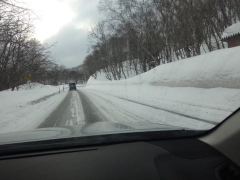

いつもの8:30スタートの焼額ではなく．

8時営業開始の奥志賀にやってきました～！

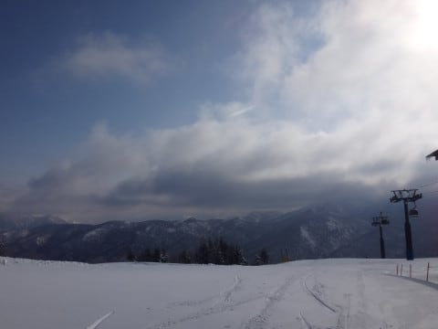

山頂の気温は-8℃と．

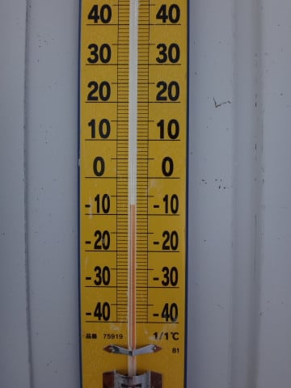

この時期としては，そこそこの冷え込み！

そして，ゲレンデは…

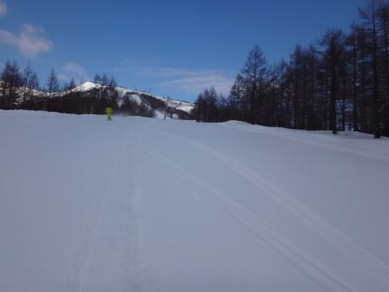

昨晩から2-3cmの積雪があったようで．

きれいな圧雪の上に積もった，ふわふわ軽い

新雪を蹴散らして滑る，超快感バーンっ！！

朝イチの，まだ全然シュプールがついてない

気持ちいいバーンを…

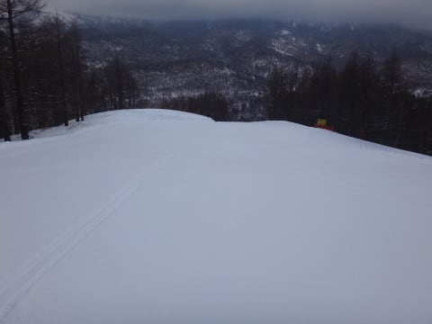

こうやって切り裂いて落下していく快感っ！

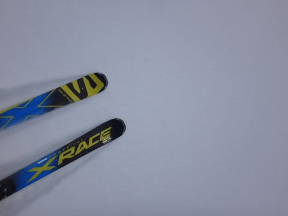

…これは．

朝イチシマシマとまた違った快感ですな！！

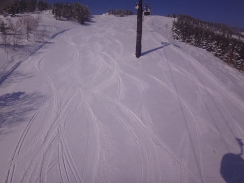

朝の1時間ほど，かなり気持ちいい

うっすら新雪バーンを楽しませて

もらいました～！

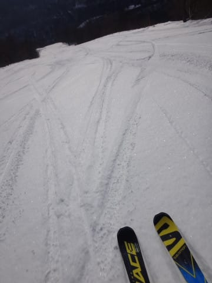

うっすら新雪を1時間楽しんでも，

まだ9時．

8時スタートってのは，いいですねぇ…

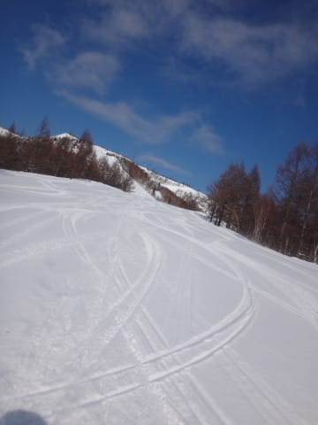

大体新雪が荒らされてきたので．

マイホームゲレンデ，焼額へ戻ります…

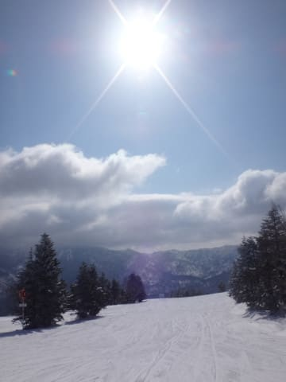

朝9時の焼額．

開始後30分なので，まだコースのところどころに

シマシマが…

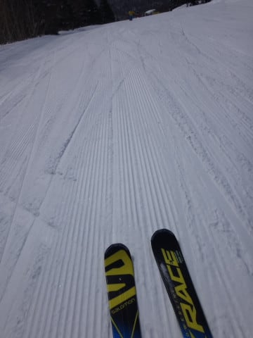

で，

この日の天気は昨日の予想通り，朝のうちは雲が

多かったけど，昼前にはすっかり晴天！

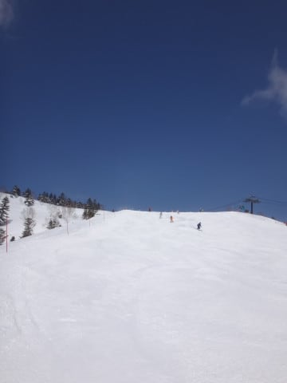

こんなにすっきり晴天なのに，雪質は最高！

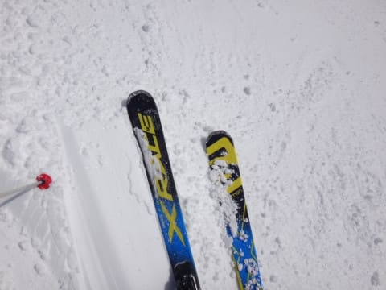

完全にトップシーズンの雪質だよ…これ．

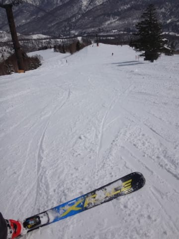

でも．

さすが3連休．

10時を過ぎると，コース上の人がちょっと増えて

来ましたね…

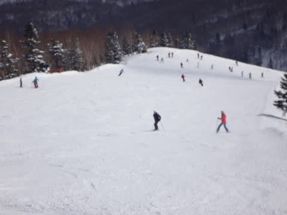

ってか，かなり増えてきましたね（泣）

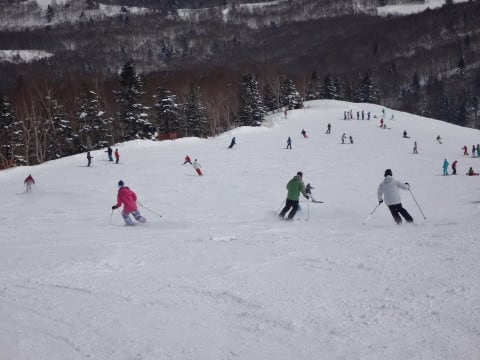

だけど，輸送力が高い焼額第1ゴンドラ．

こんな状態でも，ゴンドラ待ちはゲートの外まで

延びることはなく．

搬器数台待てば乗れるレベルの混雑で．

うーむ．

3連休で待ち時間がこんなに短くて，いいの？？？

ってレベル．

で．

気温は昼間もマイナスをキープし．

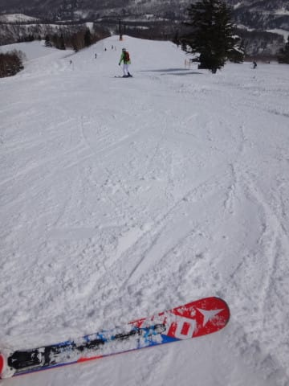

午後になっても，この時期としてはいい雪だったんだけど…

…でも．

焼額の東～南斜面側．

日が当たっているので．

緩むというところまでいかなかったけど．

ちょっと雪が固まってきた感じ…

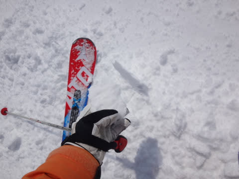

だもんで．

また，北斜面で雪質が良いだろう奥志賀へ戻って

みましたが…

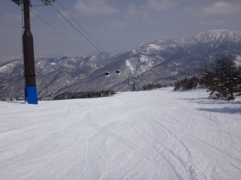

うぉ！！

やっぱり北斜面．

雪がいいよ！

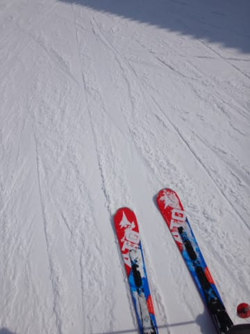

奥志賀ゴンドラ側ダウンヒルコース．

3月午後とは思えない最高雪質！

…なんだけど．

待ち時間のほとんどない焼額と比べ．

奥志賀ゴンドラは，午後1時を過ぎても

ゴンドラ平均5分待ち…（涙）

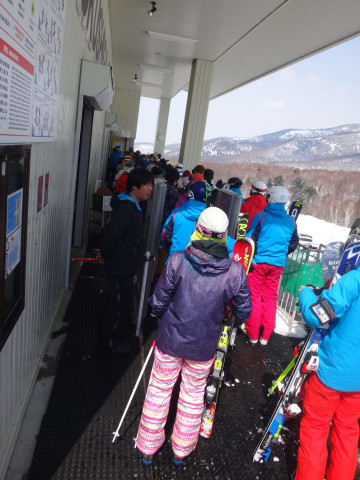

だもんで．

ゴンドラは避けて，高速リフト側のエキスパートコースへ！

うむ．

こっちも，この時期としては超実にいい雪の，

最高バーン！

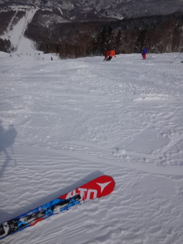

気持ちよく飛ばしたい放題！

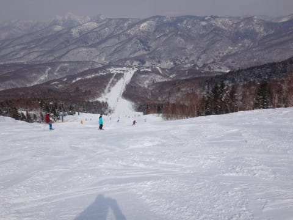

うはははは！

3月下旬でこんなにいい雪を滑れていいんだろうか…！！？

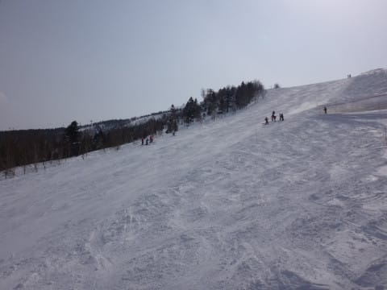

…って感じで，気持ちよく3時ごろまで飛ばし続けて

いると…

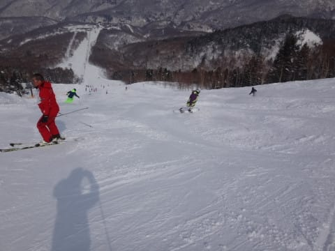

ありゃ？

それほど深くないけど，コース全面，ちょいと

凸凹になってきて…

そして，コブ溝部分には硬い下地が…（泣）

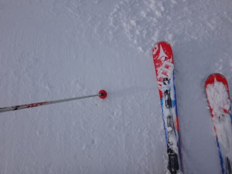

でもまぁ．

最終的には，まだ大回りできるレベルの

しっかり冷えたゲレンデ状況なので．

条件としては，結構良かったかな～．

…ってことで．

焼額ホームの私が．午後4時45分と，焼額より15分長くゴンドラが

動くという点にもひかれて，結局奥志賀で，

ラストまで滑ってしまいました…

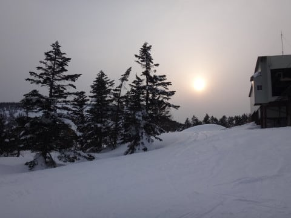

で．

まだ終わらない．

そう．まだ終わりませんよ～．

はい．ナイターです．

でも，いつもと違って，サンバレーナイターです！

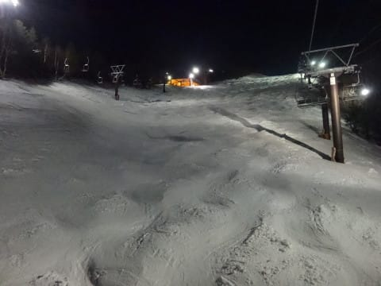

今日も，クワッドリフトで営業です！

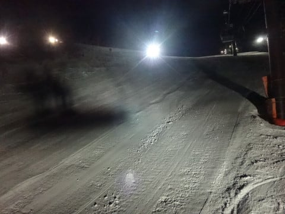

ちょっとゲレンデの圧雪は甘いところが時々あったけど．

でも，シマシマをたらふくいただいて．

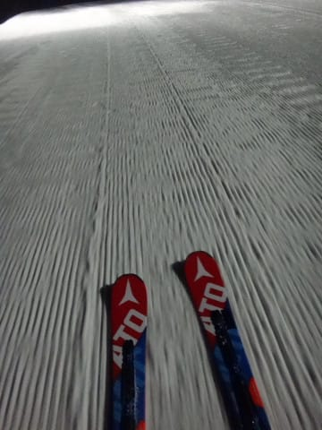

この日のナイターも，結構楽しかったかな～．

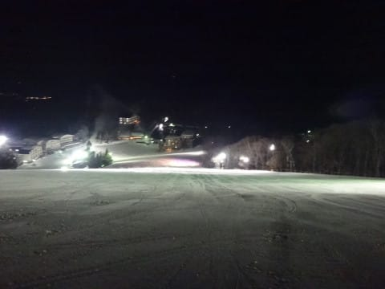

とりあえず．

昼間も，ナイターも．

全く3月下旬と思えないいいコンディションが続き．

恵まれてるな！！

## 💬 コメント一覧

### 💬 コメント by (れお)
**タイトル**: 奥志賀早朝は、強風のため
**投稿日**: 2017-03-19 06:29:02

ゴンドラ＆２高は運転見合わせとのことでした…。迷いましたがヤケビに来ちゃいました。もし朝一奥志賀行かれるようでしたら、確認されることをおすすめします〜!

### 💬 コメント by (Skier_S)
**タイトル**: れおさま
**投稿日**: 2017-03-19 09:00:26

情報ありがとうごさいます～！

奥志賀スタートはあきらめ、1ゴンスタートに

しました…

奥志賀ゴンドラ動いてないから、1ゴンいきなり混んでます(;_;)

### 💬 コメント by (michi)
**タイトル**: Unknown
**投稿日**: 2017-03-19 11:50:07

昨日は本当に天気も雪質も良くて最高でした。

3月中旬にあの雪質。素晴らしいですね。

夕方になってもそれほどコブコブにならず良かったです。

大回り用にもう少し長めで硬い板が欲しくなり物色中。また物欲に負けそうです（笑）

### 💬 コメント by (かず)
**タイトル**: Unknown
**投稿日**: 2017-03-19 18:59:50

今日隣動いてくれて助かりましたよ　12時に宿に帰るつもりでした　ほんと土曜の朝の奥志賀最高でした さすがにあれは今シーズン無いでしょうね

### 💬 コメント by (Skier_S)
**タイトル**: 今日は混みました…
**投稿日**: 2017-03-20 00:10:10

＞michiさま

ぜひ，連続での物欲選手権を

開催してください（笑）．

朝イチ焼額には，ロングの板がいいですよ～！！

＞かずさま

午前中はたまりませんでしたね…

奥志賀が動いてくれて良かったです．

今日の奥志賀も良かったですが，

第2高速ペアが混んだのがちょっと残念…

