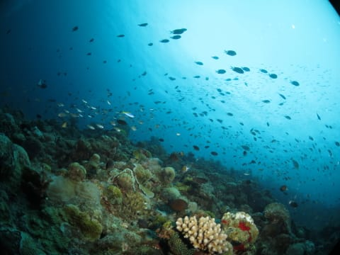
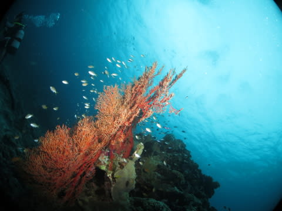
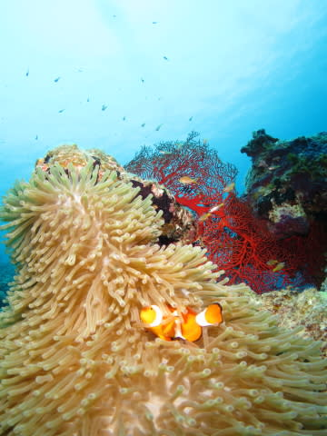
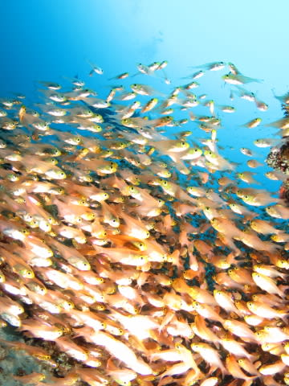
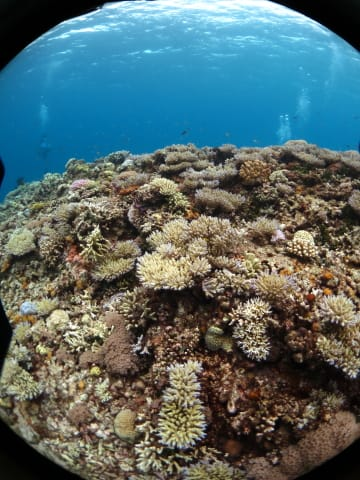

# 沖縄・ケラマ諸島は…大雨（涙）

📅 投稿日時: 2016-08-07 21:33:16

ということで．

座間味にダイビングに来ているわけですが．

…いや，もう．

あれですよ．

金曜は完全徹夜で仕事を終えて．

＃終えたことにした，という説もあり

出発30分前に，上司にメールを送り付け．

何とか，旅行先に仕事を持ち込むことなく，

無事出発できました…

で．

どうやら，

全国的に夏らしい天気になってるらしく．

スカッとした，暑い日差しが全国で照り付けているようですが．

…だというのに．

なぜか，沖縄だけは大雨洪水警報中（涙）

今日も終日雨が降り続ける悲しい天気なのですが…

そして，気温も夏っぽくなく．

風も吹き付けて…

泳いだ後なんかは

「ちと寒いかも？」

と思うほどなのですが…！？？

なぜ？

一体私が何をしたというの？？？←だから，いっぱいやってるから

到着した昨日も，そして今日も．

終日雨が降ったりやんだり，

お日様は顔をださず，

時折強く降る感じで，泳ぎたくなる天気じゃありません（泣）

まぁ，潜ってしまえば雨が降っていようが一緒なんですが．

水中に日が差さず，全体的に暗い写真に

なっちゃいます…（悲）．

でも．

まぁ．

台風で潜れないよりはましだな．

うん．台風よりは，マシだ！！

…と，自分に強く言い聞かせて．

仕事を忘れて楽しんでます．

明日は早くもラストダイビング．

そして…明後日から仕事か（泣）

とりあえず，台風が来ず，水温が上がりまくって

サンゴの白化が進んでいるらしい，沖縄本島近辺．

慶良間諸島は，まだサンゴは元気です．

明日一日楽しんできます～！！
