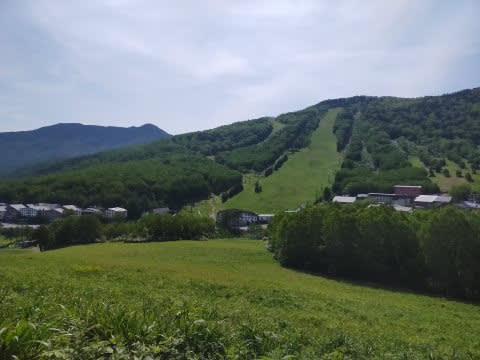
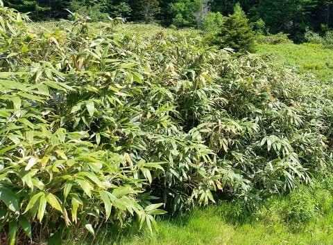
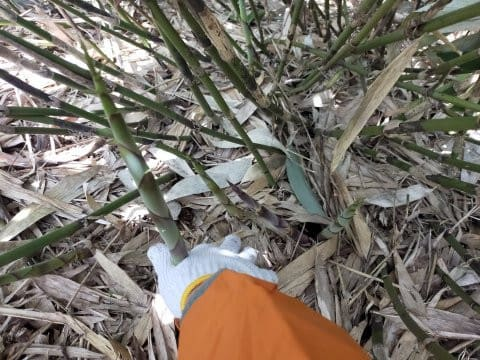
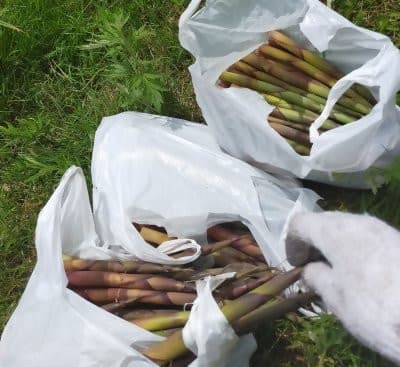
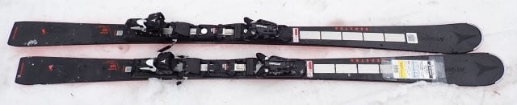
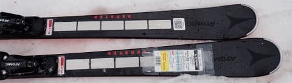
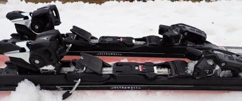
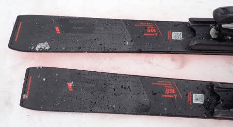
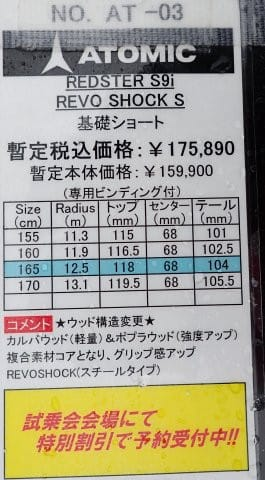

# 2024シーズンモデルのスキー板，試乗レポートその17…ATOMIC REDSTER S9i Revoshock S

📅 投稿日時: 2023-06-22 04:12:06

🏷️ カテゴリ: [スキー板試乗](c0bd8048615710cee890e403a36cc9a2b.md)

ってなことで．

昨日の記事で，この土日にVMGレヴォーグ君の

車検の代車で計四を借りた話をしましたが．

軽自動車で長距離高速移動はさすがに

辛いだろうし，この土日は出かけるのは

あきらめよう…

と，思っていたのですが．

久しぶりに晴れるという週末の天気予報に

誘われて．

なぜか日曜朝4時に起きて，軽自動車で

日帰り往復500㎞走ってきてしまったのでした…

しかし．

わざわざ軽四で草津越えを越えて，

また志賀高原に行ってしまった私は．

やっぱり志賀高原愛が強いのかも…

何をしてきたかって？

毎年恒例の，ささやぶに入りこんで．

こんなことをしてきました…

いや．

ちょうど今週末がピークだったみたいで，

竹の子，大漁でした…！！！

しかし，軽自動車で往復10時間かけて

志賀高原までいってきたというのに．

家の夕食に間に合うように，

志賀高原現地滞在わずか2時間ちょいで

トンボ返りでした…

ってなことで，本題へ．

本日も2024シーズンモデルのスキー板の

試乗レポート．

今回はアトミック編です．

では，どうぞ～！

〇ATOMIC REDSTER S9i Revoshock S　165㎝

基礎小回り

今シーズンモデルと見た目ほぼ同じに見えますが，

コアの材質が変更となり，フレックスなどの

調整が入ってるらしい，来シーズンモデル．

履いてみたところ…

確かに，今シーズンモデルよりちょっと

フレックスが強くなったかな？

ちょっと張りが強くなったように感じます．

ただ，この日の試乗したコンディションが，

かなり湿った重い雪が2－3㎝積もった

難しめのコンディションだったのもあり…

グリップ感がそこまで強く感じられず，

どちらかというと，板を動かして谷回りを

捉えていく板．

山回りでもがっつりとしたグリップ感で

エッジに沿ってキューンと切れていくというより，

板を動かしてターンを作っていく板に感じました．

板のしなやかさは感じつつも，トーションも

柔らかめなので，板が動かしやすく，

動かすとスムースな旋回力を持っているので，

板を積極的に動かしていく小回りに

向いていそうな感じ．

ズレズレというわけではなく，切っても

行けるけど，ずらしていっても素直に

回ってくるので，非常にリスクが低く，

低速から使いやすい板だと思います．

圧をかけていくと，エッジがズルっと逃げる

わけではなく，エッジの圧感を保ったまま

じりじりと板が動いていき，板が動いた中で

ターンしていく感じ．

逆に言うと，がっつりグリップのカービング

強制マシーンじゃないので，そこそこの斜面は

カービングで滑っていき，ある程度の急斜面は

板を動かして丁寧に滑っていきたい…

という人に良いかも．

板なりに滑らさせられる板ではないので，

コブや荒れた斜面でも板を動かしやすく，

怖くないし滑りやすいです！

体力・脚力がなくても扱えそうな，非常に

扱いやすい板．

…ただ．

ハイスピードでガンガン横Gをかけて

滑る板ではないので，

私にとっては，もう少しがっつりグリップで

刺激が欲しい感じですが．

おそらく，ハイスピードでがっつりエッジに

沿った，キレキレのカービングの刺激が欲しい

人は…

おそらく，S9i Proを買ってね，ということ

なのかと．
