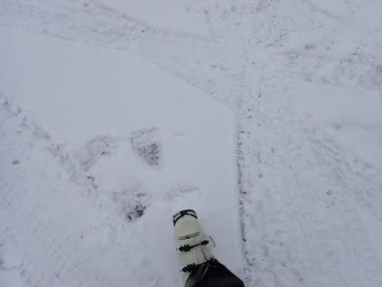

# 2023/12/2(土)の志賀高原焼額山スキー場は…滑れるのは第4ロマンスリフト1本だけど，コース幅いっぱい滑れてガラガラ！

📅 投稿日時: 2023-12-03 02:03:12

ということで．

今シーズンもやっと帰ってきました，

わがホームゲレンデの焼額山スキー場！！

いやー．

やっぱり，いつものメンバーに会うと，

帰ってきたという感じですね～…

で．

今朝，久しぶりの志賀高原の登り坂は，

完全に雪景色！

今シーズン初の本格雪道．

結構滑るので，明日志賀高原に来る方は

ご注意ください…

本日運行しているリフトは，第4ロマンス

1本のみ．

朝8:30の営業開始時点で並んでいたのは

この程度と，想像よりずっと人が少なく，

ガラガラ！

昨日からの積雪量は5㎝程度と，いまいち

積雪が足りず，

残念ながらゴンドラは動きませんでしたが…

でも，第4ロマンスリフト沿いのコースは

人工雪と合わせて積雪量は十分！！

もう少しコース幅が狭いかと思っていたら，

コース幅いっぱい滑れます！！

これは…

雪質も，しっかりしまった人工雪のうえに

天然雪が乗って，硬めなのにエッジが噛む

めちゃくちゃ快適なバーンコンディション

じゃないですか！！

うはーーーー！！

天然雪だ！！

イエティのアイスクラッシュと違って，

冷え冷えで気持ちいい，

シマシマバーン！！

そして幅いっぱい滑れて，

久しぶりに大回りができる！！

今シーズン滑走6日目にして，

初めて大回りができたよ！！←かなり偏った環境で滑ってたんだな…

気持ちいい…気持ちいいよ！！

こんないいコンディションなのに，

今日は人が少なくて…

リフト待ちも終日この程度と，せいぜい

待って数人程度．

ガラガラです！！

バーンはちょっと人口密度が高い瞬間も

あったけど，それでもこの程度で

イエティに比べれば天国！！

タイミングによっては完全クリアなコースを

攻められて…

いや…最高…

最高なんですが…

（対イエティ比）

で，

天気は終日曇ったり雪が降ったりで，

時折雪が強く降り…

バーンの上に，うっすら新雪が積もる

時もありましたが．

うっすら日が差すタイミングもあり．

気温は低くて，

1㎞の長いペアリフトなので乗車時間10分近く，

その間に体が冷えて，寒かったけど．

…でも，こんないいコンディションで

幅いっぱい滑れる，ガラガラの1㎞近い

ロングコースを思う存分滑れて．

かなり楽しかったです…！！

ってなことで．

今日もリフトストップの16時まで，

たっぷり滑りました～！！

いや…よかった．

ペアリフト1本だけだったけど，

ガラガラだったし，人が少なかったので

雪も終日荒れず，思ったよりいい

コンディションのマイホームゲレンデの

シーズンインだったのでした…

また明日も焼額で滑ってます！

## 💬 コメント一覧

### 💬 コメント by (横須賀のウルトラセブン)
**タイトル**: 祝ヤケビシーズンイン
**投稿日**: 2023-12-03 05:53:50

Sさんお久しぶり～セブンです！今シーズン初ヤケビおめでとうございます！セブンは本日タイヤ交換で

来週シーズンイン予定です。（もち志賀のシーズン券購入済）昨日のスノーナビのヤケビレポに極さんの

姿も写ってました～皆さん今シーズンよろしくです❕

### 💬 コメント by (ねも)
**タイトル**: Unknown
**投稿日**: 2023-12-03 16:12:58

Ｓさん　やりましたね！

焼額山スキー、羨ましい(^^;)　特に｢イエティに比べれば天国!!｣に座布団１枚(笑)

良いシーズンになりそう？　私も楽しみ✌️

### 💬 コメント by (Skier_S)
**タイトル**: 志賀高原初すべり完了
**投稿日**: 2023-12-04 03:03:17

＞横須賀のウルトラセブンさま

お久しぶりです～！

来週シーズンインですか！また志賀高原でお会いしましょう！！

＞ねもさま

もう，シーズン中にはとても乗ろうと思わない遅い4ロマでも，

イエティに比べれば天国です…

シーズンインはいい感じだったので，今シーズンこれからも暖冬にならず，

いいコンディションが続いてくれることを願うばかりです

