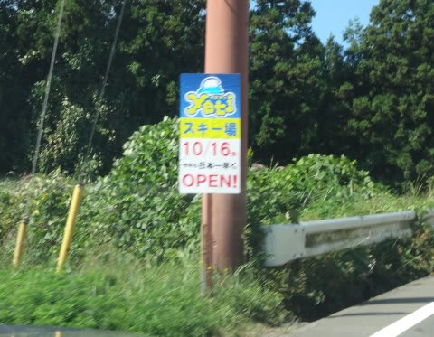
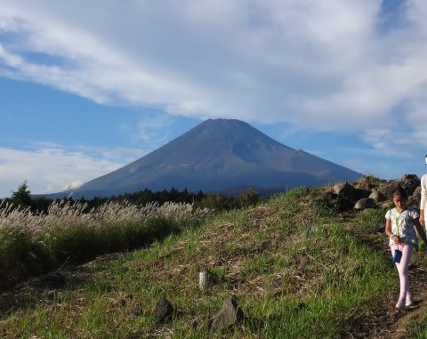
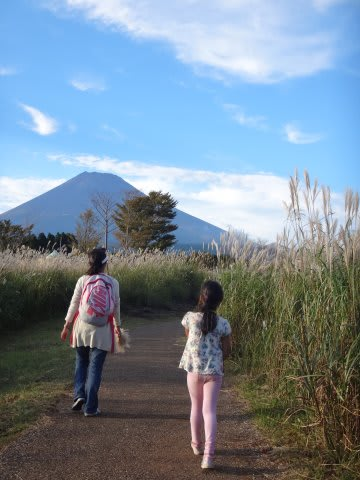

# そして，先週末も…

📅 投稿日時: 2015-10-07 01:56:39

えーっとですね．

先週末，とあるところを車で走っていたところ．

…道端に，なんだか，こんな看板が出てました．

この看板を見て．

あぁ．

あと2週間で，シーズンインだなぁ…

…とい思った，Skier_Sなのですが．

この看板を一体，どこで見てきたかというと．

この週末は，また，静岡県まで行って，

こんなところを歩きまわってきました…

最近，トレッキングがお気に入りとなりつつある

我が家ですが．

いやー．この日は，

富士山がきれいに見えましたね～！

…しかし．

私の気記憶が確かなら．

この前の週は，北海道に旅立ってた気がするのに，

この週末は，また静岡県まで行き．

…

…

で，今週末は．

…たしか，西表にダイビング遠征に行くはずだった気がするのだが…

…まだ，全く準備していないのですが．

そして，もしかしたら．

西表から帰ってきて．

3日ほど仕事をしたら．

…Yetiで初滑りのような気がするのだが？？

なんだかやっぱり，

ご無体職場のストレスのおかげで，

毎週山か海に行かないと死ぬ身体になってしまっているので．

…これは，やむを得ないことだな．

うん．しかたない．←と，自分に言い聞かせてみる

…そして．

Yetiでの初滑りが終わったら．

その後は，5月最終週まで．

毎週のスキー場通いが始まるわけで．

…また，このブログ．

なし崩しの冬モード＆夏モードミックス状態が

しばらく続くなぁ…

…さて．

8月に行ってきたモアルボアル．

去年のパラオ旅行記がやっと終わったので，

そろそろモアルボアル旅行記を書き始めようと

思っているんだけど…

…

…いったい，いつ書き終わるんだろう？？

…そして，今週末に行く西表の旅行記，

一体いつ書き始められるんだろう…？

…期待しないで，待っててください．

## 💬 コメント一覧

### 💬 コメント by (mae)
**タイトル**: Unknown
**投稿日**: 2015-10-07 22:23:19

シーズンが待ち遠しいこの頃ですが、ヤケビの営業期間が4/3までとなってますね。GWまで営業しないのかも。

### 💬 コメント by (Skier_S)
**タイトル**: maeさま
**投稿日**: 2015-10-08 01:05:33

な，な，なんとっ！！！

私も今確認して，初めて知りました…

なんてこったっ！！！！

GWまでやってくれないのか？？

そして，4月やGWの早朝もないんでしょうか…？？

ものすごーーーいショックです．

これまでも4月は土日のみ営業でしたが，

昨シーズンは4月半ばに何かの陰謀（？）で

山の神のリフトが止められたため，

人が少なかったですからね～（涙）．

うーん．

さらに焼額の魅力が墜ちていく…（泣）．

