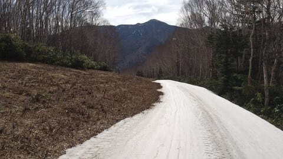

# GW最終日までの志賀高原スキー場の天気を予想してみた…そして4月29日(土)焼額山営業ラストデーの志賀高原スキー場特派員レポート！

📅 投稿日時: 2023-04-30 00:41:29

ってなことで．

わがホームゲレンデの営業最終日だった

本日．

…私は泣きながら仕事してました…(涙)

いや．

焼額の営業最終日に滑れなかったのって，

いつ以来だ…？？

コロナの緊急事態宣言が出てスキーに

行けなかった2020年を除くと，

家の引っ越しでスキーに行けなかった

2016年以来ですか(涙）

でも，それ以前になると…

もう思い出せない過去になります（遠い目）

とりあえず．

焼額営業最終日，それもGWの土日に

出張を入れた私の上司を恨んでもいいですよね？？

恨まれて当然ですよね？？

…というところで．

特派員から送られてきた今日の焼額ラストデーの

写真を見ながら．

遠い地から私が行けなかった焼額ラストに

思いを馳せましょう…（頬を伝う涙）

で．

本日の焼額は…朝のうちは雲が多めながらも，

薄曇り～晴れの天気だったようで．

早朝スタートの6時は，結構雪が硬かった

みたいですね…

でも，7時ごろには気温も+5℃以上に上がっちゃって，

雪も緩み始めてきたようですが…

でも，朝のうちの焼額．

雪が緩み始めたくらいは，結構よかった

みたいです！

まぁ，滑れるのはパノラマコースだけですが…

確かに，一見すごいよさそう！！

サウスコースまで下りてきたところも，

結構まだ幅があるし…

心配していたゴンドラまでの連絡路も，

しっかり雪出しして最終日まで

維持したようです…！！

ただ，朝のうちは良かったみたいですが，

昼頃になるとかなりいろんなところに土が

出てきた汚れた雪になっていき，

滑りがかなり悪かったようで…

焼額の営業最終日のラストゴンドラまで

生き残った特派員はいなかったようです（涙）

一方，明日以降もまだ営業が続く奥志賀高原．

第3ゲレンデはまだまだいけそうな感じ！！

その上の第4ゲレンデも，まだまだ楽しめそう

ですね！！

ただ，第3ゲレンデより下のエキスパート

コースは…

うーん．かなりヤバげな感じ…（涙）

ちょっとこれは，滑るのはきついかな…？？

それよりも，エキスパート下の緩斜面がヤバい．

ちゃんとこんな感じで雪よせして廊下を作って

くれてるところはいいけど…

廊下を作ってない部分は．

これはちょっとあんまり滑りたくない

感じですね…（泣）

果たして．

明日の雨でも，このコースは切れずに残るのか？

…あるいは，切れてしまってゴンドラ往復で

営業するのか？？

切れないでいてくれると嬉しいんだけどなぁ…

で．

気になる明日の天気ですが．

大変残念ながら，志賀高原は29日土曜の夜10時の

段階で，すでに雨になっています（泣）

それも…気温が+10℃を超える，激烈高温の雨です（激泣）

（[北信建設事務所道路気象状況カメラ](http://hokushin.pref-nagano-roadcamera.jp/)より）

この雨は明日まで降り続けますが…

意外にも，明日の9時か10時くらいには

止みそうです…！！

雨が止んだら，風はそこまで強くないと思うので…

明日は全リフト終日運休になるほどの

荒天にはならなさそうな予感…！！

ってなことなので．

明日から一気にGW最終日までの

志賀高原の天気を予想して

みました～！！

4/30(日)：朝9時過ぎまで雨．早朝のうち

　時折強く降り，風も強い．

　朝10時ごろから天気は回復に向かい，

　風も収まっていく．

　昼には晴れていきそうだけど，気温は

　+10℃を超える激烈高温が続き，

　驚くほど雪が解ける一日になりそう．

5/1(月)：晴れたり曇ったりかな…

　プチ低気圧が発生しそうなので，

　そいつの動き次第で天気は変わる．

　朝から気温は+5℃越えと冷えないが，

　夕方に向かって冷えていき，夕方は

　バーンがカリカリになっていく．

　夕方から，雪がわずかにぱらつき，

　夜に向かって積もるかも

5/2(火)：朝は数㎝～10㎝くらいの積雪．

　あさイチは気温0度を下回り，久しぶりに

　冷えたコンデション！！

　でも，天気は終日晴天で日差しが強く，

　昼間に向かって気温がぐんぐん上がるので…

　午前中のある段階で，積もった雪が

　融けて滑りが強烈に悪くなる．

　朝は最高，そのあとは気温が上がり

　ストップ雪の一日

5/3(水・祝)：5連休初日は終日晴れ．

　気温は朝から+5℃以上，昼間は+10度を超え，

　雪はざぶざぶ．滑りがあまり良くない雪に…

　晴れるけど，暑いくらいの一日．

5/4(木・祝)：この日も晴れてくれそう．

　前日と同じく朝から高温．

　朝から雪はざぶざぶで，昼間は滑りが

　悪い雪になる．

5/5(金・祝)：おそらくリフト営業中は曇り．

　夜に雨が降り始める．

　終日気温は激烈高温．朝から雪は緩いし，

　昼間は+15℃を越えるかも？？？

　…でも，日差しがない分雪はまだましかな…

5/6(土)：雨．朝から雨．いつ止むかまだ不明．

　気温が激烈高温の雨なので…

　この日で息絶えるゲレンデは多そう．

　下手するとこの日で志賀高原は終わるかも…

5/7(日)：皆さんの行いが良ければ

　この日も渋峠と熊の融の下半分くらいは

　滑れるかも…

　今のところ天気はまだ不明ながら，

　朝まで雨が残り，その後晴れる

　可能性は高いけど…

　まだどうなるかわからん．

うーん．

2日以降，雪が降ったり冷えることは

なさそうな予想です…(涙）

特に5連休に入ってからは高温が続き，

さらに6日の雨でとどめを刺されそうな

予感です(激泣）

ただ．逆に言うと，5日くらいまではまだ

滑れるゲレンデがありそうなので．

GW前に全滅する

と思っていたのに比べれば，まだマシな

状況なのかも…

とりあえず．

GW後半に滑ろうと思っている人は．

これから激烈に寒いギャグを連発して，

GW後半まで寒い日が続くように

努力してみましょう…

PS.「布団が吹っ飛んだ」「ストーブがすっ飛んだ」

　程度では全く冷えないことは実証済み．

　もっと聞くのがつらいレベルの寒いギャグを

　お願いします…
