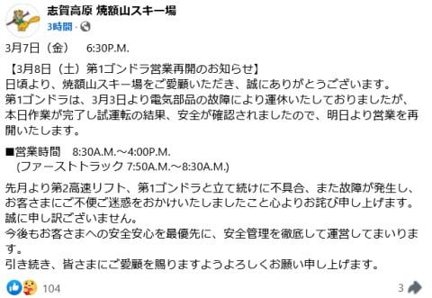
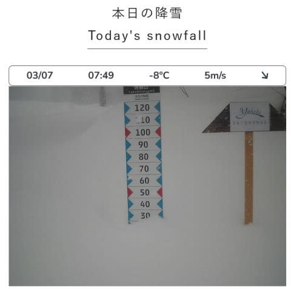
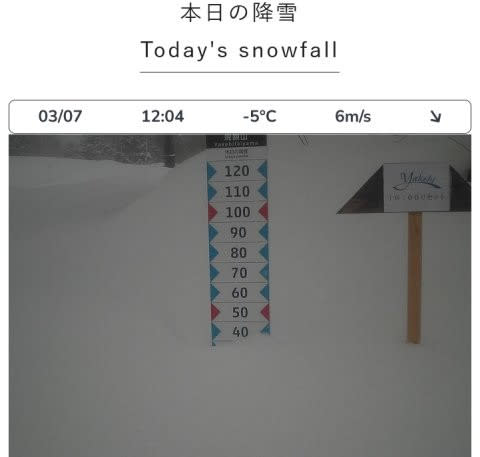

# 明日から志賀高原で滑ってます！…この週末は基本土日ほとんど晴れで，冷えて雪もいい，恵まれた週末になりそう！！

📅 投稿日時: 2025-03-08 12:19:33

🏷️ カテゴリ: [日記](cc4b5682fb7b8b144980957a978653fb0.md)

えー．

3日月曜より故障で運休していた，焼額

第1ゴンドラ．

ようやく修理が終わり，明日から運転再開

するようです…！！

（[焼額山スキー場Facebook](https://www.facebook.com/yakebitaiyama/posts/pfbid0351bM5o3tCxZHJ62uZQJwUxXKN2C5eJ99JsqTgBBdHEjevsNdFKbEgaQoa2p8pPzLl)より）

これで，週末に第1ゴンドラが動かないという

最悪の事態は避けられたか…（一安心）

で．

本日7日(金)の焼額山ですが…

朝イチまでにかなり冷えた軽めの雪が

20~30cmほど積もったようですよ～！

([焼額山スキー場ライブカメラ](https://www.princehotels.co.jp/ski/shiga/livecamera/)より)

予想通り，午前中はかなりの勢いで雪が

降り続け…

昼までにさらに10cm以上積もり，

今日1日で合計40cmくらい積もったみたい

ですね…

これで5日の雨でやられて凍った下地の

硬い雪が隠れてくれたようで．

明日の朝イチのバーンコンディションは

かなり良くなったみたいです！！！

とりあえず，この週末の最終的な天気の予想は．

8日(土)：朝までの積雪はほぼ0．

　朝イチの気温は-9℃．

　朝は前日の雪が圧雪された，

　トップシーズンのシマシマバーン！

　朝から晴れ，午後は曇っていくかも．

　午後は急斜面とかで下地のカリカリが

　出てくるところがわずかにあるかも

　しれないけど，　

　終日気温はそんなに上がらず，

　雪質は終日Good！！

　そこそこいい天気の中，

　いい雪で楽しめそうな一日！！

9日(日)：たぶん朝イチは曇り，

　だけど，昼前に晴れる．

　運が良ければ朝から晴れ！

　朝イチの気温は-10℃近い．

　プチ低気圧の位置によっては，

　もしかすると前日の夜に数cmの

　積雪があるかもしれないけど，

　朝イチはいい感じに締まった

　トップシーズンシマシマバーン！！

　昼間もマイナス気温なので雪は良く，

　終日荒れないトップシーズン雪を

　太陽の下滑れる，いい一日！！！

という感じで．

この週末はまだまだトップシーズンの

感じで滑れる，良い週末になりそうです！！

…しかし．

また12～13日にかけて，気温が上がって

液体が降りそうで．

そのあと，15日までにはゲレンデが回復

するかどうかかなり微妙なので．

ヘタすると，土日ともトップシーズンの

雪で滑れる最後の週末かも…！？？？

…てなことで．

先週滑れなかった私としては

仕事が終わってなかろうが，

睡眠時間が週平均5時間切って

いようが，

何があっても今週末は志賀高原で

滑りに行きます！！！

あと4時間後に出発です…！！

今日もいつも通り，3時間ちょい睡眠で

出発ですが（涙）

では，志賀高原で会いましょう！！

## 💬 コメント一覧

### 💬 コメント by (hapi44)
**タイトル**: Unknown
**投稿日**: 2025-03-08 13:02:16

やっとですね！

行ってらっしゃいませ😆

Sさんのゲレンデ報告楽しみにしてます！

### 💬 コメント by (Skier_S)
**タイトル**: Unknown
**投稿日**: 2025-03-08 22:50:52

>hapi44さま

レポートかきました〜！

今日は思った程よくなかった感じ（涙）

でも、２週間ぶりのスキー、楽しんできましたよ〜！！

### 💬 コメント by (ねも)
**タイトル**: Unknown
**投稿日**: 2025-03-09 06:02:31

いやぁＳさんの志賀高原愛には、誰もかなわないと思います👍 表彰状もらえるかと😅

安比高原に来ています⛷️　滑りは楽しいですが……

６日に来るとき、東北新幹線トラブルに巻き込まれました、いや当事者かな？(笑)

自分が乗っていたはやぶさ21号が、あんなにでかでか報道されていたとは(ﾟ-ﾟ)

### 💬 コメント by (Skier_S)
**タイトル**: ＞ねもさま
**投稿日**: 2025-03-10 00:24:27

え！？？

あの連結が切れたはやぶさに乗ってらしたんですか…！！

いろんな意味で引きが強いですね…（笑）．

安比，カリカリバーンじゃないんですね．

楽しんできてください！

