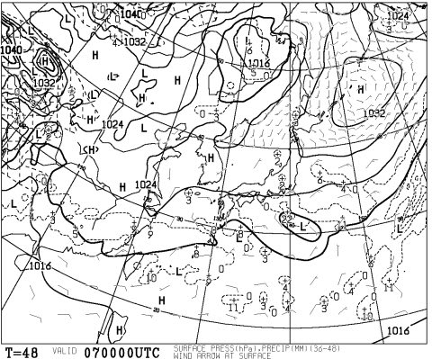
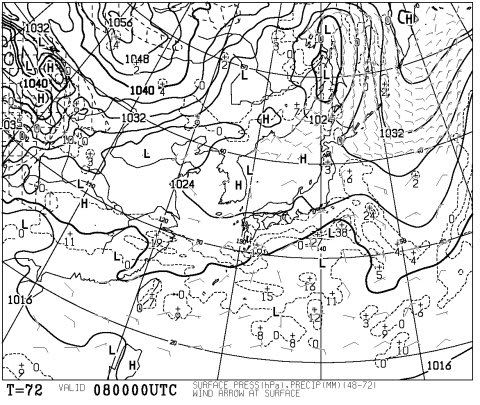

# あれれれ？昨日の天気図と微妙な違いなんだけど…土日は晴れるかも．

📅 投稿日時: 2015-03-06 00:35:47

🏷️ カテゴリ: [スキー天気予想](c6554f5c3c106093b511a8daae23757e8.md)

えー．

やはり．

南岸低気圧の予想は難しく．

7日の天気図がこんな感じになり…

あれ？低気圧，予想より南にずれた？？

と，思ったら．

8日日曜の予想図も…

…予想されてた低気圧，ほとんど発達しないまま，

かなり南に抜けちゃう予想になり．

…この予想図だと．

土日，全く降りませんよ．

それどころか，晴れそうですよ．

気温がめちゃくちゃ上がることもなく，

ちょっと暖かめではあるけど．

いい感じの土日になりそう…

＃午後は下地のアイスバーンが出てくるかもしれないけど

うーん．

わずかな低気圧の南北のずれで大きく予想が変わる

南岸低気圧の難しさ…

でも．

当然．

明日になったら，また予想が変わる可能性もあるので．

また，明日に再度予想します…

…このままの予想であってほしいな～！

＃2日続けて天気予想になっちゃった…
