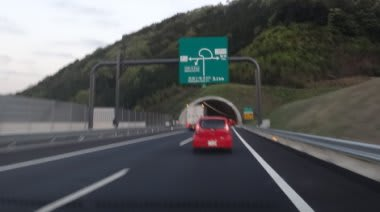
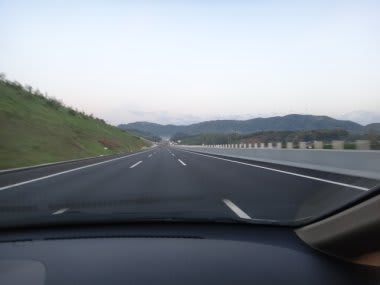
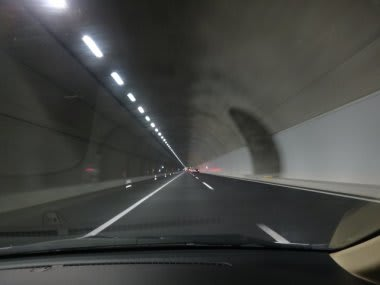

# 新東名走ってみたよ

📅 投稿日時: 2012-04-28 20:48:36

あー．

夜中2時に出発し．

朝方，無事関西某所に着いたわけですが．

今回，新東名を走ってみました．

GW初日ということもあり．

朝4時～6時ごろに走ったというのに，

結構交通量は多かったですね～

それどころか，SA,PAが早朝4時ごろというのに

ほとんど満車ってのにびっくり…

新品ぴかぴかの道路，走っていて気分は良かったですね～．

周りの車の平均車速は，法定速度の10%～20% の増量キャンペーン

って感じで．

結構スピードを出しても安心できる道路ですな～

…でも．

予想外に．

全線3車線かと思ったら，一部3車線だったんですね…

半分以上2車線でした．

でも，トンネルとか橋とか切り通しとか，すべて

3車線規格で作ってあるので，3車線幅のトンネルを

わざわざ2車線で使っているというもったいない状態…

このトンネルなんかも，意味もなく路肩が広いんですが．

どうして全線3車線にしてないのかな～？？

ちともったいない．

だけど．

部分3車線とはいえ．

GWのこの時期．

渋滞することもなく，気持ちよく飛ばして走れるってのは，

ありがたいことです．

PS．旧東名と合流した後，渋滞のメッカである岡崎近辺が

　3車線化されてました…

　でも，2車線規格のところを車線の幅と路肩を狭めて

　強引に3車線化したので，車線幅は首都高なみで，

　制限速度が60kmになっていたという…
