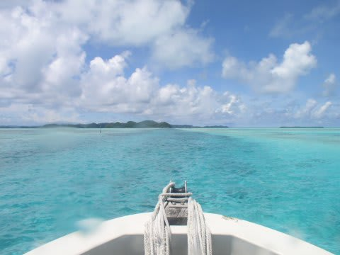

# なぬ？今の小学校には秋休みがあるだと…？

📅 投稿日時: 2014-09-23 02:23:05

ということらしいんですよ．

ええ．

なんというか．

自分が子供のころに夢に見た，

秋休みですよ．

あ・き・や・す・み．

…今の小学校は，そんなもんがあるんですね～．

…いや．

そのかわり，

うちの娘の小学校，夏休みが短くて．

「え？8月末まで夏休みなんじゃないんだ…」

と，驚きながらも．

娘の学校に影響がないよう，今回のフィリピン旅行を

計画したわけですが．

先日，カレンダーを見ていて，

思ったわけですね．

…そうか．

10月に，娘の秋休みがあるのか…

ちょうど3連休と重なる形で，秋休みが…

いろんな大人の事情で[7月の旅行を
キャンセル](e6634c756cf96be04f2ce6dae3b62b2d9.md)することになり，

会社が認める夏休み5日間のうち，

3日しか休みを取れなかった今年．

＃8月に夏休みパート1としてフィリピン・オスロブ，

＃9月に夏休みパート2として，石垣に行っている気がするけど，

＃そこは突っ込まないこと←9月は3連休利用だったので，会社は休んでないし(言い訳)

いろいろご無体職場のストレスで，何かの

リミッターが外れてしまっていたらしく．

っつーことは．

…一日会社を休めば．

行けてしまうなぁ…．

…一日だけ，会社を休めば…

ってことで．

…なんだか，正気を失っている間に．

私の手元に，10月の3連休に絡めた，

パラオの予約完了メールが届いていたのだった…．

果たして．

ホントにこの日に休みが取れるのか．

まだ未定だけど．

10月には，秋休みとして．

子連れでパラオに行ってきます～！

…会社は1日しか休まないんだけど．

…キャンセルにならなきゃいいな…（願望）

＃…しかし．

＃パラオから帰ってきた次の週が，

＃Yetiオープンのような気が…

＃ダイビング⇒翌週スキーのパターンか？？

## 💬 コメント一覧

### 💬 コメント by (KENKEN)
**タイトル**: なぬ？子連れでパラオでダイビング？
**投稿日**: 2014-09-23 20:57:43

ダイビングですよね？

どちらのショップでしょうか？

ブルーコーナーとか子連れで行けるのでしょうか？

子連れOKなら、ぜひ当方も行きたいですが・・・・・

### 💬 コメント by (マルハバ)
**タイトル**: これは・・
**投稿日**: 2014-09-23 22:06:47

帰り道のジャーマンチャネルですね？

### 💬 コメント by (伽羅。)
**タイトル**: なんと！
**投稿日**: 2014-09-24 00:55:35

秋休みなんてものがあるんですね！

うらやましい…

Sさんのアクティブさ、見習いたいです

### 💬 コメント by (Skier_S)
**タイトル**: ダイビングです
**投稿日**: 2014-09-24 10:01:53

>KENKENさま

ダイビングです～

子づれ乗船可のショップが

みつかったので…

コーナーとか、シュノーケル

できなさそうだけど、娘どうしよう？

＞マルハバさま

正解です！

世界中のダイビングスポット、写真を

見ただけで当てますね(^^;)

>伽羅さま

このアクティブさをまねしたら、

お金がいくらあっても足りないかも…

### 💬 コメント by (KENKEN)
**タイトル**: コーナーへのシュノーケルツアーありますすね
**投稿日**: 2014-09-24 20:38:44

調べてみると２つのショップ(スプラッシュ＆マーメルダイバー)でダイビングと一緒にコーナーでシュノーケルが出来そうですね。

あの激流で子供がシュノーケルなんて出来るの？ってちょっと不安ですが。

でもコーナーならシュノーケルでも面白そう。

うちも行っちゃおうかな・・・・・・

でも沖縄(西表)の旅費の倍位するな・・・・

うーん悩む。

### 💬 コメント by (Skier_S)
**タイトル**: KENKENさま
**投稿日**: 2014-09-25 00:50:40

そうそう，ダイビングショップを

聞かれていたんでした…

ショップはデイドリームさんですが．

普通は子供乗船は断っています．

今回，我が家はいろいろあって，

娘もコモドでのクルーズ船経験も２回あり，

異常に船に慣れているということで

特別に許可してもらったものです…

しかし，ブルーコーナーでシュノーケルですか？？

ドリフトシュノーケルじゃないと辛そう…

で．

パラオのお値段，西表の倍しますか？？

我が家は，ダイビングフィー込みツアー，

安めのホテルで申し込んだので，

西表と変わらんなぁ…と思ったり

したのですが…

私にとっては西表の方が

イメージ的に高い場所です(笑）．

### 💬 コメント by (KENKEN)
**タイトル**: コーナーでのシュノーケルは・・・
**投稿日**: 2014-09-27 21:14:18

ショップに問い合わせてみたところ、シュノーケルは

ドリフトや船のロープや梯子につかまってするそうです。

またガイドはつかないとのことでした。

ダイビングポイントには連れていくので勝手に泳いでねってことのようです。

5歳からOKとは書いてますが、ちょっと怖いですね。

パラオ旅費は確かに西表の倍までは掛かりませんね。

ただ、燃料追加料金や空港使用料、パーミット、夕食(外食)費でやはり足は出ますね。

うちは西表メインで考えてみます。

### 💬 コメント by (Skier_S)
**タイトル**: Re:コーナーでのシュノーケルは・・・
**投稿日**: 2014-09-29 13:01:10

5歳からOKですか！

う～ん。その時は梯子につかまって‥

ってやつでしょうね～

燃油サーチャージと言えば、

今回予約した時の金額より下がったらしく、

差額が戻ってきました！

3人で1万円くらい。

ラッキーです！

