# 2013シーズンのスタートから2週間…11月3日のイエティの詳細レポート

📅 投稿日時: 2012-11-04 17:49:46

🏷️ カテゴリ: [2013スキー滑走日記](c91dbe557f9a69230b1600e48622fdd61.md)

はいはいはい．

お待たせしました．

＃誰も待ってないって

お待ちかねの，Yeti詳細レポートです．

＃だから誰も待ってないって

先日，動画をアップしましたが．

この週末も．

土曜日帰りでYetiに行ってきたので，そのレポートをば．

天気は…

なぜか曇り．

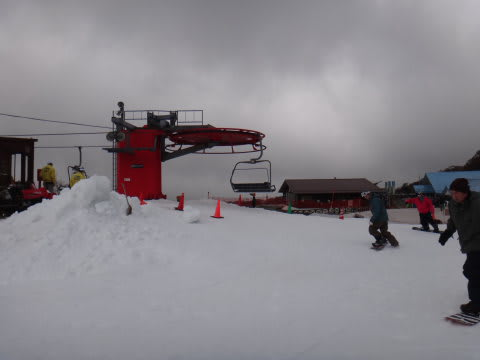

…私の天気予報では，晴れるはずだったんだけどな～．

御殿場の町は晴れてたんですけどねー(負け惜しみ)．

でも．

曇って気温は低めだったので．

雪は壊滅的にどぼどぼにならずにすんだので，まぁ良かったかな．

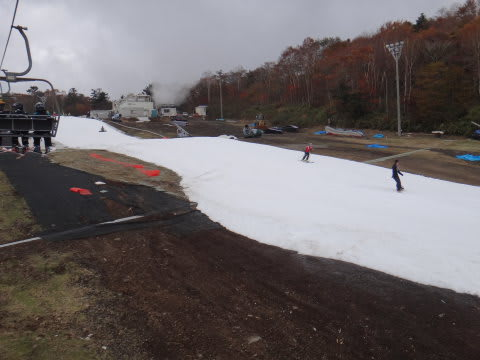

コースは先週よりわずかに広くなってきました．

大体，幅10m前後で続く感じ．

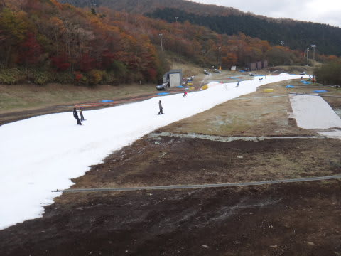

朝の30分は快適に滑れます．

ところどころ，雪が薄くなりかけてるところもあるけど．

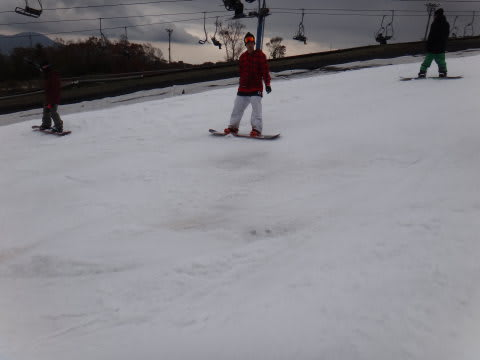

コースに完全に穴が開くことは無かったですね～．

クワッドリフトも，板を履いたまま乗りおりOK.

雪自体は，やわらかめではありますが．

板が潜ってしまうことも無く．

板に張り付くことも無く．

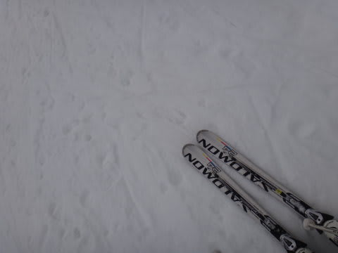

まぁ，いい方ではあったんですが．

まぁ，雪は良かったんですが．

でも．

でも．

この週末．

混んだよ～っ！！（泣）

まず，リフト券売り場から15分待ち．

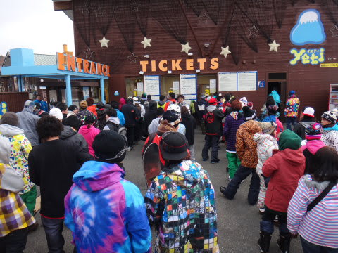

そして，午前9時半には，リフトがすでにこんな列．

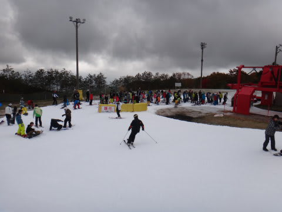

9時半には，クワッドと平行にかかっているペアを動かし始めて，

ちょっとリフト待ちが減るかな～．

と思ったけど．

11時ごろには，ペアリフトもこんな列に…（涙)

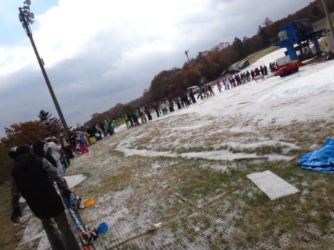

クワッド10分弱，ペア5分待ちって感じかな．

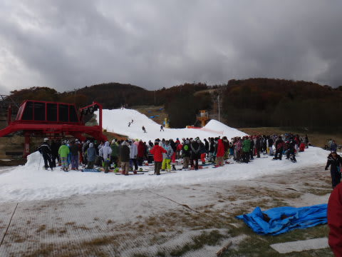

(こっちはクワッドの列)

そして…

ゲレンデは．

普通の神経を持っているスキーヤーなら，滑走意欲を

失ってしまうこと請け合いの混雑．

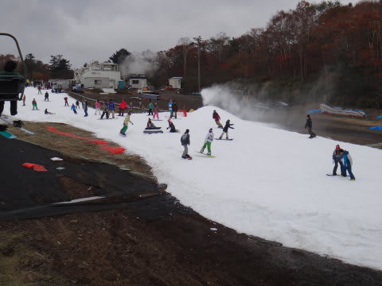

とりあえず．

午後には減るかな？と思ったけど．

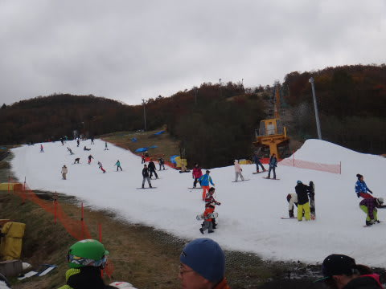

まったく減らず．むしろ増えてるよ…

さすがの私も，午後2時半には退散してしまいました．

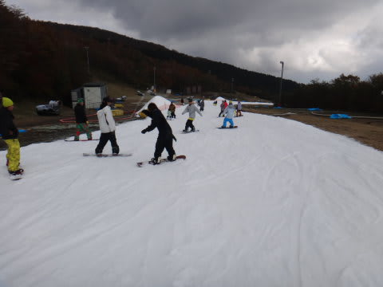

うーむ．

オープンしてから，徐々に人が増えていってるなぁ…．

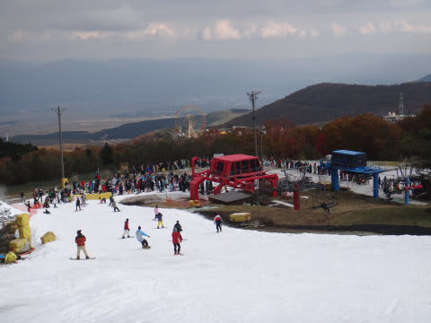

来週は軽井沢がオープンするから，少しは減るかな？

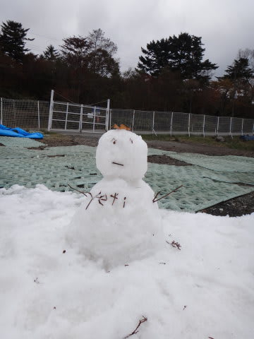

## 💬 コメント一覧

### 💬 コメント by (まこと)
**タイトル**: 楽しみにみてますよ
**投稿日**: 2012-11-05 17:24:32

Skier_Sさんとは面識はありませんがいつも楽しみにみてますよ。

### 💬 コメント by (Skier_S)
**タイトル**: ありがとうございます
**投稿日**: 2012-11-06 02:16:05

楽しみに待っていてくれるとのコメント，感謝です．

励みになります．

冬モードと夏モード，両方に興味がある人がなかなか

いないのか，例年シーズン切り替え時には読者が

減るんですが…

これからはまたスキーメインになりますので，

懲りずにご愛顧のほどお願いします．

