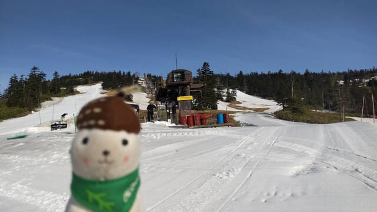
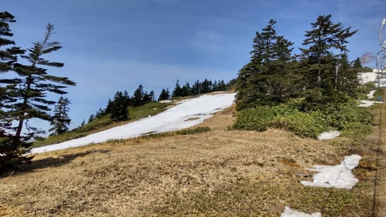
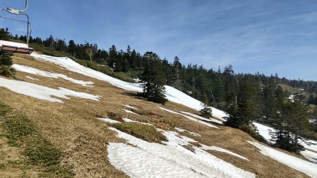
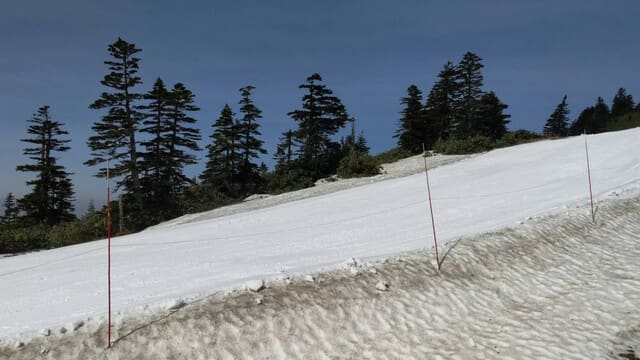

# 今週末，スキーにいくのはあきらめた．残るは月山か…

📅 投稿日時: 2025-05-24 01:11:31

🏷️ カテゴリ: [日記](cc4b5682fb7b8b144980957a978653fb0.md)

昨日は睡眠時間があまりとれず，すごく眠い

Skier_Sです．

…まぁ，私はいつも眠いのが通常運転ですが…←危険だから，それ

しかし．

これだけ眠いのに．

先週もかぐらファイナルに行きそびれ，

今週もスキーで滑らないとなると…

これまで毎週身体を動かし続けた人間と

しては．

「うがーーー！！身体を動かさないと

体が腐る！屋外で運動を…運動をさせろ～っ！」

てな感じで，

何か身体を動かさないとストレス発散に

ならないだけじゃなく，フラストレーションも

溜まっていくので…

こんな状況ですが，明日はせめて陣馬山にでも

山歩きに行ってこよう！！

と，突発的に思い．

今，もう深夜1時を過ぎているというのに．

また朝4時起きで出かけることにしました～！

いや．そんなに朝早く起きなくても…

と思われるかもしれませんが．

ゲレンデも山も混んでいるところが

好きじゃなく，ガラガラのところをマイ

ペースで飛ばすのが好きなので．

朝5時くらいには登り始めておきたいん

ですよね…←健康にいいのか悪いのもはや分からない

ということで．

これから睡眠時間3時間で出発です～！

…実は．

今週末，渋峠に滑りに行こうかとも思ったけど…

やはり志賀草津道路が朝8時オープン

なので朝イチに間にあわないし．

交通費と時間と，それで滑れるゲレンデの

クオリティを考え，渋峠に行くのは

あきらめました…

ってな感じで，行くのをあきらめた渋峠ですが．

今日の渋峠，いつものおこみん特派員によると．

いい天気だったようですね～！

うん．乗り場付近はまだ結構雪があるようですね…

硫安がまいてあるのか，朝のゲレンデは

かなり硬めで板も走ったようですが．

ゲレンデの下の方は…そろそろかなり

幅も狭くなり．

パークのアイテムも数が減ってるのかな…

でも，まだキッカーが残ってますね！

そして，昨日は穴が開いていたようなところも，

渋峠はまだ雪をもってくるところがあるからか，

ちゃんと埋められていたようです…！

でも，ゲレンデはしばらくすると結構

荒れてきたみたいですが…

とりあえず，この土日の渋峠の天気は，

土曜：朝のうちは日も射すか？

　午後は曇り，夕方は雨になりそうだけど，

　リフト営業時間中は降らずにもちそう

日曜：明け方まで雨．意外とリフト営業中は

　止んでるかも？昼間に降ってもポツポツ程度．

　せいぜいパラパラでそこまで強く降らず，

　風も明け方は強めだけどリフトは動きそう

という感じで，ひどい予想だったのが

そこまで悪い天気じゃない感じになって

来ました～！

…でも，私は滑りに行きませんが…

ってなことで．

おそらく今週末で渋峠も終わり．

天元台も昨日終わってしまったので，

残るは月山のみ．

はてさて．

いつ月山に滑りに行こうか…

と考えながら．

私は明日，今年初の山歩きに行ってきます…

## 💬 コメント一覧

### 💬 コメント by (Yoshi)
**タイトル**: Unknown
**投稿日**: 2025-05-24 17:43:48

陣場山に朝５時から、、、すごい

朝ごはん家に帰って食べれそう、笑

### 💬 コメント by (Skier_S)
**タイトル**: >Yoshiさま
**投稿日**: 2025-05-25 19:54:17

はい…山頂でもカロリー補給しましたが，10時ごろに帰宅してもう一回

朝ごはん食べました(笑)

