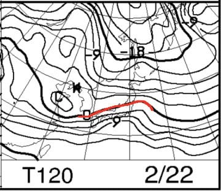

# 2019/2/17(日)の志賀高原スキー場，詳細レポート！…冷え冷え，ガラガラ，午後は晴天．ゲレンデは心持ち固めだけどいい感じ！志賀高原遠足の一日

📅 投稿日時: 2019-02-19 01:52:08

えー．

空から液体が降ってくる危機が

迫っている，19日夜～20日朝にかけてですが．

最新の，19日夜9時の天気図を見てみると…

…やっぱり，ダメです（涙）

志賀高原には，水色の+6℃線が

近づいているほどなので…

気温がぐぐっと上がります（泣）．

そして，地上天気図をみると．

大変残念なことに．

志賀高原にも水色の降水域が

かかっているので．

空から液体が降ってくることを

覚悟しなくてはならなさそうです（激涙）

…ただし．

今の天気図のままなら．

降水量はそれほど多くなさそうなので．

ザーザー降るほどまでは行かなさそう…

…なんですが．

図中に赤矢印で示した低気圧が

この予想図より発達するか否かで，

降水量は全く変わりそう…

この予想図より発達しなければ，

ほぼ降水量は無く．

予想より発達すれば，

雨は強くなりそうな感じ…

とりあえず，私が全身全霊を込めて

冷え冷え踊りを踊っておきますので．

低気圧はそれほど発達せず，

雨の降りは弱くなるはず…っ！！

そして．

20日朝9時の850hpa予想では．

うーむ．まだ赤く印した0℃線は

志賀より北で．

志賀高原には，+3℃線が近づいてます…

だけども．

なんということでしょう！

地上天気図を見ると，水色の降水域．

本州のど真ん中だけ，すっぽり抜けていて．

志賀高原は，ギリギリ降水域にかかるか

かからないか…というところ．

これは．

上手くいけば…

19日火曜の昼間はパラパラ雨が降るけど．

19日火曜の夜から20日水曜の朝にかけては，

雨が降らずにすむかも…！？？？

そして．

21日になると…

志賀高原には，こんどは水色の

-6℃線がかかるくらいになってるし．

地上天気図も，日本海側に

降水域がある冬型になってるし．

20日水曜の昼間から21日木曜にかけて．

そこそこ雪が積もり，ゲレンデは

多少回復しそうな気配…

で．

次の危機の22日は．

…昨日の段階の予想より，

0℃線が南に下がってますよ！？？？

ちなみに，参考までに．

これが昨日の段階での，

22日の予想図なので．

0℃線の位置，かなり南の予想に

変わってますね…

だもんで．気温上昇はそれほど

ひどくならなくて済みそうな予感…

そして，22日の地上天気図をみてみると．

低気圧が，志賀より南を通過しそうですね…

このままの予想なら．

志賀高原では，低気圧に向かって

吹き込む風は北風になるので．

雨にならずに済みそう…！

ただ．

低気圧がこれよりわずかに

北にずれて．

低気圧が志賀高原の北を通り．

低気圧に向かって南風が吹き込む

ようになると…

…

…その時は，液体が降るでしょう．

週末の雪質を決定づける，

22日金曜夜から土曜にかけて．

雨になるかならないかは，

皆さんの日ごろの行いに

かかっています．

週末の雪質が良くなるよう．

皆さん，全力で祈り，踊りましょう…！！

…って，これだけで普通のBlogの

本文くらいの分量がありますが．

今日はここからが本題．

日曜の志賀高原，詳細レポート

です！！←このBlog，記事が長すぎるんじゃないの…？？（冷静なツッコミ）

えー．

まず．

日曜の朝．

　朝までは雪がちらついているけど，積雪はほとんどなさそう．

と予想した通り，リフト営業開始前は

雪が降っていましたが…

でも，10cmほどの積雪があったので．

…積雪部分は，予想を外したようだな…（涙）

で．

いつも通りの焼額第1ゴンドラスタートですが．

営業開始前に並んでいる人も少なく．

今日は混まなさそうですね…

あさイチゴンドラで山頂に出ると．

山頂は薄日も射し…

　朝の気温は-10℃を下回る，冷え冷えの朝！

との予想通り，-12℃と冷え冷え！

ゲレンデは，圧雪コースも5cmほどの

新雪が乗っていて…

しっかり締まった固め圧雪の上に乗った，

軽い新雪を蹴散らしながら滑れる

気持ちいいコンディション！

オリンピックコースは，新雪10cmで．

ここも，しっかり下地の上に乗った

軽い新雪を巻き上げながら，

気持ちよくかっ飛ばせるよ！！

いやーー．

トップシーズンの志賀高原らしい，

いいコンディションですね～…

で．

今回，子連れで来ている私．

いつもの子連れの時は，リフト代を惜しんで

小学生無料の焼額でしか滑らないのですが．

本日はスキーこどもの日ということで，

子供の全山リフト券が無料！

…だもんで．

焼額を脱出して．

志賀高原ツアーへ繰り出しましょうか…！

と，焼額の呪いを振り切り．

まずは一の瀬ファミリーへ行ってみると…

一の瀬正面バーン．

雪はしっかり締まってるけど．

アイスバーンというほどではなく．

エッジが適度にかかる，いい感じの

締まり具合！

いやー！

意外と滑りいいよ，これ！！

しばしここで滑っていたいけど…

せっかくだから，今日はいろいろ巡るのだ！

…と．

次にやってきたのは寺子屋ですが．

なぜかここだけ，かなりのリフト待ちが…（泣）．

そして，天気も良くなく，

さらに，雪付きが悪いゲレンデなので．

ところどころ，ブッシュや浮石も

あったので．

早々に脱出して，東館へ！

東館も，今日はガラガラで，

雪も結構いいよ！

そして．

昼ごろになると…

ををををを！！

すっきり晴れてきましたよ～！！

いや，雪質は最高．

天気も最高．

コースはガラガラ…

これは，今シーズン1，2を争う

好コンディションでは！？？？

こんな天気も雪もいいのに，

こんなにガラガラでいいんだろうか…

ってなことで．

高天ヶ原から西館に抜けますが．

西館は，ちょっとコロコロが多くて

残念ながらイマイチな感じ…

そして．

志賀に毎週来ていながら．

今シーズン初めてのジャイアント！

…だって．

ジャイアントのリフト．

高速リフトだったのが，低速リフトに

架けかわって．

1本滑るのにすごい時間かかるんだもん…

バーンは，アイスバーン一歩手前の

結構固めの感じだけど．

ツルツルではなくて，

硬めが好きな人は楽しめる感じ！

いや…

しかし．

ホントに人がいないんですが…

これで天気が良くて，雪も冷え冷え

なんだから．

もう，最高な一日ですね…（感動）

この日は，そのほかに．

ブナ平にも行ったし．

再びやってきた，晴天ピカピカの

一の瀬ファミリーも．

パーフェクターはスピードが出せて，

最高のコンディションだったし．

焼額に戻ってきても，雪が

締まり気味の本日．

コースはそれほど荒れてなかったし．

…とはいえ，急斜面部分，

ところどころ荒れてたところも

あったけど…

そして．

ラストは奥志賀まで足を延ばして．

さすがに夕方，ダウンヒルもエキスパートも，

ちょっと荒れ気味ではあったものの．

今日は一日，寺子屋を除いて，

どのリフトもゴンドラもガラガラ

だったし．

人も少なく，午後は天気にも恵まれ．

毎週こうだったらいいなぁ…

と，思いながら．

夕日が暮れるまで滑り続け…

最後はホームゲレンデの焼額で．

ラストの一本を締めくくったのでした…

いや～．

楽しかった．

この日は楽しかった．

…この最高のコンディションが，

今週末も続いて欲しい…（懇願）

とりあえず，今週の雨がひどくならないように，

みんなで祈り，踊りましょう…

## 💬 コメント一覧

### 💬 コメント by (naoちゃんねる)
**タイトル**: Unknown
**投稿日**: 2019-02-19 06:34:58

日曜日はありがとうございました。

子供達もすっかり仲良くなって、本当に楽しかったようです。

すぐに休憩したがる娘が、お昼以外ず～っと文句も言わず滑ってたのですから…

あぁ、このコンディションが悪くならないよう、一家総出で冷え冷え躍りを踊ります！

### 💬 コメント by (musi)
**タイトル**: Unknown
**投稿日**: 2019-02-19 12:36:35

はい、sさんの予報通り、19日昼前から奥志賀でヘルメットに小さな氷があたる音がし始めて、現在一ノ瀬では、小雨がしっかり降っています。冷え冷え踊りが不足しております。至急お願いします。

### 💬 コメント by (若杉勲71)
**タイトル**: Unknown
**投稿日**: 2019-02-19 17:32:12

今日はヤケビ、一ノ瀬、高天原、ひがしたて、チウホテルのビーフシチュー。すべて最高ランク。しかしその後に悪夢が。液体です。それまでして滑りたくはないのて、レインボー失格の12時半リタイアでした。

その後の買い物でも雨はあがらす、今も予報通り激しくはないけど湯田中ではぱらぱら降り続いています。さあ、あすもFTが楽しみです。ちなみに今日もオリンピックポールポジションはイチゴンの二人に取られました。

### 💬 コメント by (Skier_S)
**タイトル**: 残念ながら，今日は雨（涙）
**投稿日**: 2019-02-20 02:25:30

＞naoちゃんねるさま

日曜はお世話になりました～！

しかし，お昼休み以外ホントに滑り続けでしたね…

まさか，小学校1年生の子を連れて標高差10000m滑れるとは思いませんでした．

普通は，大人だけでも10人も揃うと1万mは行かないものです…

＞musiさま

…雨ですか…（涙）

でも，ザーザー降りにならず，それほど雨が強くなくて済んだのは．

それは，私が必死に踊り続けていたからなんです…！

踊ってなければ，もっとすごい雨になっていたはずです(嘘)．

＞若杉さま

やっぱり液体でしたか…（涙）

明日朝イチはアイスバーンでしょうか．

明日は終日雪が降る一日になりそうで，

アイスバーンが隠れてくれるといいんですが．

