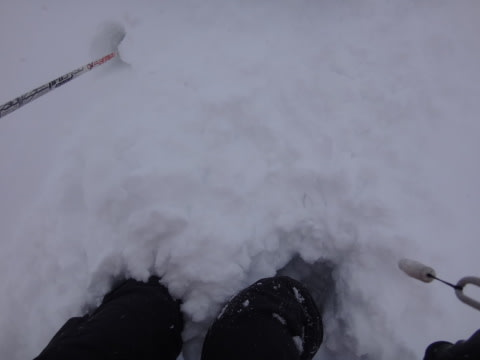
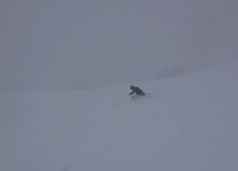
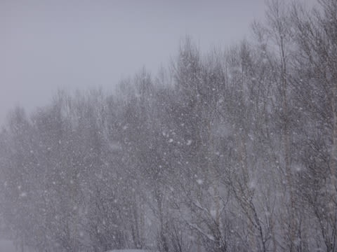
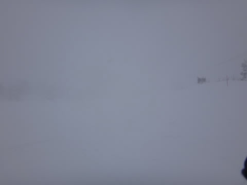
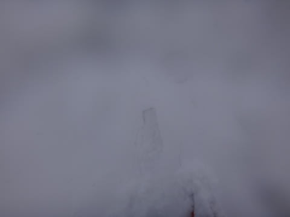
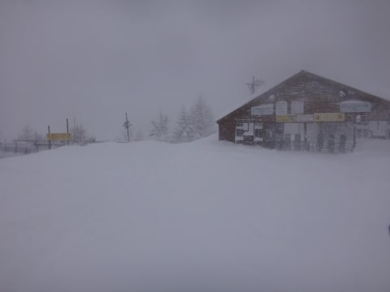
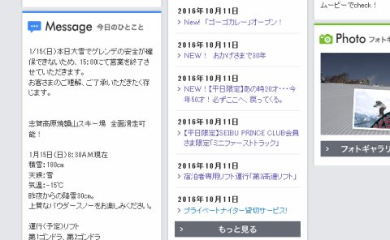

# 1月15日，日曜の志賀高原速報モード…吹雪で午後3時過ぎにスキー場全面営業終了（涙）．すごい雪だった…

📅 投稿日時: 2017-01-16 00:35:17

🏷️ カテゴリ: [2017スキー滑走日記](c7d777cecfc91bdf0fa464ad62c6d49ab.md)

えー．

本日も，帰宅してなんだかんだやっていたら．

夜遅くになってしまったので．

今日の志賀高原の状況，速報モードにて…

とりあえず．

昨晩から，ひたすら降り続け．

今朝も，かなり積もりましたよ～！

一晩の積雪は40cmくらいかな？

だもんで．

今日もゲレンデは全面パフパフです！

＃相変わらずちょっと重めの雪だったけど

そのおかげで．

…リフト営業開始は，除雪のために

遅れたところが多かったです…

＃一の瀬ファミリーは20分以上遅れたんじゃないかな？

で．

非圧雪のゲレンデは…

太ももパフ！

パフパフを楽しんでいると．

今日も雪が終日激しく強烈に力強く降り続け…

午後になると．

あまりもの激しい降雪に．

…前が．

前が見えないのですが？？

コースはどっちですか？？

そして．

この激しい雪のため．

圧雪コースも…

あっという間に新雪が！

…これ．圧雪コース上です．

コース外や，コース脇ではありませんよ…

午後は人が少なかったのもあり，

激しい降雪で，コースのいたるところが

脛くらいの吹き溜まりになっています…

…それが，こんな感じの全く見えないところに

突如現れるのですが（涙）．

全く見えないコースを，適当に野生のカンで

滑っていると，いきなりスネやひざくらいの

吹き溜まりにツッコミむという．

吹き溜まりの雪も重いので，

一旦突っ込むと，ラッセルしながら

脱出しなくてはならなくなるという．

ゲレンデの中なのに，雪山で遭難しかけてる

気分を味わえるという．

普段味わえないような，エキサイティングな経験が

できた一日でした…

そんな感じの激しい天気だったので．

奥志賀は今日一日営業できず．

そして，

一の瀬や高天ヶ原は午後2時前後に，

「天候悪化のため」立て続けに

営業を終了し．

さらには，焼額も．

午後3時にゴンドラが，

3時半には全リフトの営業が終わってしまいました…

それも．

強風で運休じゃなく，

「大雪でゲレンデの安全が確保できない」

っていう，大変珍しい理由での運休です…

まぁ，午後2時ごろからは，ホントに視界も悪く．

見えない吹き溜まりに突っ込んで止まっちゃったら．

周りが見えなくてどっちに進んでいいか

わからない…って感じだったので．

スキー場のゲレンデ内で遭難する

という，シャレにならない事態が起こりかねない

レベルでした…

いや，すごかった．

ってことで．

明日，また詳細レポートやります～！

## 💬 コメント一覧

### 💬 コメント by (めいめい)
**タイトル**: また次回･･･
**投稿日**: 2017-01-16 08:14:09

お疲れ様でした。

土曜日より危険でしたね、視界がないことが

ここまで危険と感じたことはありません。

まさにゲレンデ遭難可能レベルでしたね。

そんな中、10:30頃でしょう、プリンスホテルの

レストラン窓際から徒然さん発見(もう驚かないw)

休憩終わりごろ連れがトイレに入って行く

徒然さんとすれ違い！あそこでは声がかけられなかったとのことで･･･

また次回お探しします（笑）

13:30頃にあがり、埋もれた車2台を道路まで

出すのに1時間以上かかりました。大丈夫でしたか？

帰路の下りもたまにホワイトアウトするような

状況、15:30頃でしょう、リフト止まったのですね。

ほんとに危険な週末でしたね。

パフパフお腹いっぱい、今年はご馳走様でいいです(^^;

### 💬 コメント by (かず)
**タイトル**: 日曜心折れました　笑
**投稿日**: 2017-01-16 13:54:01

朝登りの渋滞にはまり急遽、熊の湯　リフト1本しか動かずスキー学校の生徒100人以上　1本滑って終了も帰り慣れない熊の湯の道に迷い　慣れてる方に車先導してもらいました　ウインタースポーツの怖さ痛感しましたね　可能であればこれから志賀の粉雪期待度も教えて下さーい

### 💬 コメント by (Goku)
**タイトル**: お疲れさまでした
**投稿日**: 2017-01-16 20:49:48

日曜日はレンタルでファット借りていこうかなって思っていましたが、起きてライブカメラを見てあまりにもの凄い降りに諦めました。

何だか、今年も週末になると荒れた天気になる気が・・・

しかし、これで雪不足は完全に解消されましたね。

### 💬 コメント by (Skier_S)
**タイトル**: ご無体時間に帰宅なのに，必死に記事をアップしました
**投稿日**: 2017-01-17 04:40:26

＞めいめいさま

あ，また発見されてましたか（笑）

それも，かなりのニアミスだったのですね…

また志賀高原にお越しの際は，

また発見してください（＾＾；

しかし，車発掘するの，大変でしたね…

＞かずさま

熊の湯は残念な感じでしたね…

スキー学校の生徒も，この悪天候の中

午後まで滑ったんだとしたら，

ちょっとかわいそうかも…

…今のところ，今週末もパウダーになりそうです～！！

詳細は，水曜夜の定例天気予想をお待ちください…

＞Gokuさま

いや．

すごい週末でしたよ．

物事は限度ってものがあるんだよ，

と言いたくなりました（笑）

でも，雪不足は完全解消ですね～．

しかし．

なんだか．

こんなのが続くと．

私も太い板が欲しくなってきます…

いや．

買わない．

買わないから．

