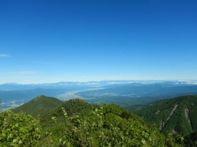
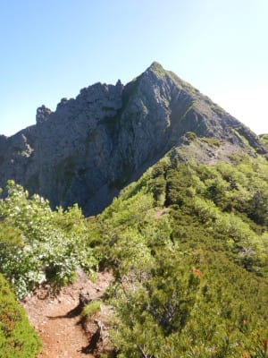

# 2021年7月，編笠山リベンジ＆権現岳へ！その5＆2022シーズンプリンス系列スキー場オープン日程

📅 投稿日時: 2021-08-24 00:28:15

🏷️ カテゴリ: [登山・旅行](c1d637a11a25b457ac978d197adbdafc5.md)

えー．

なんだか，気のせいだと信じたいのですが．

また，この記事を書きかけのまま

今朝から数時間晒してしまっていた気が…

うむ．

でも，誰も読んでないはず．

こんな記事が間違ってさらされていた

ことに気づいた人なんて，いないはず！

…と，自分にいいわけして．

ちゃんと清書して，今度こそ投稿！

…あなたは見ていない．

書きかけのこの記事を見たというのは，

幻想ですから…

というところで．

前回は

私から出ている謎の電磁波でスキー板が次々ヘタッていく話←違う．そうじゃない

の第1回目でしたが．

その続きはまた次回以降にとっておいて．

今回は，2022シーズンのスキー場オープン

日程の話題を…

ってなことで，そろそろ次のシーズンの

オープン日程情報が出始めてくるころに

なりましたが．

とりあえず，

[焼額が12月4日～5月8日までという
営業期間](eb4d04afd3349f9d4658e9dc574987de5.md)だというのは，先日お伝えした

通りですが．

それ以外にも，プリンス系列のスキー場の

オープン日程が出ていますね～…

ちょっと文字がつぶれて見にくいですが．

軽井沢も，例年通りの11月3日の祭日に

オープン予定のようですね…

([軽井沢プリンスホテルスキー場HP](https://www.princehotels.co.jp/ski/karuizawa/winter/)より）

そのほか，かぐらは11月20日(土)．

([かぐらスキー場HP](https://www.princehotels.co.jp/ski/kagura/winter/)より）

苗場は12月18日(土)．

うーん．昔は11月頭にオープンしていたのに…

([苗場スキー場HP](https://www.princehotels.co.jp/ski/naeba/winter/)より）

八海山と妙高杉ノ原は12月25日．

ほぼ年末からですね．

([八海山スキー場HP](https://www.princehotels.co.jp/ski/hakkaisan/winter/)より）

([妙高杉ノ原スキー場HP](https://www.princehotels.co.jp/ski/myoko/winter/)より)

しかし．

プリンス系列のスキー場は大体オープン日が

公開されていましたが．

肝心の狭山スキー場のオープン日はまだ公表

されてませんね（涙)

うーん．

狭山のオープン日がYetiのオープン日を左右

するので，一番重要なんですが…

狭山，頑張って10月上旬にオープンして

くれないかな？←無理でしょう（冷静なツッコミ）

とりあえず．

軽井沢オープンまであと2ヶ月半を

切ってます！！

おそらく，Yetiオープンもあと2ヶ月ちょい．

あと2か月って聞くと，もうすぐって

感じもするけど…

月山で昨シーズンの滑りおさめをしたのは，

2か月ちょい前．

スキーが終わってからのこの2か月，

すごく長かった気がするので．

これから2か月，スキーをせずに

耐えられるのか？？

そして，シーズンインまでにコロナは

落ち着くのか？←期待薄だ…

とりあえず．

あと2ヶ月，じっと待ちましょう…

ってなことで．

徒然スキーヤー日記としては，

こちらが本題なのでは？

という前フリのあとは，

本日の本題の，編笠山＆権現岳の

山登りレポートです～！

ーーーー

というわけで．

編笠山を越えて，権現岳へ登り始め

ましたが…

権現岳へ近づいてくると．

だんだん，岩がゴロゴロした急斜面が

目の前にそびえたってきました．

…あそこに登るのか…

かなり急な崖で，落ちたら「痛い」だけで

済んでくれなさそうな崖の際に道が

ついてます…

そして．

だんだん急になっていくゴロタを登って

行きますが…

あのピークまで登れば，山頂は

もうすぐかな？

最後の方は，だんだん急登になり．

結構本格的な鎖場が出てきます…

うん．後ろの人は，ちゃんとヘルメット

被ってますね．

結構な急登を登り切ると…

ここの先がようやく，見えていた

ピークのてっぺんです！！

よし．到着っ！

…振り返れば，すごい絶景が…

いや．

今日はホントに景色がいい！！

さっき登った編笠山が，もうあんなに

下の方に見えますね…！！

すばらしい景色っ！！！

…ただ．

振り返るといい景色なんですが．

やっとピークまで登りついたというのに．

…前を見ると，まだ目の前にこんな景色が

広がってます…

うむ．

まだこの先，あれを登らないと

いけないのか…

## 💬 コメント一覧

### 💬 コメント by (マルハバ)
**タイトル**: もう・・
**投稿日**: 2021-08-24 12:36:42

何回も幻想を見ています（笑）

スマートウォッチの記事では

謎の人物のフルネームが晒されていたことも・・（汗）

### 💬 コメント by (ダウンヒル)
**タイトル**: Unknown
**投稿日**: 2021-08-25 01:06:35

朝早くの出来事は...夢だったんだぁ...

すごいリアルな夢...((笑))

### 💬 コメント by (Skier_S)
**タイトル**: 皆さん，夢を見ていらっしゃるようですね
**投稿日**: 2021-08-25 02:53:20

＞マルハバさま

見ていない．

あなたは見ていません…

私の黒歴史など，見ていないのです…(暗示)

＞ダウンヒルさま

いやー．

みなさん揃って白昼夢を見ちゃったようで．

どうしちゃったのかな～？（棒読みで）

