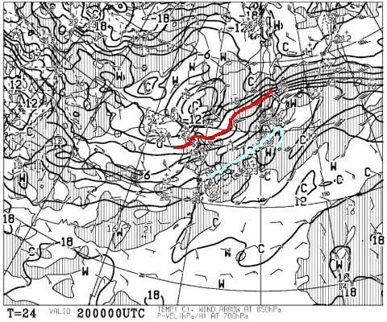

# なぬ！一ノ瀬ダイヤ＆サンバレーナイター，営業は正月のみ！？(涙)…そして，これから12月にかけてスキー場は冷えるのか，1か月予想を見てみる

📅 投稿日時: 2020-11-20 01:16:09

えー．

10月の冷え冷えスタートダッシュに期待したのに，

一番肝心なこの時期にあったかくなったことに

裏切られた感じがする今日この頃，

皆様いかがお過ごしでしょうか（涙）

長野で最高気温20度を超えるなど，

異常に気温が上がった本日．

せっかくの人工降雪もかなり解けて

しまったようです…(泣)

…そのせいで．

熊の湯スキー場も，今週末の21日のオープンは

あきらめたようですが．

([熊の湯スキー場ホームページ](https://www.kumanoyu.co.jp/lift/)より）

さらに今晩は，生暖かい南風が吹き…

さらに明日も気温がかなり上がります(涙)

20日朝9時の850hpa気温図を見ると…

水色の+12℃線が志賀高原に近づいてます(泣)

何だよ！この時期に+12℃って…！！！

で，20日は，午後になぜか空から

液体もぱらつきそうです．

ザーザーぶりではないのが救いですが，

ぱらぱらと液体が落ちてきます．

さらに風も強いので…

高温，雨，強風

のトリプルコンボで，20日はかなりやばいです．

横手の雪がどこまで耐えてくれるのか…

とりあえず，20日の夜9時になっても，

赤い0度線はまだ日本海上で，

志賀高原は+6度線がかかっているので，

夜になっても，すぐに人工降雪機は動かせないか…

ただ，21日の土曜，朝9時には何とか

0度線は長野県までかかってくれます！

これなら，21日の早朝からは人工降雪機が

動かせそう…！！

頑張れ，人工降雪機！

しかし．

この冷え込みも一瞬で．

21日の昼間には気温が上がってしまいそうで．

22日の日曜には，また0度線が北に上がってしまい，

志賀高原は水色の+6℃線がかかっているので…

22日は人工降雪，無理ですね(涙)

とりあえず，今は20日の雨＆高温での融雪が

それほどひどくなく．

かつ21日の明け方前からの一瞬の冷え込み＆

わずかな天然雪に期待し．

フルパワーで人工降雪を動かして，

横手が滑れるようになることを祈りましょう…

で．

昨日も予想した通り．

22日は気温がまた気温が上がるものの．

23日からはまた冷え込んでくれそうです…！

24日，25日の850hpa気温図を見ると，

赤い0度線が長野にかかっているので．

志賀高原は，人工降雪機が動かせそう．

…ただ，25日の予想，昨日だと

もっとがっつり冷えそうだったんだけど…？

…と思って，26日の予想図を見ると…

…

ダメだ…(涙)

また，志賀高原には+6℃線が近づくレベル…(泣）

週間の850hpa気温予想を見てみても．

せっかく23，24，25と冷えるのに．

26日はまた気温が上がるようです(泣)

26日は，このままの予想だと人工降雪は

厳しいか…

この26日以降，このまま気温が上がっちゃうのか？？

あるいは，気温が下がるのか…？？

と，1か月気温傾向を見てみると…

うーむ．

とりあえず，赤丸で囲った大パニック

異常高温大騒ぎは21日に向けて終わってくれて．

その後は，おおむね平年並みか，せいぜい+1℃

高い程度に収まってくれそうです…！

26日は一瞬気温が上がりそうだけど．

そのあとさらに気温が上がる…

という可能性は低そうなので，

ちょっと一安心…

28，29日の週末には，いくつかの

スキー場がオープンできそうな感じ…

ただ．

これから28日まで，天然雪が積もることは

なさそうなので．

オープンできるのは，強力な人工降雪機を

もっているスキー場のみになりそう

ですが…(ちょい涙）

ということで．

今週末は残念な感じだけど．

…それにも輪をかけてかなり残念な

ニュースが…

志賀高原の中央エリアのナイター

営業カレンダーがホームページに

出てましたが．

これを見ると，今シーズンのナイター営業，

かなり縮小されてしまうようです…！！

([志賀高原中央エリアホームページ，ナイターカレンダー](http://shigakogen.co.jp/wp-content/uploads/2020/10/20-21%E3%83%8A%E3%82%A4%E3%82%BF%E3%83%BC%E3%82%AB%E3%83%AC%E3%83%B3%E3%83%80.pdf)より）

おととしまでほぼ毎日営業だった一ノ瀬ファミリーは，

昨シーズンは火，水と週2日休みになり…

今シーズンはさらに休みが増えて，

日・月・火と週に3日休みになるようです…！

そして．

わがナイターのホームと言っていい

ダイヤナイターが…

正月しかやらないの！！！？？？

なんと…

なんということだ！！！！

週末，ファミリーのペアリフトだけに

2300円払えということか！？？

高速リフトのダイヤがなければ，

ナイターやる意味がないんですが…(泣）

そして，サンバレーナイターも正月のみに

なりました(涙）

残念だ…

夜まで滑りたい私にとっては，あまりにも

残念なニュースだ…

これで，

普段の週末に高速リフトが動くナイターは，

志賀高原では焼額のみ

になりましたね…

うーむ．

焼額ナイター，行きたい気満々なんだけど．

営業時間が6時から8時までなので．

宿で夜ご飯を食べると，1時間しか滑れない…

焼額ナイター，9時までの営業時間に

してくれないかな～…

## 💬 コメント一覧

### 💬 コメント by (アリス)
**タイトル**: 雪解け残念
**投稿日**: 2020-11-20 13:54:47

Skier_S様

今週の気温上昇による各スキー場オープンの延期と志賀高原のナイター変更情報とほんと残念です。

かぐらはオープン延期情報出していませんでしたので、来週の連休明けの平日を狙って初滑りに行こうと計画していたのですが、本日に延期を発表していましたので予定変更です。ライブカメラの映像は悲惨な状態です。

### 💬 コメント by (Northfox)
**タイトル**: ガッカリです
**投稿日**: 2020-11-20 23:40:47

ナイター営業のカレンダーはショックでした．

ダイヤモンドはナイターに丁度良いコースなのに。楽しみが減りました。

ファミリーのクワッド動かすかペアリフト高速運転してほしい。。。

### 💬 コメント by (Skier_S)
**タイトル**: ダメだ…来週もダメかも
**投稿日**: 2020-11-21 00:46:31

＞アリスさま

もう，ホントに残念なニュースが続きます（涙）

スキー場に雪はないし，八方もナイター営業縮小するみたいですし…

スキー場に冬が来てくれないのに，

スキー場冬の時代がやってきてしまった感じです（泣）

＞Northfoxさま

ナイター営業縮小，ホントにショックです…

ファミリーのペアリフトだけに2300円払う人がいるんでしょうか…？？

これで，ファミリーナイターのお客さんも減って，

結局ナイターが無くてもいいよね，という負のスパイラルに

落ちていく気が…

