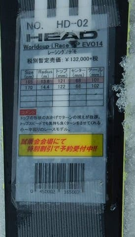

# 2020シーズンモデルのスキー板，試乗レポート…HEAD編その2

📅 投稿日時: 2019-05-24 00:53:16

ってなことで．

かぐら，横手山が終了となる，今週末．

横手も何とかぎりぎり今週末までもたせた

感じのようですが…

渋峠は，雪がある限り，来週以降も

営業するようです！

（[横手山HP](https://yokoteyama2307.com/news/)より）

しかし．

ついに来週以降．

残るは，渋峠と月山のみになりますか…

シーズンも終わっていきますね…（涙）

というわけで．

本日はスキー試乗レポートを行くわけなんですが．

前回の試乗レポートまでは，3月のアサマ2000で

試乗した板の報告でしたけど．

今回からは，4月21・22日の志賀高原での

試乗した板のレポートになります．

この日のコンディションは，

[21日土曜](ea64664474c25aa4c3ee001e73aed8933.md)は，午前中は比較的締まった感じの，

固めの斜面．午後は完全に緩んだ春の雪．

[22日日曜](e248299458196b8693f1dce1c9900e0c9.md)は，試乗開始時はちょっとだけ

締まった感じの下地が残ってたけど，

すぐに緩んだ春の雪になっていきました…

だもんで．

前回までの板は，硬い雪での評価となりますが．

今回以降の報告は，柔らかい春雪での評価と

なります．

…ということで．

指導員資格もプライズも持っていない

どシロートが，勝手な個人的感想を

垂れ流しているだけの試乗レポート，

本日はヘッドの板です．

では，どうぞ～！

○HEAD　WORLDCUP REBELS i.RACE 165cm

基礎オールラウンド

R=13.6という，純粋小回り板よりは

わずかに大きめのサイドカーブで，

小回りも大回りも行けるという，

オールラウンドのこの板．

SuperShapeシリーズよりは上級向けという

位置づけとなるらしいのですが…

午後のラストに近い，かなり緩んだ，

荒れたコンディションでの試乗

だったわけですが．

どちらかというと，REBELSシリーズなので．

競技用に近い，硬く締まった整地をねらって

そうな板だから，荒れた緩めの春の雪では

厳しいだろうなぁ…

と，思って滑り出すと．

意外や意外．

荒れた斜面でもコントロール性が高い！

板が埋もれるようなザブ雪の中，意外と

谷回りから板が動かしやすく．

それでいて，板にどっしり感があるので．

山回りでのグリップ＆張りの強さと

相まって，結構な安定感とスピード耐性を

感じさせる板です．

板をグリップさせてたわませていくと，

結構旋回性が強く，カービング小回りっぽく

回っていけます．

165cmの板にしてはエッジの接雪長が長く感じ，

小回りだけじゃなく，ある程度の大回りまで

十分行けます．

だのに．

板が埋もれるようなザブ雪でも，山回りで

板を動かしていける自由度があり．

ひねりを作って，ズレでコントロール

していこうとした時も，板の抵抗の

受け方がちょうどいい感じで，ズレの中でも

きれいに旋回して行けるという，

板の操作の幅の広さを持っています．

操作性が高いので，初めて履いた板なのに，

安心して谷回りで体を落としていくことができ．

荒れた斜面でも，谷回りで体から板を離して，

軸を長くとったターンができるという…

しっかりした張りと安定性，トップからテールの

エッジまでしっかり効く感じがあるので．

硬い斜面のトップスピードでも十分行けると

思いますし．

それなのに，春のザブ雪でのコントロール性が

高いのに驚き…

いや．

来シーズンモデルのHEAD．

[前回の2機種](ef941b092ec4150ba51294001eb462176.md)と合わせて

3機種履いたけど．

どれもいいですね～…

## 💬 コメント一覧

### 💬 コメント by (Northfox)
**タイトル**: Unknown
**投稿日**: 2019-05-25 15:05:13

なんだかとても惹かれる板ですね。

来シーズンに試乗してみたいです。

でも気に入って欲しくなってしまったら、それはそれで困るんですが (^^；

### 💬 コメント by (Skier_S)
**タイトル**: ＞NorthFoxさま
**投稿日**: 2019-05-25 22:13:46

来シーズンのHEAD板，3種類履きましたけど．

全体的にいい出来でしたよ．

来シーズン板，HEADやNordica，Fischerなど，

いい板が多かったのでいろいろ目移りしてます…

（いや，買わない．買わないから！！）

### 💬 コメント by (Northfox)
**タイトル**: Unknown
**投稿日**: 2019-05-25 23:50:08

いや～板尾買蔵さんがアップを始めましたね。（笑）

しかし、試乗会で気に入った板をその場で片っ端に買い付けるセレブな事をしてみたいものです。

### 💬 コメント by (Skier_S)
**タイトル**: ＞Northfoxさま
**投稿日**: 2019-05-26 23:38:19

試乗会で気に入った板を，4セット買い揃えるという

セレブもありです（笑）

