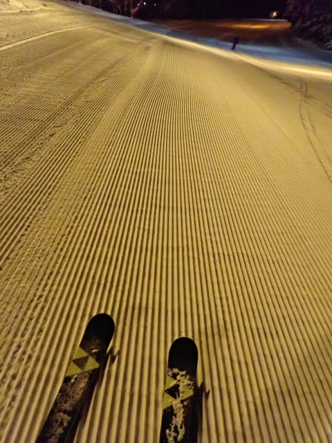

# 2025/1/11(土)の志賀高原スキー場は…朝イチは雪，昼から晴れ時々曇り，雪は冷え冷えトップシーズン！

📅 投稿日時: 2025-01-12 00:39:59

ってなことで．

3連休初日の今日は，予告通り志賀高原で

滑ってました～！！

まず．

朝の中野市街は意外と雪がなく，

ほぼ乾燥路でしたが…

山道は完全無欠の雪道なので，

ご注意を…！

山道を登ってくるときは，山の上に

雪雲がかぶっていて，雪が降ってました…

そして．

今日は悲しいことに，焼額山到着が

予定よりちょいと遅れてしまい，

ゴンドラに乗ったのが営業開始10分以上

過ぎてしまった8時40分過ぎ…(泣）

この時間のゴンドラは飛び乗り．

で．山頂の気温は-10℃をちょい下回る

程度と，－11℃という予想ほぼぴったり！

朝イチのゴンドラで山頂に着くと…

雪がぱらついていた天気から，

ちょっとうっすら日が射し始めて

来ましたよ…！！

そして山頂の雪は…

これも予想がぴったり，圧雪の上に

うっすら新雪が乗った状態で…

それも雪質はかなり軽めで，

ここも予想通り！！

この，軽いうっすら新雪の下地は，

割としっかりした圧雪で…

いい感じでスピードが出せる

気持ちいいバーン！！

しっかり気味の圧雪をカービングしながら，

新雪を蹴散らしていくこの快感…っ！！

そして．

2－3本滑っていくと，雲が残っているものの，

空がだんだん明るくなり，バーンが

きれいに見えるようになってきて…

これ，今シーズンイチのいいコンディション

かも…？？？

という感じで．

いいコンディションを滑っていると，

朝9時半ちょい前になったので．

本日オープンのヤケビコーストを

見に行くと…

やっぱり，かなり待ちの列がついてますね…

オープン直前には30人ほど待っていたかな…

かなり待ちの列が長く，待つのが嫌なのと

コース幅が狭そうなヤケビコースト，

どうせ30人も滑ったらボロボロバーンに

なってるだろうな…

と思い，あきらめましたが．

このコース，今日は間隔をあけて1人ずつの

スタートだったので，ゴンドラ1本滑って

15分以上たった後に来ても，まだ列が

伸びてました…

ということで．

ヤケビコーストはあきらめましたが…

今日は新雪狙いの人はみんな新規オープンの

ヤケビコーストを狙うだろうから．

ヤケビウォールとヤケビバレーが

ねらい目かも…？？

と，私としては今シーズン初のヤケビウォールへ！

60cmの積雪があった昨日はオープンして

なかったとのことで，深めのパウダーを

期待したけど…

膝パフ程度ですね…（残念）

オープン直後の1本だけは結構

楽しめましたが．

2本目はもうグサグサになってて

ダメでした（泣）

続けて，ヤケビバレーも見に行きますが…

ここは広いので，まだ結構新雪が

残っていたものの．

脛パフくらいか…

それも，圧雪コースの上の新雪は

軽かったけど，ちょいと重めの雪で，

踏まれたところと新雪がまだらの

コースは結構厳しかった…（泣）

うーん．

昨日60cｍ積もったってことだから

期待してきたのに…

ちょっと新雪は期待外れ（泣）

だもんで，圧雪コースをメインで滑りますが…

午前中はちょいと人口密度が高め

でしたね（涙）

午前11時前には，ゴンドラもゲート外まで

列が並び．

第2高速も混むタイミングがあったので，

さすが3連休…

と思っていたら．

今日も11時半の昼休みごろになってくると，

ゴンドラ待ちもリフト待ちも一気に短く

なっていき，午後はゴンドラ・リフトとも

搬器数台程度の待ちに短くなりました…！

さらには，12時を過ぎると…

ふはははは！

ここも予想通り，晴れてきましたよ…！！

晴れてきたのに，午前より人口密度が

低いんですけど…！？？

あれ？今日は3連休初日だから，

絶対午後まで人が減らないと思ったのに…

晴れていて人が少ないのに，

雪質がこんなに良くていいんですか？？

いや．

これ，午後はトップシーズン最高雪質で

晴天でガラガラという，シアワセの

トリプルコンボじゃないですか…！！！

ただ，予想通り，オリンピックコースと

GSコースは，夕方になるとボコボコに

なってきましたが…

パノラマコースや唐松コースは，

下地がしっかりしていたからか，

全然フラットですよ！

こんな天気がいい，雪質がいい日に

午後までフラットなコースが残って

いるとは…！！

ぐおおおおお！！

今日は朝はイマイチとはいえ，新雪は

滑れたし．午後はガラガラ最高雪質晴天の

トリプルシアワセコンボデーだったし．

シアワセだ…

シアワセすぎる…！！

と，喜びながら．

先週より営業時間が15分伸びた4時15分の

ラストリフトまで，夕日が沈んでいく中

滑り倒したのでした…

いやーー．

満足．

3連休の初日から，満足の一日で

あったぞよ…

…

…が．

そうです．

終わりませんよ～！！

まだ，終わりません．

そうです．

ナイター参戦です！！

18時から20時までの第3高速リフトの

焼額ナイター．

最高の圧雪クオリティの焼額のシマシマを

朝に続けて味わえるという，

1日で2度おいしい，最高のナイターです！！

見よ…

このシマシマを…っ！！！

もう，言葉にならない．

今日はナイターの参加者も少なく．

このシマシマが1時間近く滑っても

残っていて．

ひたすらシマシマを切り刻める，

朝イチの最高バーンを繰り返し

滑れるような．

もう，言葉にできない快楽にあふれる

ナイターでした…

ってことで．

今日も20時のナイターストップまで，

ひたすら滑り倒し，満足の1日を

終えたのでした…

いやーーーー．

良かった．

今日は満足の1日であった…

明日もちょっと雲が多いかもしれないけど，

基本的には晴れ間が多い，冷え冷えいい天気

になりそうですよ～！！

## 💬 コメント一覧

### 💬 コメント by (モイストシルバー)
**タイトル**: Unknown
**投稿日**: 2025-01-12 09:04:08

土曜日焼額行ってきました。

軽い新雪と青空で、今シーズンベストでしたね。

オープンしたヤケビコースト、12時過ぎに行ったら既に閉鎖されていました(泣)

### 💬 コメント by (富山県民)
**タイトル**: Unknown
**投稿日**: 2025-01-12 10:25:59

こんにちは。

三連休初日に志賀高原を堪能されたのですね。

私は今日1月12日は新潟県糸魚川市にある糸魚川シーサイドバレーに来ています。

天気は薄曇が広がってますが晴れ間もあります。雪質は糸魚川シーサイドバレーとすれば良いです。

糸魚川シーサイドバレーには6年ぶりに来ました。

今日はスキーの日で1日券が半額です。

糸魚川シーサイドバレーは毎年1月12日は1日券が半額になります。

去年までは平日で行けなかったですが今年は日曜日なので行けました。

天気予報を見ると来週末も晴れそうです。

最近はいいタイミングで週末に晴れてくれます。

明日は地元富山県のイオックスアローザに行こうと思ってます。

### 💬 コメント by (Skier_S)
**タイトル**: 今日も最高！
**投稿日**: 2025-01-12 23:40:19

＞モイストシルバーさま

あら．焼額で滑ってらしたんですね…

土曜は良かったですよね～！

ヤケビコーストは一瞬で単なるコブコブバーンになったと聞いているので，

行かなくて正解だったかも(笑)．

＞富山県民さま

イオックスアローザ，行ったことないんですよね…

らいちょうバレー＆極楽坂とか，マイナーな牛岳とかは行ったことあるんですが…

来週は火曜14日に雪が降りますが，それ以降はあんまり雪が降らなさそうです…

