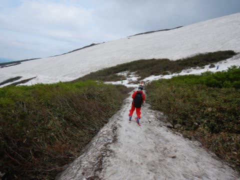
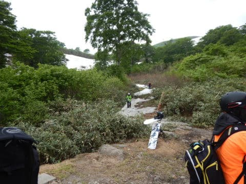
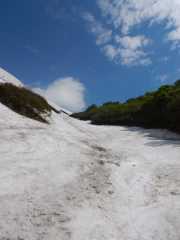
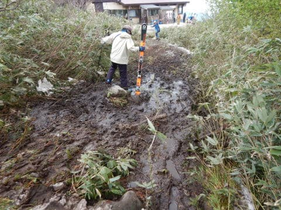

# 2021/6/12(土)月山スキー場で滑ったよ！…リフトには滑りこめず、沢コースも厳しい感じ(涙)

📅 投稿日時: 2021-06-13 00:01:36

🏷️ カテゴリ: [2021スキー滑走日記](c2b0fc073d6357d3b786f6ca655147f7d.md)

ということで．

今日は予告通り月山で滑っていたわけですが…

月山，例年より雪が少ないです(涙)

例年より1-2週間，雪が消えるのが早い感じで．

おそらく沢コース，本日で終わり．

そして，大斜面も来週末は無理っぽい感じ(激泣）

とりあえず，沢コースは日曜滑れるかどうかギリギリ

なので，無理して今日滑っておいて

良かった…って感じ．

（ほぼ徹夜でスゲー眠かったけど…）

（追記…日曜朝は沢コース開いてました！）

ってなことで，本日のレポートですが．

今朝は，8時ちょうどくらいに駐車場に到着

しましたが…

駐車場は結構混んでたけど，

満車にはなってない程度．

先週は駐車場があふれてたってこと

だったので，先週よりは空いてるみたい．

そして，駐車場から歩くこと10分．

リフト乗り場へ向かいますが…

うむ．

6月第2週でこの道に全く雪がないとは．

雪，少ないですね…(泣）

明後日まではリフト1日券4700円，

半日券3500円ですが…

一日券・半日券は月曜まで．

それ以降，日券はなくなります．

で，

リフト券売り場の列はそれほど

ひどくなく…

リフト待ちも，8:15ごろは全くなし！

リフトに乗りますが…

まだ，リフトが冬モードなので，

搬器が高いところにかかってますね～…

私が月山リフトが冬モードの時に

来ることはほとんどないので，

私には結構新鮮．

で，次の火曜から木曜を運休にして，

リフトを夏用の低い位置に架けかえる

ようです．

そして，山頂に着きますが…

リフトより上のTバーがかかっている

ところは，まだ雪が十分ありますね！

そして，リフトを降りた左側．

この写真だとわかりにくいけど，

ゲレンデにつながる雪の道が

まだ，かすかに残ってます！

ただ，この道ももう息も絶え絶えな

感じで．

明日まで残るかどうか，微妙…

さらに，この道の先は藪が出ていて，

ここからまっすぐ大斜面側に抜けられません．

大斜面に行くにはこの道を抜けて

登るか，

リフトを降りてから岩ゴロゴロの

道を登ってゲレンデ上側に出るかの

どちらかになります…（涙）

まぁ，

今日は沢コースが滑れるので．

沢コースなら，歩いて登らずに滑れます！

で．

沢コース自体は，幅は狭いものの十分

滑れるのですが…

でも，最後の部分は，板を脱がないと

通れなくなっており…

もう，ヤバい感じ．

そして，最後のリフト乗り場に

滑り込むところも，昨日までは

滑れたらしいけど，今日は雪が

途切れちゃってます(涙)

昨日まで，ここまで板を履いて

滑りこめたってのが信じられない…

で．

次は大斜面へ向かってみますが．

リフトを降りたところを，この木道

に沿って進み…

その先にある，石畳の坂道を登って

行きます．

雪解け水が流れる，足場の悪いところを…

このくらい登ってくると，ゲレンデです．

ここまで上がってこないと，

この目の前にある藪を超えられないので，

大斜面に出ることができません…(泣）

何の修行だ…(涙）

ただ，ここまで登れば，あとはまっすぐ

トラバースしていくだけで…

大斜面へ出られます！

大斜面，上の方は広くてコブラインが

いっぱいあるけど…

途中一部，かなり狭くなってます（泣）

一番狭いところはこんな感じですが．

この狭いところを抜けると，また数本

コブラインがあって…

大斜面が途中でぶった切られている感じ．

遠くから大斜面を見ると．

もう，真ん中に大きな島が出てきてて．

ゲレンデがじきに切れちゃいそうです…

違う角度から見た，一番狭い部分が

こんな感じですが．

…これ，来週末まで大斜面がもたない

可能性が高いですね…(泣）

ってな感じで．

晴れたり曇ったりの天気の中．

大斜面と沢コースを滑ってましたが…

昼頃になると．

最後のリフトに向かう部分の，

雪の切れ目が大きくなっていき…

ものすごい泥道を行軍しないと

リフトにたどり着けなくなっちゃい

ました（泣）

ホントにこれ，昨日まで滑って

リフトまで行けとは信じがたい…(涙)

あまりにも状況がひどくなって

しまったので．

昼頃には，このリフト乗り場への

ショートカットパスがクローズに

なってしまいました(激泣）

だもんで…

こんな感じで，リフト乗り場の

かなり下に滑り込み．

そこから，こんな感じで登らなくては

ならないという．

またもや，「何の修行？」

状態になってしまい…

さらに追い打ち．

午後になると，沢コース下部も，

「これ，開けておいて大丈夫？

　踏み抜いて沢に落っこちない？」

という，かなり怖い状況になってきて…

これもまた，かなりのサバイバルな

感じに…

いや．

月山って，藪やら石やら沢やら，自然が

あふれていていいですね！！

（必死のポジティブシンキング）

まぁ，沢コース．

下部や…

上部は，もう営業終了時間には

途切れそうな感じで．

明日はたぶん無理なんじゃないかな…

という雰囲気を醸し出しつつも．

コース真ん中部分はまだ滑れる

状況だったので．

最初と最後がダメなだけで

このコースがクローズになるのは惜しい…

今日，滑れるうちに滑り倒しておかないと！！

…と．

また，いつも通り．

日が傾く，リフトストップまで滑り

倒したのでした…

ってな感じで．

明日はおそらく，リフトを降りてから

ゲレンデに出るまでは，かなり歩いて登り．

また，ゲレンデからリフト乗り場までも，

かなり歩いて登らないといけない，

最終形態になっちゃいそうです…

そして．

大斜面もあと数日で切れそうなので．

リフトを滑れるのも，今週末で

終わりっぽい感じ…

だもんで．

明日が，私の今シーズンラストに

なりそうです…（涙）

## 💬 コメント一覧

### 💬 コメント by (AK)
**タイトル**: Unknown
**投稿日**: 2021-06-13 05:49:39

すごいすごすぎる...

板を担いでスキーブーツをはいて泥道を歩くまさに地獄にありそうな修行...白い粉のかなりの中毒者でないと耐えれないですね。

月山なめてましたm(_ _)m

シーズンラスト？怪我なさらぬよう白い粉を味わってくださいませ。

### 💬 コメント by (Northfox)
**タイトル**: Unknown
**投稿日**: 2021-06-13 09:21:56

パッと見、スキーではなくもはや登山のレポートのように見えます。

しかし遥々月山まで行く行動力、エネルギー凄いです。情熱が無いと無理ですね。

### 💬 コメント by (Skier_S)
**タイトル**: 今日でシーズン終了！
**投稿日**: 2021-06-14 02:06:00

＞AKさま

これが月山リフトの最終形態です…

まだ藪漕ぎが入ってないだけマシです．

…でも，月山はリフトが板を履いたまま乗り降りできるうちは

もっとマシなスキー場ですので．

こんなひどくなるのは6月中旬からですから…！

＞Northfoxさま

もう，リフト1本滑るのに30分．

リフトに10分ちょい，降りてからゲレンデに出るのに5分．

滑り終わってからリフトに乗るまで5分．

そして，楽しく滑れるのは5分くらい…

何かすごい修行感があるゲレンデです．

### 💬 コメント by (2.0GT-S仲間)
**タイトル**: お疲れさまでした。
**投稿日**: 2021-06-14 07:58:52

まさか、今シーズンの初日とラストで一緒に滑れると思いませんでした。写真も2カットほど、この日のブログにあげて頂きました。1枚はヘタレのコブ滑走ですね。

そして、予感通り日曜日も滑られたのですね。また予想通り雪解けは日曜日にかなり進んでしまったのですね。やっぱり最後だった。

私は、土曜日は嫁と一緒だったので、いろいろ寄り道してすべて一般道路で400km走り切り、途中30分ほど仮眠して日曜日の0:30に帰宅しました。最後の寄り道が那須高原SA上り線。一般道路からの来場者用の駐車場にとめて、買い物してきました。

先週は驚きの17.45km/リットルでしたが、今回は往路が高速だったし、寄り道が多かったので、14.63km/リットルでした。

ディーラーオプションのカーナビが、地元スタンド到着での給油後に電源が入らなくなり、同じ症状3回目なので、オイル交換含めてディーラーに修理出しました。3週間ほどナビなしになります。ナビはまぁいいんですが、バックカメラとハンズフリー通話がなくなるのが不便です。バックカメラもセンターコンソールに表示してくれればいいのに。新型レヴォーグだと、センターインフォメーション壊れたらもっといろんなもの使えなくなりそうですね。

道の駅西川でも山の駅でも月山筍売り切れでしたが、もっとふもとの山菜屋さんで月山筍手に入って、早速日曜日にたけのこご飯を作りました。

また四カ月後のイエティですね。お疲れさまでした。

### 💬 コメント by (ikkun)
**タイトル**: Unknown
**投稿日**: 2021-06-15 15:25:08

これは…スキーじゃない(笑) スキー○を確実に逸脱してますね

まさに登山じゃないないですか

私しには無理だなあ

### 💬 コメント by (Skier_S)
**タイトル**: コメント回答遅れました！
**投稿日**: 2021-06-17 01:10:19

＞2.0GT-S仲間さま

土曜はお世話になりました～！

Yetiと月山で会うなんて，いろいろ終わってますね(笑)．

こちらは車中泊で，日曜もしっかり滑りました．

下道400km運転お疲れ様です．

また来シーズン，Yeti でお会いしましょう！

＞ikkunさま

これは，スキーというより…そうです．修行です．

身体を鍛えに行くんですよ…

