# 2月29，3月1日の週末の志賀高原スキー場の天気は？…土日とも曇り空，昼間はちょっと気温が上がりそうだけど…

📅 投稿日時: 2020-02-27 05:58:19

昨日．

焼額山スキー場の公式ホームページを

見た時…

うむ？

春スキーの営業案内がもう出てますね…

…って．

もう春か…早いなぁ…

ふむふむ．

今年も4月から，休日は6:30スタートの

早朝営業をやってくれるのね…

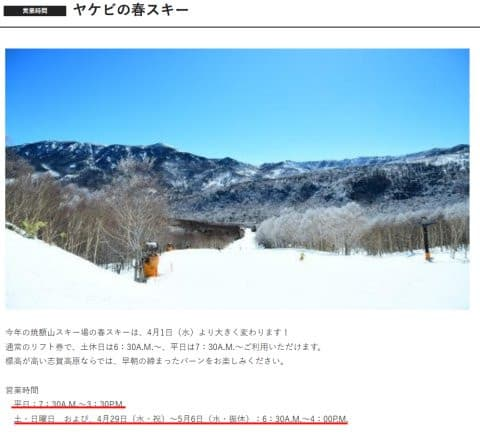

（[焼額山ホームページ](https://www.princehotels.co.jp/ski/shiga/informations/spring_skiing/)より）

ってか．

一昨年までは，4月に入ると土日のみ営業だったのが．

昨シーズンから4月も毎日営業になってくれたけど…

今シーズンも，4月の毎日営業をやってくれるようです！！

…素晴らしい…っ！！

で．

よく見ると…

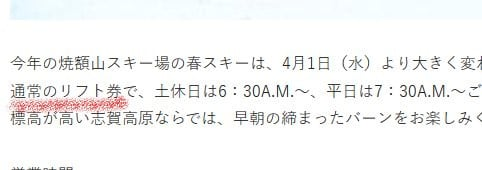

えええええ！！？？

なんと！？？

早朝営業に早朝券が要らないの？？

一日券やシーズン券で普通に6:30から滑れるの！？？

平日の営業時間は，7:30～15:30と，

ちょい早めに終わるみたいだけど，

雪のいい時間に滑れるよう，3月までより

1時間早めに始めてくれるみたいだし．

土日は，朝6:30～16:00までフル営業してくれて．

それで，朝6:30から早朝券無しで滑れるの？？？

…たしか，4月からって．

無料のプリンスクラブ会員になれば，

焼額エリア限定1日券は3800円，2日券は7600円．

これで早朝から滑れちゃうの？？？

…す，素晴らしい．

素晴らしいよ，焼額！！

これはもう，最高級の絶賛を送りたいっ！！

皆さーーーーん，4月は志賀高原の

焼額に来てください！！！

そして，この素晴らしい早朝追加料金なしという

営みを，ぜひ継続させましょう～！！

…あとは．

4月まで雪が残ることを祈るばかり…（ぼそ）

…と．

久しぶりに志賀高原のいいニュースをお知らせした

あとは．

水曜深夜恒例，この週末の志賀高原の天気予想に

参りましょうか．

…えー．

まずは，27日（木）の850hpa気温図を

見てみますが．

うむ．

昨日の予想から変わらず，水色の-9℃線が

志賀高原にかかってますし…

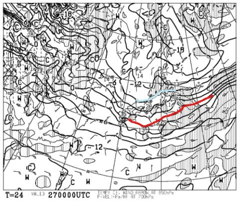

そして，これも昨日の予想と変わらず，

27日の500hpa気温図には，そこそこの

雪が降る目安，赤い-30℃線が

志賀高原にかかってますよ！

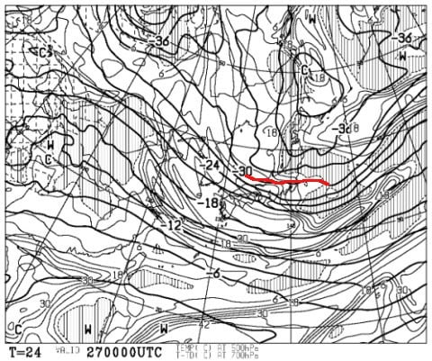

で．地上天気図は，日本海側に積雪が

予想されているので…

降ります．

27日は，終日降って積もります！！！

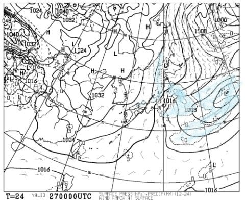

次に，28日（金）の850hpa図を見てみますが．

うむ．

この日も水色の-9℃線が志賀にかかり，

冷え冷えです！

朝は，焼額山頂で-12℃くらいまで下がる

激冷えです！

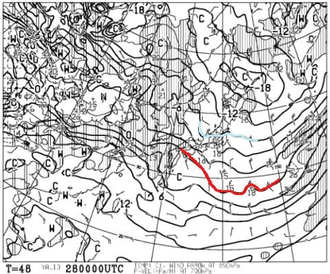

そして，この日の地上天気図は，

水色の降水域が日本海側にわずかに

かかってます…

志賀にそれほど降水域がかかってないので，

あまり積もりそうには見えませんが．

いい感じの寒気が入っており，

北風なので…

おそらく，8日朝までは冷え冷え雪が降り続け．

8日午前中にはすっきり晴天になるという，

ベストデーかも？？

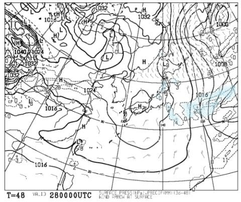

そして，肝心な土曜日，

29日の850hpa気温図ですが…

うーむ．

28日までの冷え冷えと違って，

志賀高原にかかっているのは-3℃線．

…でも，まぁこれなら，志賀高原では

昼間もギリギリマイナス気温をキープ

してくれそうかな…

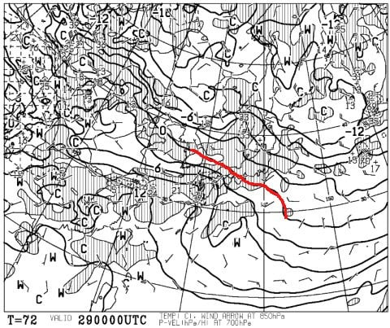

そして，29日土曜の地上天気図は．

うーむ．

高気圧は東に去ってしまい．

西から低気圧が迫ってくるので…

降らないだろうけど，終日曇り空かな…

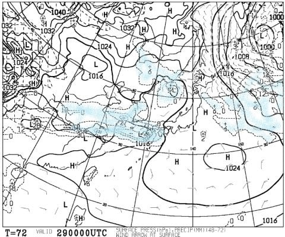

ラストは日曜，3月1日の850hpa気温図ですが．

うーーーーーむ．

この日は，赤い0℃線がギリギリ志賀高原…

気温がちょっと高めになりそうです（涙）

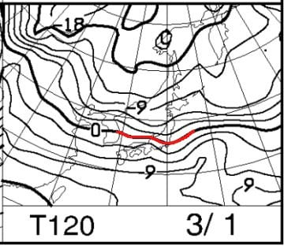

とはいえ，地上天気図を見ると，

志賀高原に降水域は予想されていないので…

この日も終日曇り空かな．

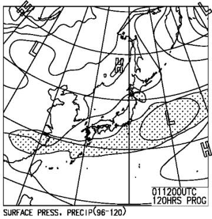

ってなことで．

まとめると．

27日（木）：朝は-12℃くらいと激冷え！！

　夜中から降り始めた雪は，朝までに

　ブーツ～脛パフ程度の軽い雪として

　積もってくれそう！朝は圧雪の上にも

　新雪が積もっているので，全面パフパフ！

　この日は昼間も気温が-7℃程度までしか

　上がらない激冷えデーで，終日雪が

　降り積もりそう．

　営業時間中に10～20cmは積もりそう．

　風はそれほどないので，ゴンドラは

　止まらないかな．

　午後に向かって，コース上の斜度が急な

　かなりバーンが荒れていきそう．

28日（金）：この日も朝は-10℃以下の冷え冷え！

　そして昨晩からの積雪が，10～20cmは

　ありそう．朝は多少雲が残るかもしれないけど，

　じき晴れて，朝イチは最高の

　冷え冷え雪のピカピカ圧雪バーン！

　この日は終日気温が低く，雪質は最高のまま

　晴天という恵まれたコンディション．

　雪が柔らかく，午後はちょっと荒れ気味の

　バーンになりそうだけど，

　シーズン最高級の一日．

29日（土）：この日の朝は-5℃前後．

　天気はおそらく終日曇り．

　あさイチは冷え冷えの締まった圧雪！

　昼間の気温は0℃近くまで上がるけど，

　時折日が射すかどうかという程度で

　終日曇り空なので，それほど雪は

　悪くならない．

　終日いい感じの雪だけど，午後は

　ちょっと凸凹したバーンになり，

　急斜面の一部はコブ溝に硬い

　下地が出てきそう．

1日（日）：朝の気温は-3℃くらいかな？

　終日曇り空．

　あさイチは締まったいい感じのシマシマバーン！

　この日も昼間は０℃近くまで気温が上がるけど，

　終日曇り空なので雪はいい感じをキープ．

　午後は多少凸凹するものの，それほど荒れず

　割とフラットなバーンを飛ばせそう．

　晴れれば最高なんだけど，残念ながら

　太陽は顔を出さなさそう

って感じでしょうか…

うむ．

まぁ，土日とも気温が0℃近くまで

上がりそうだけど．

太陽が出ないので，雪質は悪くならず，

いい雪で滑れそうな感じ！

## 💬 コメント一覧

### 💬 コメント by (ゆーき)
**タイトル**: Unknown
**投稿日**: 2020-02-27 07:09:10

期待できそうですね、週末。

今週は、ちょっと浮気して、別に行く気が、、、野沢とか、戸隠とか、、、

### 💬 コメント by (かず)
**タイトル**: Unknown
**投稿日**: 2020-02-27 10:28:35

Sさんお借りします   

レインボーさん本日ヤケビオリンピック  その他非圧雪 底つきでカチカチですか？明日朝どちらに行こうか検討してマス

### 💬 コメント by (いか)
**タイトル**: Unknown
**投稿日**: 2020-02-27 13:19:37

土曜日に志賀におじゃましようと思います〜。

30分早い、奥志賀スタートの予定です。

すっきり晴れると良いのですが。。。

### 💬 コメント by (西館)
**タイトル**: また床でおやすみになったのでしょーか
**投稿日**: 2020-02-27 22:22:59

Ｓさま、今回の更新時間は朝ですねもう少しで日の出ですね。

私もスキー時間確保のため、平均睡眠時間は3時間程度ですが、Ｓさんてばもっと少ない？。

でも天気予報楽しみに待ってましたよありがとうございます！

ですが、実は今週末は東京国立博物館へ七支刀（剣の本体から6本の枝刃が出てる剣。アニメに出てきそうな。奈良県の石上神社(物部氏関係の神社)に奉納されていて7年くらい周期で本物が出てくる）を見に行く予定をしていたのですが、例の騒動で昨日から休館になってしまったのでした｡｡｡

因みに3月7日(土)に予定されていた奥志賀のイベントも急遽中止されてしまったっすよ｡｡｡何それ｡｡｡屋外なのに。雪上なのにねー。仕方ないんだけど･･･分かっていてもさぁ嫌なもんは嫌だよねー(-ε-)ﾌﾞｰﾌﾞｰ

こんな時こそめげずに志賀高原へ！とも思いましたが、気抜けして力が入らないので、リーダー、1回休みを申請します！

### 💬 コメント by (Skier_S)
**タイトル**: いい感じで志賀は雪が降ってます！
**投稿日**: 2020-02-28 01:29:49

＞ゆーきさま

今週末は，最高晴天冷え冷えではないけど，

そこそこ冷えた曇り空って感じなので，まぁ悪くない感じですよ…

でも，標高が低いスキー場は雪が緩むと思うので，

標高が高いスキー場をおススメします．

＞かずさま

どうぞ，好きなだけ連絡用にお使いください(笑)

＞いかさま

をを！

久しぶりですね～！

残念ながらすっきり晴れなさそうですが，また焼額で

お待ちしています～！

＞西館さま

鋭いですね…床で寝てました（涙）

出かける前に慌てて書きかけの記事を仕上げました．

…でも，平均睡眠3時間！

それは私より短いですね…

なんだかんだ言って，私は平均5時間近く寝てる気が…

今週末はゆっくり休んでください…

