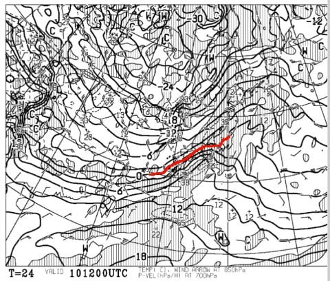
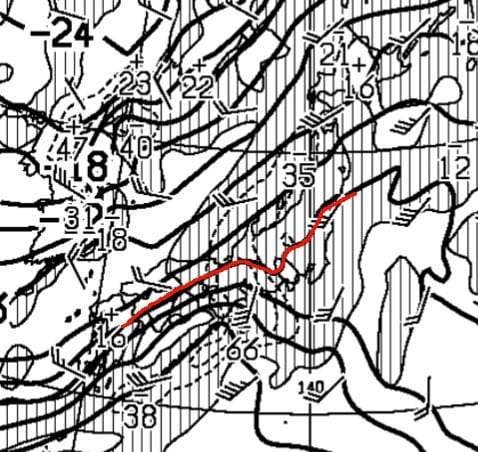
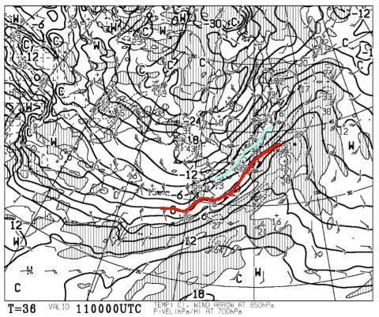

# 明日から3連休！10日昼間は結構良さそう！で，夜は何とか雨にならずに済むか…？？？でも私は土曜は滑れず（涙）

📅 投稿日時: 2018-02-10 03:20:07

🏷️ カテゴリ: [2018スキー滑走日記](c11b88dc181f34079ab41db74a3587646.md)

ということで．

10日の天気ですが．

今のところ，水曜での予想の

　朝の気温はこの時期としては高めの-3℃程度．

　前日からの積雪は無く，朝イチはきれいな

　圧雪が楽しめそう．

　午前中はおそらく結構いいコンディション．

　（略）

　リフトストップのころには曇り空かな．

　おそらく，ナイター終了までは，降らずにもちそう．

という予想のままで．

ちょっと気温が高めなれど，雪質は

それほど悪化せず．

ナイター終了までは，わりといい感じの．

恵まれたコンディションで滑れそうです…！！

昼間は南風もそれほど強くならなさそうなので，

第2ゴンドラもおそらく普通に運転できそうな

感じ…！

土曜，結構良さそうです…

…でも私は滑りに行けない（涙）

で．

気になる，10日夜は雨になるのか，雪になるのかですが…

最新の，10日夜9時の850hpa予想図を見てみると．

ををを！

0℃線は志賀より南のまま…

拡大してみると．

結構きわどいながらも，志賀高原は

氷点下をキープしそうかな…

これなら，降り始めは水っぽい重めの雪かもしれないけど．

10日夜は，それほど雪質悪化しなくて済みそうです！！

そして，11日の朝9時には…

志賀高原には-6℃線が掛かっているので．

これは，朝の焼額山頂は，-8℃くらいにまで

冷えこみますね…

朝には冷え冷え雪になりそうです！

ってことで．

このままなら．

このままの天気図なら．

志賀高原は雨にならず済みます！！

だもんで

11日の予想は，概ね水曜の段階の予想の，

前日の夜が雨にならなかった場合の通り．

　朝までに積雪がありそう．

　積雪量は…ブーツパフくらいか？

　朝のうちは圧雪バーンは柔らかめの圧雪．

　天気は雪がちらついたり止んだり．

　午後は，雪がかなり荒れて凸凹バーンに．

って感じになりそうです～！

12日は，水曜段階では

　朝は曇りか，太陽が顔をのぞかせるか…

　まだ微妙．

と書きましたが．

うーむ．曇り～小雪，というところか…

すっきり晴れとはいかなさそうです．

朝，もしかしたら10cm程度の積雪があるかも．

それ以外は，概ね水曜の予想通りです．

10日に雨にならないので，下地はそんなに

固くならないだろうから，

下地は固くなるかも…という部分を抜いた

　気温は，朝の山頂は-15度近くまで冷えそう！

　朝イチは冷え冷え圧雪で楽しめるかな．

　午後は全体的にちょいと荒れたバーンになりそう．

　この日は寒いよ！最高気温も-10℃以下だよ！！

という感じですかね．

　曇り時々晴れ，時折雪雲が飛んできて雪がザーッと降る…

という天気になりそうです．

ってなわけで．

今のところ．

皆さんの必死の踊りが効いたのか．

徐々に冷える予想に変わっていきました…！！

しかし．

まだわからない．

その時が来るまで，分からない．

もう少し．

あと一日．

土曜の夜に気温が上がっちゃわないよう．

最後の追い込みの冷え冷え踊りを，

地道に踊り続けましょう…！！

…でも私は土曜に滑りに行けない…（涙）．

## 💬 コメント一覧

### 💬 コメント by (かず)
**タイトル**: Unknown
**投稿日**: 2018-02-10 20:31:44

8.9日朝駐車場で-20℃　9日は昼間暑くなりました

平日2日で満足してしまいます　10日は込み過ぎで午前で終了しました　もう自宅です　明日も混むと思いますが雨じゃなくて良かったですね

### 💬 コメント by (Skier_S)
**タイトル**: かずさま
**投稿日**: 2018-02-10 21:23:49

今日はコンディション良かったかと思いますが…

やっぱり3連休，混んだのですね．

明日はちょっと雪が積もってそうです…

入れ替わりで明日から志賀へ行ってきます！

### 💬 コメント by (yama)
**タイトル**: ３連休初日
**投稿日**: 2018-02-10 21:47:56

１０日は一の瀬スタート、奥志賀まで往復して、東館山から西館山を回り終了しました。３連休はたしかに人が多いと感じましたが、ヤケビ１ゴンは１１時ぐらいでも待ちはほとんどなかったです。奥ゴンが混むのが早いので空いているところを回りました。iskiで19000mほど滑れたのでリハビリ中としては満足な初日でした。明日ご一緒できるのを楽しみにしています。

### 💬 コメント by (Skier_S)
**タイトル**: yamaさま
**投稿日**: 2018-02-11 23:28:35

詳細レポートありがとうございます~！

今日も混みましたね…

残念ながら今日はお会いできませんでしたが，

また明日お会いしましょう！

