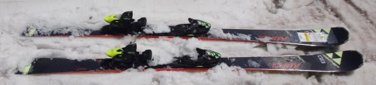
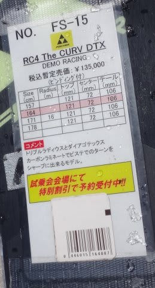
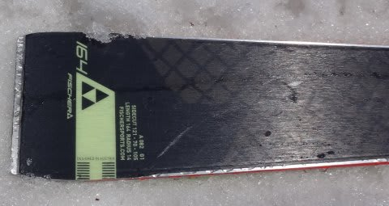
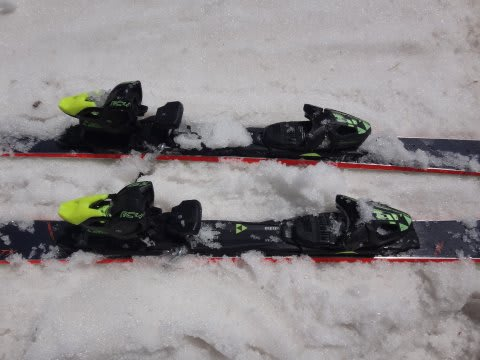
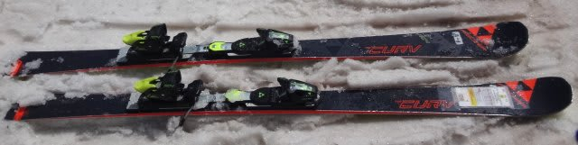
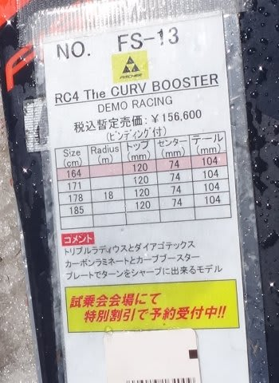
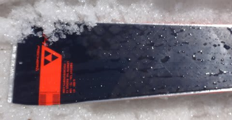
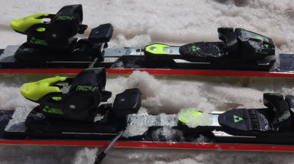

# まだまだ続く，2017シーズンモデル，スキー試乗レポート第9回…FISCHER編

📅 投稿日時: 2016-05-29 01:02:22

えー．

この土曜日ですが．

神田へは行ってません（笑）．

いろいろ用事があったので．

神田の魔力からは逃れられています．

ってことで．2017シーズンモデルのスキー板試乗レポート，

続きます…

まだ1/3ほどの機種が終わった程度です．

まだまだ続きますよ～っ！！

ってことで．

今日はフィッシャー編，2機種です．

では，どうぞ～！

FISCHER RC4 The CURV DTX 164cm

基礎小回り用・大回り用（長さで異なる）

えー．

ちょっとラインナップが変わった，今年のFISCHER.

The CURVって，去年まで無かったモデルですが…

昨年度までのRC4 SCやRCの後継機になるんでしょうか．

The CURVシリーズ．

boosterとかいう強そうなプレートが付いた

The CURV BOOSTERと，

普通のRailflexビンディングがついた

The CURV DTXの2種類があります．

こちらは，RailflexビンディングがついたDTXの方です

どちらかというと，DTXの方がサイドカーブがきつく，

小回りチックの板のようですが…

まぁ，長さは178cmまであり，長さによっては

大回りも行けるようです．

今回は，164cmを履いてみましたが…

荷重ポイントは，センター～心持ちトップ目．

基本的にセンターキープで行けます．

わずかに傾けたところからしっかり線でエッジが効いて，

ガッツリエッジグリップできれいに回ります．

小回り板っぽく，気持ちよくたわんで

小さい半径で回っていきます．

山回りの仕掛けでテールのエッジが効いて，

ターン後半の押さえ・走りがすごくいい感じ．

軽快に回り，スピード耐性も十分．

エッジグリップが強く，

軽快でターン後半までしっかりグリップさせた，

深いキレたターンができる，いい小回り板．

ATOMICのSXほどクリンクリン回る旋回性は無いけど，

それに近い性能を持つ，気持ちいい小回り板だと思いました…

FISCHER RC4 The CURV BOOSTER 164cm

基礎小回り～大回り用（長さで異なる）

こちらは，CURV boosterとやらのプレートが付いた，

The CURV BOOSTERです．

今シーズンモデルのRC4 RC Proは，RACE Boosterとかいうプレートでしたが…

プレートが変わったようですね…

トゥピースとヒールピース側は，金属バーでつながれたような，

結構しっかりした感じです．

履いた感じは…

DTXと違いずっしり重いです．

履いた瞬間から重く感じます．

その代り，安定性は高く．

高速には強そうです…

また，フレックスも結構強くなり，

164cmという，小回り用っぽい長さの割に

DTXよりサイドカーブが心持ち大きいことと，

たわみが出にくいのもあって．

この日のような柔らかいザブ雪では，

板がたわまず．

板なりにサイドカーブのみでミドルターンくらいの

回転弧で曲がっていく感じでした．

板が重めなので，板を動かして小回りを…

って感じでもないです．

どっしり重く，エッジグリップもガッツリ強く．

フレックスもガッチリと固めで．

割とテールのエッジが効いて，エッジに乗って

走っていく板です．

短めの板で小回りも…というより．

170cm台の板を買って，

固めの締まった整地で，ハイスピードロングターンを

決める感じの板ではないでしょうか…
