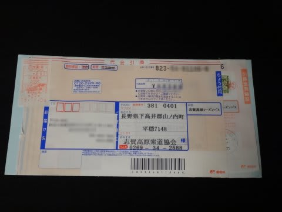
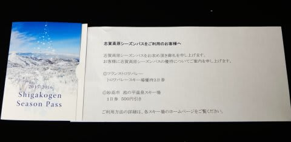
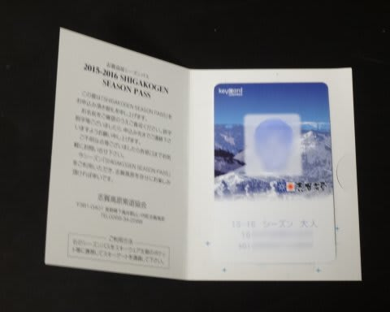

# スキーシーズン必須アイテム・志賀高原2016シーズンのシーズン券が届いたよっ！

📅 投稿日時: 2015-11-10 01:29:31

🏷️ カテゴリ: [日記](cc4b5682fb7b8b144980957a978653fb0.md)

えー．

先日のイエティにて．

なんと．

奥志賀高原ゴンドラ，一日40本以上乗車という方と

お会いしてしまったのですが．

…えーっと．

私が食事を抜いて，どれだけ死ぬほど滑っても，

焼額第1ゴンドラ35本が限度なんですけど…

かつて，Skilineの記録を見て．

「なぬ？奥志賀ゴンドラ一日40本以上！？？[そんなの可能なのか](e980c23b24939a374b74c3e0c03402b86.md)！」

と思っていた，

そーゆー記録を実現された，ご本人を目の前にして．

つくづく，

…自分というものは，なんと普通の人間であることか…

と強く思わざるを得ない今日この頃，

皆様いかがお過ごしでしょうか．

という時候の挨拶が終わったところで，本題へ．

先週，金曜日のこと．

…志賀高原索道協会から，何か届きましたよ…

ふむ．

これは，この時期定番の，志賀高原のシーズン券ですね．

10月中旬に郵送で申し込んだんですが．

11月4日から発送が始まったらしく．

その第1便で届いたようです…

こんな入れ物に入れて届きましたが…

ふむ．

今シーズンは，志賀高原のシーズン券を見せると，

妙高池の平のリフト券が割引になるのか…

…

…行かないので，全く意味なし．

で，

気になるシーズン券のデザインは…

あぁ．

ここ4シーズン，全く変わってませんね…

あと．

例年なら，GW後半の3～5連休が終わるまでが

有効期間だった，志賀高原のシーズン券．

今シーズンは，3連休の次の週末まで有効だよ！

数日とはいえ，期間が伸びたなぁ…

と，かすかに喜んだものの．

でも．

でも．

[焼額の営業は，4月3日まで](e122f1cef4d960defbf3a0130b0f09a3f.md)なんだよな…

かなり残念な感じがある今シーズンですが．

とりあえず，必須アイテムも手に入ったことだし．

例年通り，12月第1週からGW明けまで．

毎週の志賀高原通いの予定なのだっ！！
