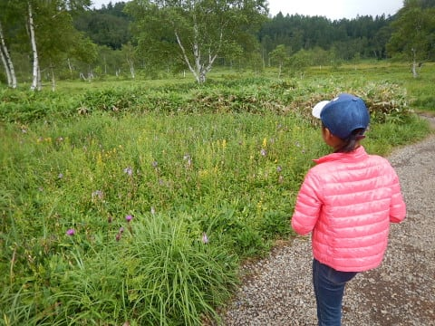
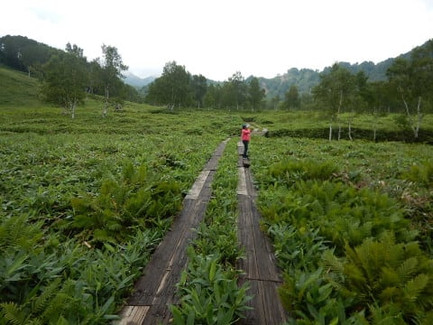

# 今日は志賀高原で盛りだくさんの一日

📅 投稿日時: 2017-08-19 23:30:39

🏷️ カテゴリ: [日記](cc4b5682fb7b8b144980957a978653fb0.md)

えー．

今朝4時過ぎに家を出て．

午前中は志賀高原を半日間，

たっぷりトレッキングしてきて．

そして，昼はおいしいおそばを食べに行ったあと，

午後には野猿公苑にて，さると戯れ．

夕方には，小布施まで足を延ばし，

栗のスイーツを堪能し．

…これだけでも十分な一日だったのに…

夕食を食べた後，

夜はまた志賀高原に戻り，

コンサートを楽しみ．

さらに，大蛇祭の花火をホントに真上に見える

特等席で堪能し…

それだけで終わらず，最後には石の湯の

ゲンジボタルをみて帰ってくるという．

朝4時に家を出て，夜10時まで遊びまくるという．

ナイターまで滑るスキーシーズンの土曜と同じような，

志賀高原での夏の土曜を過ごしたのでした…

いやー．

朝から晩までたっぷり満喫の一日でした～！

あしたは，大蛇際のおねりを見て帰ります～！
