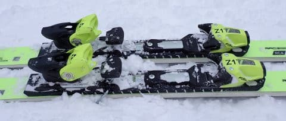

# 2025シーズンモデルのスキー板，試乗レポートその11…FISCHER RC4 WC GS MASTERS

📅 投稿日時: 2024-06-07 02:37:13

🏷️ カテゴリ: [スキー板試乗](c0bd8048615710cee890e403a36cc9a2b.md)

うーん．

日本ではあまりニュースになってないみたいですが．

本日，SpaceXのStarshipのテストフライト4が行われました…

前回のテストフライト3ではスーパーヘビーの

ブースターは無事着水したものの．

肝心のStarship本体は大気圏突入後に

コントロールを失い分解という結果でしたが…

果たして，テストフライト4はどうなったのか？？？

いやーーー．

今の時代は，[こんなもの](https://www.youtube.com/watch?v=rXRVtt8M9oY)がYoutubeで見れるってすごい…

[打ち上げは無事終了](https://www.youtube.com/watch?v=p9wtSVw3M8Y)し，1段目のスーパーヘビー

ブースターは無事メキシコ湾にランディング

バーン後に軟着水．

その後，Starshipは高度150㎞，秒速27km

という状態から大気圏突入．

高度70kmあたりで，プラズマに機体が覆われて

行くのは単純に美しく．

「ぉぉぉおお～！！」

って見てましたが．

高度60kmを割ったあたりで，フラップが熱で

壊れてボロボロと破壊されていくのを見た

ときは，

「ぁぁぁああ～！！」

って感じで．

これは今回も失敗か？？？

と思ったところで通信が途絶え，

リアルタイム映像がブラックアウト．

あぁ…

今回も機体破壊したか…

と思ったところ．

まさかの画像再開！！

Space Xのスタッフの大歓声の中の，

”The ship is still alive!!"

という実況を聞いて，

「ぅぉぉぉお！」

って感じでしたが．

ブラックアウトから復活後，破片でレンズが

汚れたのかカメラ画像がほぼ見えなくなり，

実況が

"The question is how much the ship is left..."

と言っていたのには，悪いけど

「ぶはははは！」

と笑ってしまいました…

しかし，その後，半分ほどがボロボロに

壊れたフラップが動いて健気に姿勢修正を

しているのが写り，まだ機体が正常コントロール

下にあることがわかって．

"We can see that flap is still actuating!!”

というのに

「ふぉぉぉぉお！」

と，再び感動し．

このまま無事着水するのか？

あるいはその前にフラップが壊れるのか…

という際どい状態で，Maximum Dynamic

Pressureを通過！

ここからあとは，フラップにかかる動的な

空気圧は下がっていく一方なので…

…これは，最後までもってくれるのか…？？

その後も，ぽろぽろとフラップの破片が

飛んでいく中，その壊れかけたフラップで

姿勢制御．

さらに肝心の一番最後のFlip Maneuverを

まさかまさかのそのボロボロフラップで

無事乗り越えて，

最後の数秒のLanding Burnで速度10km/h

くらいまで減速し，無事着水した瞬間は

「ぐぉぉぉおおお！すげーーー！！」

と．

長いドラマを見終わったように感動したのでした…

いや．

なかなか盛り上がる動画だった…

…しかしこれ，

やられた！と思わせながら無事生きて帰ってきた

っていう，見事に盛り上がるシナリオに

なっていて．

結果を知らなければ，まさに手に汗を握って

「どうなるのか？どうなったのか？？？」と

ひやひやさせる展開が続く，

「これ…イーロンが仕込んだんじゃないか？」

と思わせるくらい，見事なエンターテイメント

でした…！！

ってなことで．

こんな動画を見て感想を書いている暇もない

というのに，長い前振りを書いてしまった後は

本題へ．←これ，前フリのほうが長くない？？

本日も2025シーズンモデルのスキー板の

試乗レポート．

今回はフィッシャー編です！！

〇FISCHER RC4 WC GS MASTERS 181cm

GS競技用（FIS規定外）

FIS規定外でR=21となるこの板ですが．

181cmのみ，M-Plateがついて定価24.2万円．

183cm，188cmはアルミブリッジでトゥピースと

ヒールピースを繋ぐ選手向けのALU-KUプレート

がついて定価28万円となるらしいこの板ですが．

今回は28万円の方じゃなく，24万円の方です…

（ちょっと値段の高さに引いている）

やはりGS用ということで結構張りが強いので，

私が普段履きにしてる185cmのFISCHER RC4 

RCと同じR=21なのに，旋回半径が大きく

感じます．

…でも，RCのほうがR=21にしては旋回半径が

小さめに感じるので，こっちの板がR=21として

適切な旋回半径かな…

この日のような柔らかめの圧雪の上に新雪が

乗ったようなコンディションでは，

板がたわまないので結構縦目に落ちていった

ものの，それでもサイドカーブに乗って

板は回ってきてくれます．

私が焼額の朝イチ用として履いている

189cm，R=27の選手用のGS板よりは扱い

やすいですね…

しっかり硬めの雪じゃないとたわみが出ずに

カービングで谷回りを作りにくいということは

なく，この日のようにある程度柔らかい雪でも

ずらしを入れなくても谷回りを作って

いけました．

さらにずらしのコントロール性はかなりいい

ので，荒れた雪でも適度にズレを入れながら

滑って行けます．

ズレ落ちていくようなズレではなく，迎え角を

作りながらずらしていくと板がきれいに回っていく

ような，旋回性があるズレをする板なので，

ズレていってもコントロール性は高いです．

…ただ，ずらすにはある程度の正確なポジション

と脚力が必要なので…

おそらく，体力のない人，フレックス120以下の

柔らかいブーツを履いている人だと，

この板はちょっと手ごわく感じるかも．

逆に言えば，体重と体力があってブーツも

しっかり硬めのモノを履いている人は，

グリップも強く高速安定感も高いし，

それでいてズレのコントロール性も高く，

キレとズレの出し入れが自由にできるので，

この板をハイスピードゲレンデ大回り用として

履きこなせると思います．
