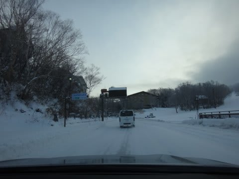

# BRレガシィE型＋BLIZZAK REVO GZで雪道を走ってみて

📅 投稿日時: 2013-12-19 01:02:46

ってことで．

[前回に続き](e98f3e52101a254cf4fedcb46fa5123bb.md)．

今度は，BRレガシィ+REVO GZで志賀高原の雪道にチャレンジしたわけですが．

かの有名な(?)志賀高原の雇用対策安全対策の．

おじさん4-5人が道路に立ちふさがって

「4WDじゃないとチェーン付けなさいね～」と指示する，

志賀高原チェーンチェック．

これまでの，オデ雄君(仮名)でのチャレンジでは．

必ず止められて

「4駆ですか～？」

と，聞かれたのですが．

＃毎週通っていても，まったく覚えてもらえない

レガシィでチャレンジすると．

止められることなく，あっさりパスさせてもらえました…

うむ！すばらしいぞ！スバル車！

…って，志賀高原の雪道にチャンレンジって，

皆さんこういうネタを期待していませんよね…

では．

雪道で運転した印象をば…

とりあえず．

REVO GZ．

効きます．これは．

私にとって，これだけ効けば十分以上だわ…

つるつるミラーバーンやブラックアイスはまだ走ってませんが．

そこそこの圧雪路面では．

…ここ，アスファルトか…？

ってほどのグリップ力を発揮．

こんなにブレーキ効いていいの？という減速Gを

発生させてくれます．

スタッドレスの進化はすごいなぁ…

圧雪路面では，10年前のスタッドレスだと

想像つかないグリップだわ．

積もりたてのふわふわ雪だと，やはりある程度滑りますが．

滑ったとしても，今度はスバルのAWDとの組み合わせで

安心してコントロールしていけます．

リアやフロントだけが滑ってアウトに出て行った場合とかでも，

アクセルを入れてステアリングを保持していれば，

確実にニュートラルステアに戻る！

＃車全体のラインは軽くアウトに膨らむけど，スピンモードには

＃入らない

雪道のコーナーでも，アウト側に余裕があれば，

安心してアクセル踏んでいけます．

そして．

スバルのAWDの最大のメリットは．

エンジンブレーキが4輪すべてに効く事ですね～．

ほかのオンデマンド4WDだと，マイナストルク(エンジンブレーキ)

状態では，ABSのコントロールに悪さすることを避けるため，

リアのトルク伝達を抜くところですが．

スバルのAWD，エンジンブレーキもリアに効く！

これは心強い！

で．

今のところ．

雪道で走っていても，過剰にVSCやTRCが効いてる感じは

ない……っつーより，効いてるかどうか分からないです(笑）．

昔のTRCつきの車のように，過剰にエンジントルクが抜けて，

どれだけアクセルを踏んでも上り坂をゆっくりとしか上らなく

なる…ってことはないし，動作しているって気づかないです．

とりあえず．

レガシィとREVO GZの組み合わせ．

雪道でも良く曲がるし，よく走る．

アクセルONでフロントが外に逃げていってしまうため，

アクセルOn/Offでステアリング調整が必要だったオデ雄君(仮名)と

違い，何も気にせず，普通に走れてしまう感じ…

まだ，ガンガンに攻めて走っていないので．

また後日，攻めて走ったらどんな感じだったか

レポートします…
