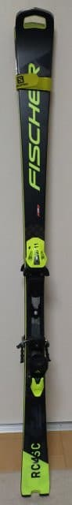

# 2024シーズンを共に過ごしたスキーアイテムたち…そろそろシーズンも終わりなのでシーズンまとめモード

📅 投稿日時: 2024-05-18 04:08:38

🏷️ カテゴリ: [日記](cc4b5682fb7b8b144980957a978653fb0.md)

終わってないですよ！！

まだシーズンは終わってないんですが…

あと，私のスキー予定も残るは月山のみ．

今シーズンも昨シーズンほどではないにしろ

仕事がいろいろ忙しく，シーズン54日しか

まだ滑ってないのに…もうシーズンほぼ

終わりか…（泣）

ってなことで．

そろそろ今シーズンの振り返りモードに

入ってくるわけですが．

まずは，今シーズン一緒に過ごしたスキー板を

振り返ってみましょう…

私の手持ちの板は7セットあるわけですが…

今シーズンは，ほとんど以下の3セットだけで

滑り切った感じ．

・FISCHER RC4 RC PRO '21

普段履きにしているのがこの185cmの

大回り用板のRC.

志賀高原で滑っているうちの，7～8割くらい

このRCで滑ってた感じでしょうか…

トップシーズンはほぼずっとRCを

一日中履いてましたね…！

で．なんと．

この板，今シーズンでメイン板として

3シーズン履き続けているわけですが…

試乗会で履いた新品板と比べても，

まだ全くヘタった感じがありません！！

まぁ，ここ3シーズンはコロナやら

激務やらで滑走日数が2割ほど減っては

いるとはいえ．

それでも3シーズンもったのはすごい…

私のメイン板としては史上初の

4シーズン目に突入です！！

いやーーー．FISCHERの板って，

かなり頑丈でうれしいなぁ…

・VOLKL DEACON 84

荒れた雪・春雪用セミファットのこの板．

志賀高原では，RCを履いてない残りの2割から

3割はこいつを履いていた感じでしょうか…

12月や1月で新雪が積もって雪が荒れ気味の

日も履きましたが．

3月や4月に入って，昼頃に荒れてくると

ほぼ確実にDEACONに履きかえて滑って

ましたね～．

やっぱりこの板，春の雪の楽しさが

全然違う！！

これまで春の雪で荒れてくると楽しく

なかったのが，この板を履くと結構

楽しく滑れるので…

春スキーには必須ですね．

それでいて，春以外のモサモサ新雪も

行けるし．

整地でも普通の大回り板としてそこそこ

使えるので，雪がどうなっているかわからない

時は，こいつをもっていけばまずは

大丈夫という，不思議な安心感がある板

なので，出番が多かったですね．

…でも．

今シーズン終盤には，滑走面が結構波打って

来ました…

アイロンを当てると，ビンディングの前後

部分あたりがかなりコンケーブになって

いるのがわかります（泣）

とりあえずチューンナップに出したので，

滑走面はフラットに戻ると思いますが…

まだヘタった感はないので，使い過ぎによる

劣化ではないことを願いたい…

・石ころふみ用FISCHER RC4 SC PRO ’21

イエティ，志賀の初日と最終日，

そしてかぐらなど．

石ころを踏みそうなところで履く

この板．

志賀では2日しか履いてないので，

そんなに履いてない感がありましたが…

志賀以外ではこの板しか履いてなくて．

志賀の2日以外，イエティで6日，

かぐらで1日の計9日履いているし．

今後の月山でも履くので…

シーズン55～56日のうち，約2割がこの板を

履いている計算になりますね．

滑走距離はそれほどではないけど，日数的に

この板は結構履いてます…

でも．この板もほとんどヘタっている

感じが無いので…

やっぱりFISCHERの板は，かなり長持ちする

板なのかも…？？

…続いて，以下の2種類．

この2種類は，残念ながら今シーズンほとんど

履いてません（泣）

・FISCHER RC4 SC PRO ’23

石ころふみじゃない，トップシーズン用

小回り板として買ったこの板ですが．

ロングコースの焼額では小回りをしよう

とは思わないので…

トップシーズンは小回りの板を

履こうと思うことがなかった

というのが，ひとシーズン終わって

明らかになりました．

いや．

昔は斜面が荒れてきたり，人が増えてきたりして，

大回り板だとキツイ…

と思うときに小回り板に変えてたけど．

今は斜面が荒れるとDEACONの出番だし．

今シーズンは，焼額がそこまでひどい

混雑になることも少なかったし．

ナイターも大回り板で滑ったし．

結果的にこの板，トータル数時間しか

履いてないんじゃないかな？？？

うーん．

RCをメイン板にする前，

2013シーズンから2020シーズンまで

165cmのATOMICのSXをメイン板として

ひたすら小回り板を履いていた自分が，

シーズン中ここまで小回り板を履かない

ようになるとは…

10年前の自分に教えてあげたい．

・FISCHER RC4 GS Master

あさイチの人がいないフラットバーンで

かっ飛ばすためのこの板ですが．

今年はトップシーズンの雪があまりにも悪すぎて．

GS板でかっ飛ばそうと思う雪になることが

ほとんどなかったので．

おそらく出動したのは4日間だけ（泣）

それも，うち2日間は1-2本滑っただけで

履き替えているので．

こいつもトータル5-6時間しか

履けなかった気が…

いや．

雪さえよければもっと履きたかった．

もっと履きたかったのに，暖冬のせいで

全然履けなかった板です…

悲しい…

さらに一度も履かなかったのが，

以下の2セット（涙）

・LINE Sir Francis Bacon

新雪用の，センター108mmのファット板

ですが…今シーズン，一度も履いてません（涙）

だって…

だって，この板を出すほどの新雪が，

一度も積もらなかったんですもん（泣）

暖冬なんて．

暖冬なんて，嫌いだ～っ！！！

・FISCHER RC4 RC 魔改造版 

この板は，私が今メイン板としているRCが

ヘタったら出動させようと，大事にとって

ある板なんだけど…

なにぶん，RCの前にメインマシンとして

履いていたATOMICのSXが，4セットとも

平均40日でヘタって行ったので．

RCも1シーズンちょいでヘタるはず！！

と，RCを買って気に入った直後に

慌てて買った予備機だけど．

まさか，FISCHERの板，4シーズン目に

突入できるほど頑丈だと思わなかったので，

この板も一度も出動の機会なく終わりました．

いや，予備機が出動しなくてよいのは

板がヘタってないということで，すごく

良いこと．

この板，このままあと2-3シーズン出番が

無くて済んでくれれば，物欲選手権に

負けなくて済むからうれしい

なぁ…←いや，RCがヘタらなくても物欲選手権に負けるでしょ

…ってなことで．

ほぼ3セットで完結しているので，

板を7セットも持つ必要があるの…？

という，当然のツッコミを受けそうな

今シーズンでしたが．

…暖冬が悪い…

暖冬がなきゃ，GS板もファット板も

出番があったのに…

でも．

今シーズン．RCもDEACONもまだ

ヘタってなさそうなのでチューンナップに

出したし．

SCもGS板もほとんど履いてないので，

ヘタってるわけがないし．

…次のシーズンは，板を買わずに済みそう

だな…っ！！！←物欲選手権に負ける盛大なフラグのような気が？？
