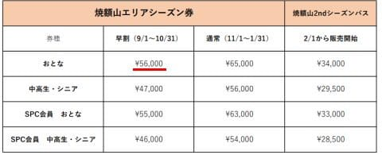

# 2024シーズンもプリンス系列9スキー場で使えるシーズン券が出るけど，値上がり無しの10万円！！これはお得かも

📅 投稿日時: 2023-09-18 03:12:13

🏷️ カテゴリ: [スキー雑談](c1f9d2cb7478308da16419928ea3945e9.md)

ここ数年，プリンス系列の全スキー場で

使えるプレミアムシーズンパスが出てましたが…

今シーズンは情報がなく，

「もう出ないのかな？」

と思っていたところ．

9/15付で情報が出てました～！！

（[プリンスホテルプレミアムシーズン券案内ページ](https://www.princehotels.co.jp/ski/premium_season_ticket/)より．以下同）

先着300名の早い者勝ちで，

申込期限は10/19までなのですが．

これまではあまりにも高すぎて

全く検討対象にも上がってこなかった

このチケット．

今シーズンの値段を見ると…

え？10万円？？

昨シーズンと値段変わってないの？？

いや…ほかのスキー場，鬼のようにシーズン

券が値上がりしていて…

その中で，これまでと同じ10万円でこれだけの

スキー場が滑れるってなると．

今年は逆に「安い」と感じるほど…！！

それも，当たり前ながら，全てのスキー場が

シーズンインからシーズン終了まで滑れるので．

軽井沢の11/1のアイスクラッシュスタートから，

かぐらファイナルの5/19まで滑れます！！

これはすごい！

さらに，有料駐車場もリフト券定時で無料で

利用できるとも書かれていて…

かぐら・苗場ではかなり有効なチケットなのでは！？

いや．

焼額限定シーズン券が，早割で56000円だから…

（[焼額スキー場シーズン券情報ページ](https://www.princehotels.co.jp/file.jsp?id=421313)より）

これに4万4000円乗せれば…

焼額の早朝・ナイターはもちろん．

軽井沢のシーズンインから，

さらに万座，妙高が滑れて．

北海道に行けば，富良野も滑れて…

そして，とどめの苗場・かぐら，

かぐらもファイナルまで滑れて駐車場も

タダとなると…

シーズン券が軒並み値上げした今では，

安く感じるよ！！

狭山は滑れないみたいですが…

まぁ，それはいいや．

ってことで．

一瞬かなり心揺らいだのですが…

いや．

志賀高原全山のシーズン券早割より

高いし．

かぐらもシーズン3回か4回ほどしか

行かないし…

と考えて，今シーズンも志賀高原全山券に

しようと思ったのでした…

しかし．

まさか今シーズンも値上げせず，10万円で

このチケットを売り出すとは…

志賀高原・富良野・軽井沢の自動ゲート対応

チケットで，チケット交換無しでそのまま

乗れるみたいだし．

めんどくささもないので，リフト券が

軒並み爆上がりしている今，かなりの

お買い得チケットだと思うので．

気になる方は，300枚が売り切れる前に

購入を検討してみてください！！

…そして．

どうでもいい話だけど．

[このチケットの紹介ページ](https://www.princehotels.co.jp/ski/premium_season_ticket/)の焼額の写真…

知ってる人がいっぱい写ってる気がする…

## 💬 コメント一覧

### 💬 コメント by (げんさんスキー)
**タイトル**: Unknown
**投稿日**: 2023-09-18 17:45:26

こんにちは、はじめまして。

プリンスは作シーズンまで付いていた2万円分のチケットが無くなったので、実質値上げかと。

でも外が値上げしているので据え置きは検討候補になりますね。

それから値下げした車山高原が安いです。

### 💬 コメント by (Skier_S)
**タイトル**: ＞げんさんスキーさま
**投稿日**: 2023-09-19 01:36:51

コメントありがとうございます～！！

あ，昨シーズンまでは2万円分のチケットがついてきていたのですね…

それだと，確かに実質2万円分の値上げですか…

でも，志賀・野沢等の6スキー場共通券が12万ってことを考えると，

10万でもお得かも．

車山は逆に値下げしたんですか…！！！

それはすごい…！

