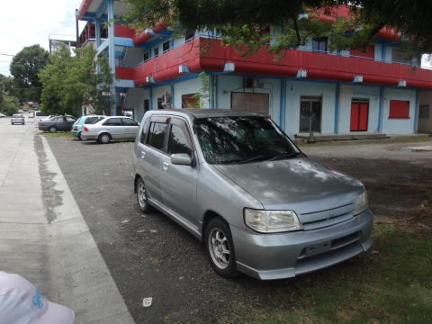

# 2014年10月，小学生の子連れでパラオへダイビングに行ってみた，その33…お昼ご飯はドーナッツ

📅 投稿日時: 2015-09-21 00:16:27

🏷️ カテゴリ: [ダイビング日記](ce3a7a8d424d112fce83ee85c81a0e344.md)

えー．

シルバーウィークです．

巷は，5連休のようです．

ええ．5日間，ぶっ続けのお休みです．

こんなお休みが続くなんて．

お休み祭りです！←なんのこっちゃ？

…とりあえず．

私も無事5連休がとれたので．

ちょっと，出かけてます…

いや，ダイビングではないんですよ．

シルバーウィーク，ツアー料金もなにもかも

お盆と同じくらいの狂乱高騰物価だったので．

我が家の経済状態では，とてもとても…

まぁ，私がどこに来ているかは．

たぶん，またおいおいレポートするとして…

とりあえず今日は，引き続きのパラオレポートへ，Go!

----

で．

水が出ることに涙を流し感動しつつ，

ダイビングで塩まみれになっている

身体をシャワーで流して，

ダイビング器材を干したら…

おっと．もうお昼前だよ．

さてさて．

お昼ご飯を食べに行きますか…

ただ．

今日は午後からオプションツアーを予約してあり，

ゆっくりお昼ご飯を食べる時間がありません．

ホテル横のレストランで軽く食べるか…

と，思っていたら．

な，なんと．ホテル横のレストラン，定休日だよっ！（涙）．

うーむ．

これは．

時間もないから，どこかで食料を買い込んで，

ホテルで食べるくらいしかできないなぁ…．

だけど．

今いるホテルは残念ながら．

1Fがスーパーだったという，そういう場合に最強といえる

デセケルではないんだなぁ…．

このホテル，「バイザシー」．

町はずれにあるので．

レストランどころか．

全く周りにお店が見当たらないんですけど…（涙）．

（何もなく寂しいホテル前）

だもんで．

ホテルフロントで，

「食事を買い込むのに，いい場所はござらぬか？」

と聞いたところ．

フロント横に併設されている，ホテルのレンタカー屋の

カウンターにいた，レンタカー屋のおじさん．

この人がすごく話好きらしく，

いろいろお店を教えてくれて．

それどころか，

「用事があってちょうど出かけるところだから，

　WCTCショッピングセンターまで，

　行きだけ送って行ってやろうか？

　わははは．

　帰りは歩いて帰ってくれば，15分くらいだよ．

　がはははは」

って感じの，たいへんありがたいご提案を…

ええ？

いいの？？

WCTCまで往復30分かかるから，あきらめてた

所だったんだけど．

いいの？

ありがたや…

ぜひ！ぜひお願い！

ってことで．

甘えて，車で送ってもらうことに…

このおじさん．

トヨタレンタカーに勤めていながら，

日産車に乗っているところに

そこはかとない疑問を感じつつも…

ありがとう！レンタカー屋のおじさん！

パラオの人，優しいなぁ…

で，WCTCショッピングセンターに送ってもらうつもり

だったんだけど．

結構おしゃべり好きなおじさん，

車の中でいろいろ話しかけてくるわけで．

その途中，道端の店を指さして．

おじさん　"There's a good doughnut shop."

 私 "Oh, My daughter loves doughnut!!"

おじさん "All kids love it... Do you want to get off here?"

ってことで．

送ってもらったのは，ショッピングセンターではなく，

ホテルからそう遠くない，ドーナッツ屋さん．

ここで，ドーナッツを買い込んで，お昼ご飯代わりに

しましょう…

結構いろいろ種類があって，目移りするなぁ…

お値段も意外とリーズナブル．

ってことで，ドーナッツを買い込みましたが．

娘はホテルまで我慢できず，

帰り道の途中で食べ始めてます…

そしてホテルへ帰って…

＃ホントに周りに店らしきものは全く無い

ドーナッツを食べおわったら．

ちょうど，オプションツアーのピックアップ時間となりました．
