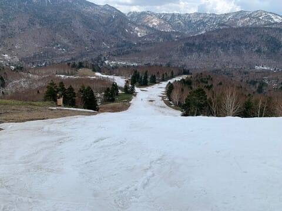
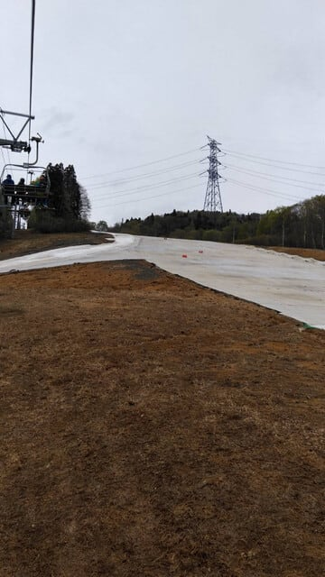

# GW前半3連休初日，4月27日の志賀高原スキー場，特派員情報…そして私はGW初日は家でVMG LEVORG君のタイヤ交換

📅 投稿日時: 2024-04-28 01:37:15

🏷️ カテゴリ: [車](cba0e8330b3f2ded7c1addfacc75d4547.md)

えー．

GWが始まりましたね…

GW前半，3連休初日の本日も，

志賀高原の特派員から写真が送られて

来ましたが…

本日は朝のうちは雲の合間に青空も

見える天気だったみたいですが，

基本的に終日曇り空，

あ，営業がほぼ終わりかけの午後3時

過ぎから4時前くらいにかけて，

一瞬雨が降ったようです…

朝から気温は+5℃を越える高温で，

早朝から雪は緩み気味だったようですが．

3連休にもかかわらず，焼額は

ガラガラだったようです…

今日は気温が高かったけど，

曇り空ということもあり，そこまで

雪は解けなかったようで．

まぁ，この辺りは昨日と同じ感じで，

雪がそこまで減った感じはないですね…

一番雪が薄くてヤバいこのあたりも，

今日は土が出てきてなかったみたいで．

雪寄せをして厚みを稼いだ効果は

あったようですね…！

GSコース，3連休は問題なく行けるんじゃ

ないかな…

という，特派員からのコメントもあり．

確かにまだまだいけそう…！

…でも．

このあたり，雪がすごく減ったなぁ…（涙）

でも，焼額はゴンドラ2本も動いていて，

コースもロングコースが2本まだ滑れるのに．

このGWは雪がないと思われているのか，

ガラガラだったようです…

ホントに誰も写ってませんね．

今日は雪もストップ雪にならず，

午後もそこそこ楽しめたという

報告もあったのに，ここまで

ガラガラとは！

ただ…GSコースがGW前半で終わって，

さらにサウスコースから第1ゴンドラに

戻ってくる最後のここが途切れると，

第1ゴンドラは終了ですが…

うーん．ここはあと1週間は厳しいかな…

それでも，パノラマーサウスコースは

まだまだ持ちそうだし．

GW後半4連休も，第2ゴンドラが

動いてくれるかも…？？

最悪第4ロマンスはGW最後まで

行ってくれるんじゃないかな…

で．

本日は，なぜかかぐらからも特派員

レポートが届きましたが．

なんと．本日からみつまたを滑って

ロープウェーまで戻れなくなった

ようです…（泣）

GWまでにみつまたが滑れなくなったのは

ここしばらくなかった気が…（涙）

みつまた高速リフトを降りてから

ゴンドラ側へは滑って降りれる

みたいですが…

しかし，帰りのタイミングの

ミツマタ第2ロマンス，激込みですね（泣）

特派員は17分待ちだったとか…

当然，かぐらメインバーンも激込み

だったみたいです…

…でも．

もうメインバーン下部，かなり土が

出てきてますね（涙）

一応まだ田代が滑れるので，混むのが

嫌な人は，田代側から上がって，

田代側を滑るのが正解なのかも…

というか．

混雑が嫌な人は，志賀に来ればがら空き

コースを飛ばしたい放題なんだけどなぁ…

ってな感じのGW初日．

私は何をやっていたかというと…

久しぶりに昼まで寝て，睡眠不足を

解消するとともに．

LEVORG君のスタッドレスを夏タイヤに

交換してました～！

…いや．

ホントは滑りに行きたかったんですけどね…

今日睡眠2時間で滑りに行ったら

たぶん死んでた．

とりあえず．

昨年11月末にタイヤ履き替え以降，

ひと冬雪道を走りまくった足回りを

見てみると…

うぎゃー！！

やっぱり汚い！！

当然，足回りを磨く！

ひたすら磨く！！

…とりあえず，汚れは落とせたかな…

で，いつものシャーシコート！

うん．

これで，13.5万km走っている足回りには

見えないくらいきれいになったかな…

フロントもかなり汚れていたところを…

ひたすら磨いてきれいにする！！

凍結防止剤がまかれた道を毎週のように

走ってきた車なので，徹底的に

磨き上げて錆を予防するのだ！

…ってな感じで．

タイヤ4本交換に5時間…

タイヤ交換というより，壮大な

下回りの汚れ落とし＆磨き上げ

タイムでした…

で．

意外と走行距離が短く，今シーズンは

1.3万kmしか走らなかった3シーズン目の

スタッドレス．（GWもスタッドレスで

走ったら1.5万km余裕で越えちゃうところ，

GW前に交換したので距離が短い）

1，2シーズン目もコロナの影響で

走行距離が短く，3シーズンのトータルで

3.7万kmしか走ってないのですが．

果たして，もう1シーズンもちそうか？

見てみたところ…

まだプラットフォームまで2-3mmくらい

ありそうですね…！！

これなら何とか，ぎりぎりあと1シーズン

もつかな？？

コロナ前の，1年2万km走っていたころだと

2シーズンしか持たなかったスタッドレス．

コロナからの3シーズンは走行距離が

少なくなったうえに，

YOKOHAMAのiG5Plusはかなりライフが

長いこともあり，

私の人生で，たぶん初めてのスタッドレス

4シーズン目に突入確定です…！

やっぱりYOKOHAMAのiG5Plus，

5万kmくらい持ちそうだな…

## 💬 コメント一覧

### 💬 コメント by (かず)
**タイトル**: Unknown
**投稿日**: 2024-04-28 14:25:17

今日いました？1Fのお店満席になってるの見ましたよ！やはり春はビールですね

### 💬 コメント by (Skier_S)
**タイトル**: ＞かずさま
**投稿日**: 2024-04-28 22:26:57

今日は志賀にはいかなかったです…

そしてリトルスターマックス，まさかの満席ですか！！

### 💬 コメント by (副院長)
**タイトル**: Unknown
**投稿日**: 2024-04-28 22:44:50

冬タイヤ4年目突入ですか、僕のブリザックも、3年3万キロオーバーですが、同じような減り方ですが、来シーズンは新しいのにします。せこくまだ、履いてます。来シーズンはVRX4になるのかな？

写真では、ディスクローターも、パッドも減ってる様に見えますが、そろそろ乗り換えでしょうか？もう1年延命して、来年でしょうか？冬タイヤ無くなった時が　乗り換えのチャンスですね。

### 💬 コメント by (Skier‗S)
**タイトル**: >副院長さま
**投稿日**: 2024-04-29 17:42:34

ブリザックが３万㎞越えてまだ山が残っている東野は，結構長道ですね…

うちの車は，ディスクローターはまだ大丈夫だし，パッドも全然大丈夫そうです．

タイヤも持つので，あと1年，７年目車検までは乗ろうかと思います…

