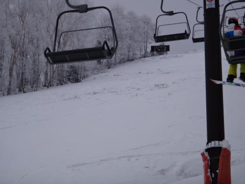
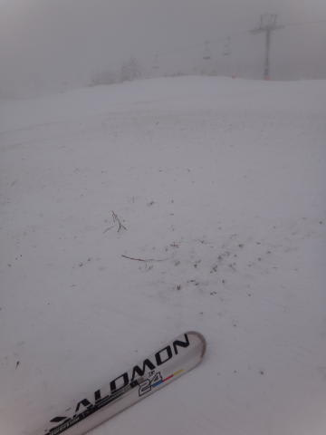
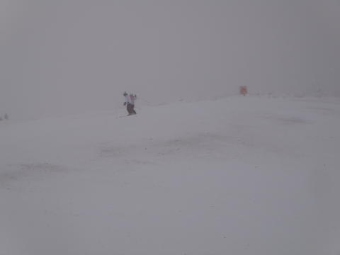
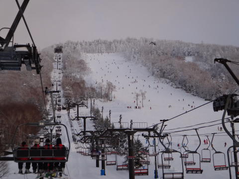
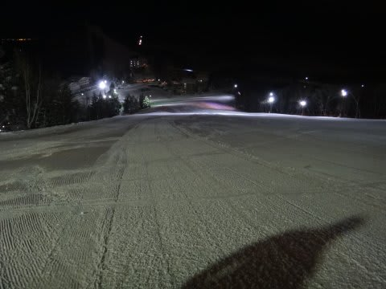
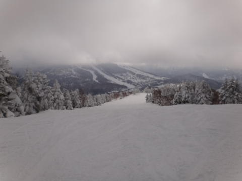
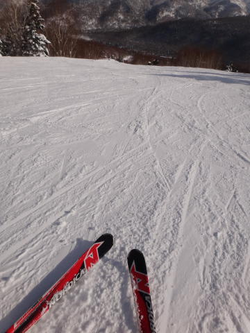
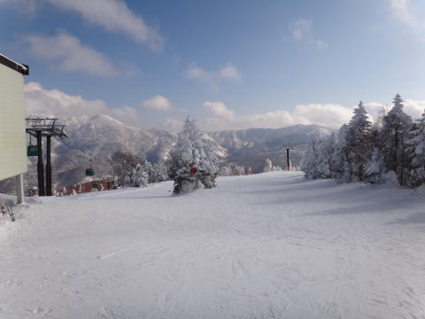
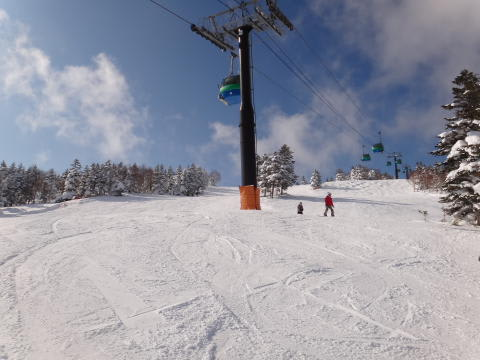
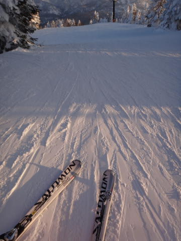

# 3連休2，3日目…1月8，9日の志賀高原は

📅 投稿日時: 2012-01-10 01:42:24

で．

昨日はちょっと更新出来ませんでしたが．

あー．3連休の2日目と3日目ですね．

志賀高原は残念ながら，ほとんど積雪はなかったです…(涙)

スキー場によっては，ぱふぱふのところがあったようですが．

志賀高原は，新雪ぱふぱふどころか，この2日間での積雪は

2-3cmくらいかな…

いや，2日目の8日は，終日日が射さず，雪が舞って-15度程度と死ぬほど

寒かったんですが．

積もるほどの雪じゃなかった…

で．

この日は，久しぶりに志賀高原でも，焼額以外をうろついたんですが．

サンバレーはちょいと荒れ気味（ナイターから圧雪かけなおしてないのか？）

丸池Aコースはまだ雪がかぶってないし…

ジャイアントの急斜面は人工雪のアイスバーン斜面だったし．

西舘山や…

寺子屋は…

恐怖の大量浮石スキー板傷つけ斜面

…積雪が足りないぞっ！

で．一の瀬は

かなりの人口密度．

…うーむ．

やっぱり焼額は雪がいいし，ゴンドラで寒くないし．

焼額が一番いいなぁ，と再認識．

サンバレーナイターはピカピカ圧雪で最高シアワセだったんですけどね．

で．9日はやっぱり焼額へ．

…この日も残念ながら積雪はほとんどなし．

せいぜい1cm程度…（涙)．

でも，おかげできれいな圧雪．

午前中は多少曇っていたものの，

朝イチはがらがらなピカピカ圧雪バーンを

飛ばすことができ…

昼過ぎには晴天に！

で．3連休最後だからか，午後はガラガラ！

ガラガラ，晴天，雪よし！

3拍子揃った最終日．

この日は夕方まで雪もそれほど荒れず，結構楽しめましたね～．

しかし．

この3連休もあまり雪が積もらず．

今年は新雪にあたらないなぁ…

…例年より，全体的な積雪が少ないような．

来週こそ，パフパフを楽しみたいんだけどなぁ…
