# 2023年8月，座間味で親子3世代ダイビング！その19…今回の旅行の座間味ラストナイト

📅 投稿日時: 2023-10-10 06:38:23

ダメだ…

3連休なのに，仕事が終わらなかった…

3日間もあったのに…（涙）

あぁ…3日とも仕事をせず過ごせる

3連休を過ごしたい…

ってな状況にもかかわらず．

こんな時間になったけど，ちゃんと更新…

えらい！！←誰もほめてくれないので自分でほめる

今日も書き溜めておいたダイビング日記，

[前回の続き](eff0d9a0e36af73fe2f4b077add8fcc40.md)です

ーーー

ってなことで．

座間味のすべてのダイビングを終えて．

船は港へ戻ります…

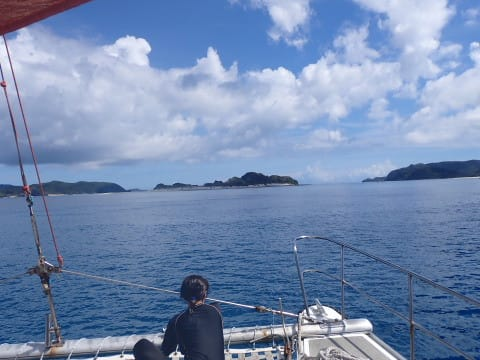

3本目のポイントは，座間味港に近い

阿真ビーチだったので，船はすぐに座間味港へ

近づき…

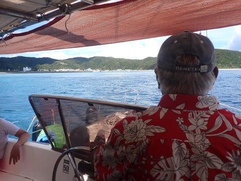

3本目Exitしてから20分ちょいで，

もう港へ到着！

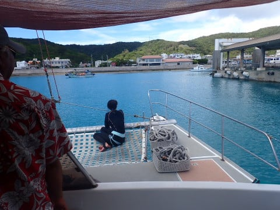

午後3時前には，座間味港へ戻ってきました…

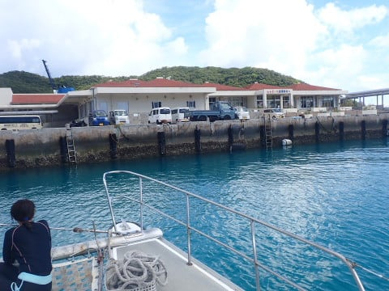

ということで．

今回，3日間お世話になったティンガーラ号も

これにてしばしお別れ．

でも，4年ぶりの慶良間の海，

楽しませてもらいました…！！

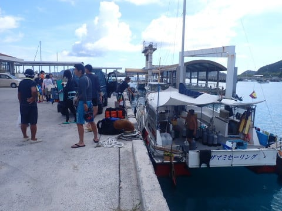

しかし．

ホントに短い3日間だった…

もう今回の旅行のダイビングがすべて

終わったとは信じられない…

また明日も潜りに行くんじゃなかったっけ？

とか思いながら，宿へ戻って…

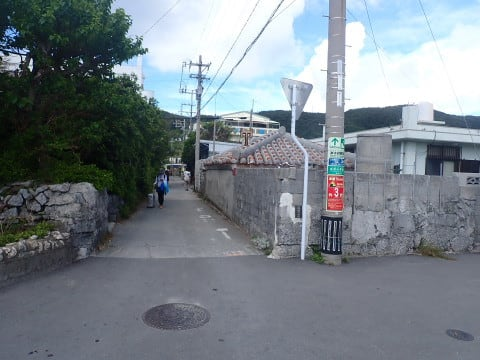

これまで船に積みっぱなしだった

ダイビング器材を洗って干していると…

ダイビングが終わったことを痛感．

あぁ…

なぜ．

なぜ，楽しい時間というのはこんなに

はかなく終わってしまうのか…（涙）

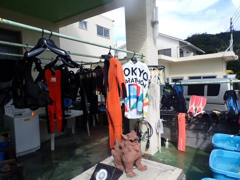

器材を洗った後にシャワーを浴びて，

自分の身体も塩抜きをするわけですが．

今日，宿に戻ってきたのは午後3時過ぎ．

まだまだ時間があるわけなので…

今日もお散歩に出かけましょうか…！

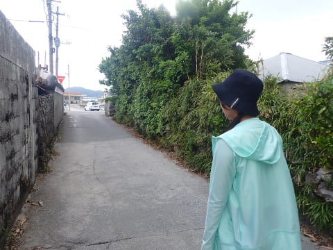

向かったのは…

前回来たときから建物が建て替えられて，

今回新たに港の目の前に新しく作られた，

「青のゆくる館」

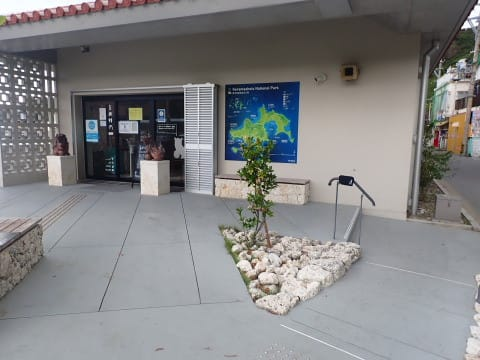

うーん．

知らぬ間にこんなものができてたので．

とりあえず入ってみましたが…

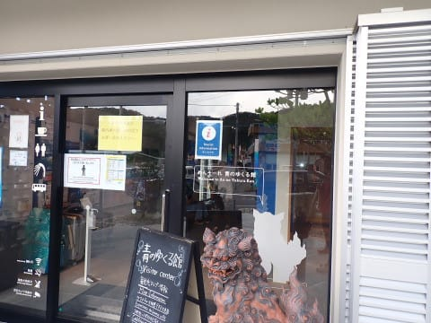

中を見ると，

なんだか，座間味の素朴な雰囲気には

あまりそぐわない，お金のかかった

展示が並んでいる観光施設ですね…

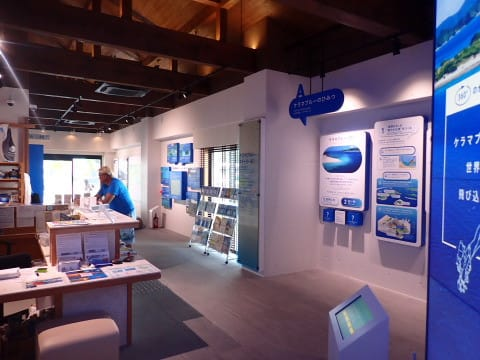

座間味の海やらなにやらが見られる

インタラクティブな動画スクリーンやら，

何やらが並んでますが…

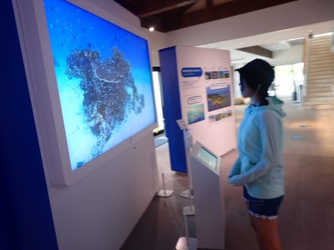

うん…

いかにも補助金で作った，観光地の施設

っぽい感じ…

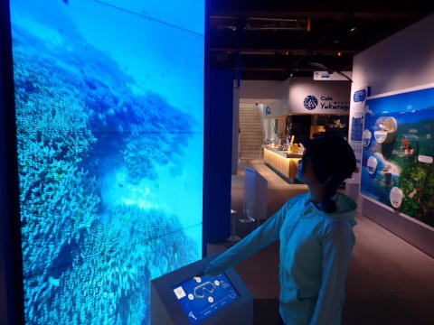

そして．

海のゆくる館を見た後は．

今回の旅行の定番となってしまった，

105ストアへ寄って…

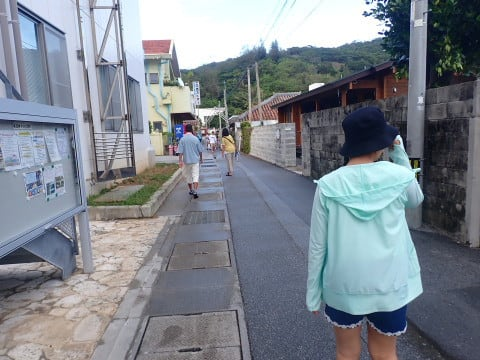

お楽しみの，アイスクリームタイム！

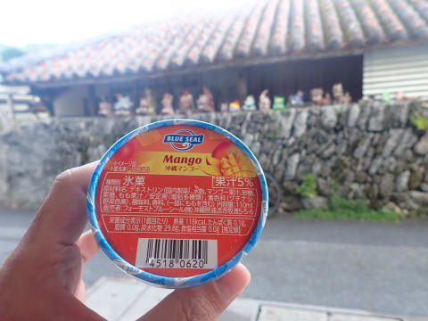

沖縄といえばこれ，ブルーシールアイス

ですが…

この，マンゴーとシークァーサー，

かなりおいしいですね～！！

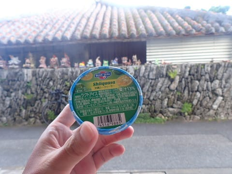

娘も満足！

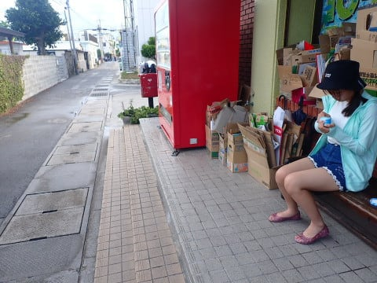

港に戻ってきたのが15時で，

夕食の予約が18時半からなので…

時間はまだまだありますね．

今度は，また港のほうへ戻って…

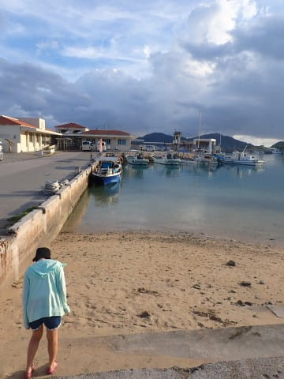

夕日が沈みゆくのを眺めます…

あぁ…今回の旅行も，終わっていく…

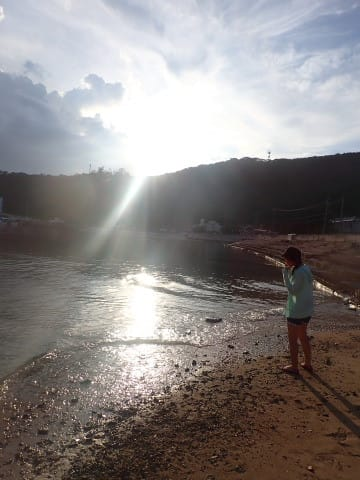

ってなことで．

夕日が沈むころ，そろそろ夕食に向かい

ますが．

…しかし座間味島，ホントに猫が多いなぁ…

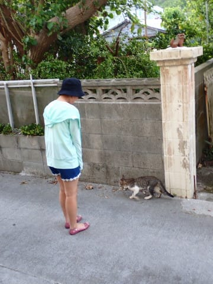

で．今晩の夕食にやってきたのは，

「三楽（さんた）」さん．

星砂さんのすぐ隣の居酒屋です．

今回，星砂さんにおすすめを聞いて，

全て予約してもらってやってきたのですが…

4日とも違うお店で，星砂さんのおススメ

だけあって，それぞれ個性があって

いい感じ．

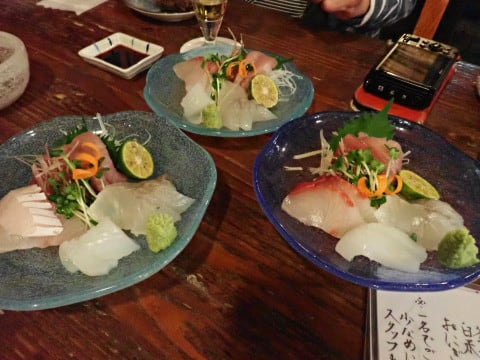

このお店は，魚介類がメインで．

お刺身やら，カマ焼きやらを楽しみながら…

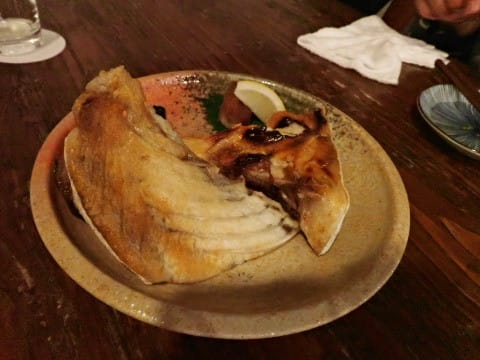

最後はしらす＆いくらご飯で締め！

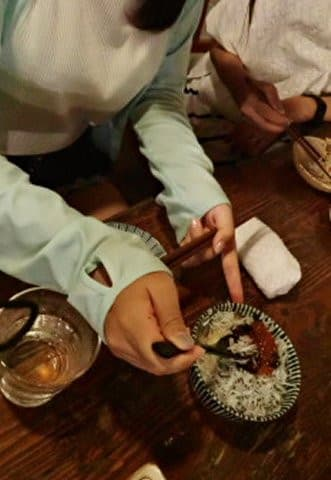

いやー．

ラストナイト，たらふく食った…

この後．

宿に帰って，ダイビングで撮った写真を

見ながら，ログブックをつけて．

今日のダイビングを家族3世代で

振り返りつつ，夜が更けていったのでした…

（[続く](efe86ccc6639e4c5efe9584b455856c67.md)）
