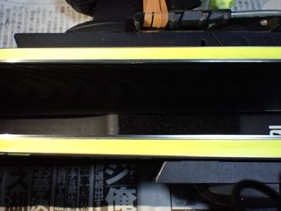
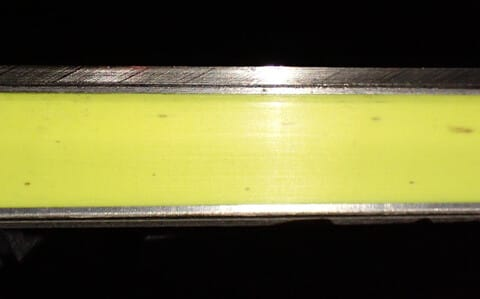

# うぎゃーーー！！今シーズンからメイン機として使っていたFISCHERのRCのスキー板が剥離！？？そして今週末の志賀高原は土曜は晴天高温，日曜は昼頃から雨

📅 投稿日時: 2025-04-12 00:23:51

🏷️ カテゴリ: [日記](cc4b5682fb7b8b144980957a978653fb0.md)

えー．

本日も志賀高原の特派員から写真が送られて

きたわけですが…

昨日の予想で，

予想した雨は，最新の天気図では，意外と

明日の朝までには止んでくれそうかな．

と書いたように．

朝までには雨がやんでくれて，朝から

日が射したようです…！！

とはいえ，朝から気温は高く．

朝9時過ぎですでに+4℃まで気温が上がり…

すっきり晴天というわけでなく，

ときおり曇ったり晴れたりだったようですが．

高温と日差しのおかげで，朝10時には

もう雪面はかなりずぶずぶだったようです…

ただ，かなり人が少なかったので，

そこまで雪は荒れなかったのかな．

とりあえず，晴天だった本日の志賀高原

ですが．

明日，明後日の天気は…

12日(土)：終日晴れの一日！

　早朝はぎりぎりマイナス気温．

　早朝一番はがっちり硬めのシマシマ．

　朝から日差しが強いので，表面は

　じきに緩んで，通常営業のころは

　滑りやすくなる．

　終日晴れで最高気温は+10℃近くまで

　上がるので，暑さを感じるほどで，

　午前中に雪はザブザブになっていく．

　午後はバーンは荒れそうで，さらに

　緩斜面は板の滑りが悪くなるか…

13日(日)：早朝からプラス気温．

　早朝はわずかに締まっているけど，

　8時ごろには気温は+5℃を越えて，

　朝から雪は緩んでいく．

　ただ，日差しはないので朝のうちは

　そこまでひどく緩まなさそうだけど…

　どこかの段階で雨が降り始める．

　運が悪ければ9時過ぎくらい，

　運が良ければ昼頃から雨．

　降ったりやんだり．時折強く降る．

　午後は風も強まり，ゴンドラが

　減速運転するかも…(涙）

という感じで．

土曜はザブザブ，日曜は昼前後から

雨という，ちょっと悲しい感じの

週末になりそうです…

ということで．

今週末も志賀高原に滑りに行くわけですが．

そのための準備をしようと，メイン機である

FISCHERの’19 WC4 RCの手入れを

していたとき…

3月の段階で，[滑走面がフラットじゃ
無くなってきているのに気づいてた](e2afb70c3b69d2a3bce954f5f1e0332d5.md)けど．

なんだか今回は，滑走面が異常に波打って

るんですけど？

これはヤバい気配が…

と，板のエッジ付近を見てみたわけですが．

この，矢印付近の部分．

ここをよく見てみると…

え？

えええ？？

見事にエッジとサイドウォールの間に

隙間があいてるんですが…っ！！？？

正常な部分は，こんな感じでサイドウォールと

エッジの間に隙間なんてないので…

…これ，見事に剥離して，隙間があいちゃって

るんですけど！！？？

買ったのは'23シーズンだけど．

今シーズンからメイン機として履き始めた

ばかりの新しい板が，1シーズン持たずして

剥離するとは…

ここしばらく抑えられてきたと思っていた，

スキー板を強烈に劣化させる電磁波を出す

特殊体質が，また復活してきたようです（涙）

あぁ…FISCHERの板は頑丈だと

喜んでいたけど…

このRCは1シーズン持たずして死んだか…（泣）

私の周りに歩いたが次々ヘタって行くという，

スキー板をヘタらす電磁波を出すらしい体質，

何とかしたい…

とりあえず．

今シーズンはもう残り少ないので．

今シーズン，もうしばらくこの剥離した板を履いて

滑ります…

ってなことで．

明日もこの板を履いて滑る予定！！

…あと2時間半後に出発か…

今日もあと2時間しか寝られないな（涙）

## 💬 コメント一覧

### 💬 コメント by (カンタロス)
**タイトル**: Unknown
**投稿日**: 2025-04-13 07:45:56

エスさま、こんにちは。

完全に物欲選手権の開催フラグですね（笑）

私も物欲に負けて、G9fis（R30、MODビンディング）を持っているにもかかわらず、アイコンビンディングはスウィングウェイトが軽くていいよ！

という悪魔の囁きに負けて、G9fis（r30、iconビンディング）を買ってしまいました…

結果、R30のFIS板が2本という、普通の人ならあり得ない板の所有状況に…（笑）

今年はほほR30しかはいてないので予備が必要だよね！と自分に言い訳してます（笑）

### 💬 コメント by (Skier_S)
**タイトル**: ＞カンタロスさま
**投稿日**: 2025-04-14 02:21:44

ふはははは．

物欲選手権のフラグだと思うでしょう．

でも，私は’21モデルのFISCHERのRCをもう1セット持っているので，

このFISCHERのRCが壊れても板を買わなくて済むのだ！！

買わなくていいはずなのだ…

…いや，買わなくてもいいんだけどな…

でも，ATOMICのG9FISを2セット買う人もいるのか…←危険な刺激を受けている

