# 4月13,14日の週末の志賀高原スキー場の天気は…土曜の朝は冷え冷え晴天！昼間は緩むか…日曜は気温が上がり春の雪

📅 投稿日時: 2019-04-11 03:20:23

ということで．

そろそろ志賀高原も．

いつもの常連さんがシーズン終了宣言と

ともに，少しずつ減っていき．

寂しくなってきましたが．

…そろそろ，読者のみなさんも．

シーズン終了してしまっていて，

週末のスキー場の天気が気にならなく

なっている人が，かなり増えている

のでは？

…と，思う今日この頃．

皆様いかがお過ごしでしょうか．

でも．

予想外に冷えた3月から，

2月より寒いんじゃないかっていう，

奇跡の冷え込みの4月に続いている

今シーズン．

もう，よっぽどなことが無い限り，

GWまでは余裕で滑れそうな感じです…

なんてったって，去年の4月は．

4月7日でもうこんな感じだったのに…

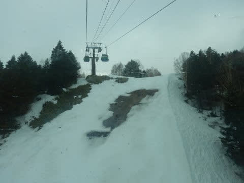

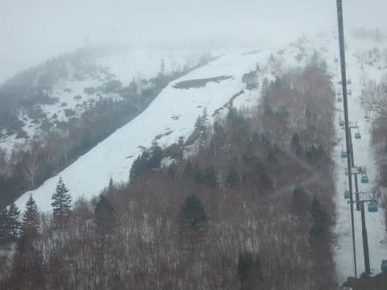

（以上2枚，2018年4月7日の焼額）

今年はまだ，今週末も全く

問題なくオリンピックコースが

滑れますから…！

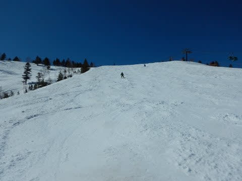

（今年4月6日の焼額）

GW前半に焼額が死に絶えた昨年より，

3週間ほど雪が解けるのが遅い

感じですね～．

ってか．

この4月，2週間続けて積雪があったので．

例年に比べても，4月としては雪が多い

感じになってきている感じです！

ってなことで．

まだまだ志賀高原は問題なく滑れる

今シーズン．

今週末もスキーに行く方のために．

水曜深夜定番，志賀高原の天気予想をば…

まず．

本日水曜の夜も冷え冷えで．

雪が降っている志賀高原．

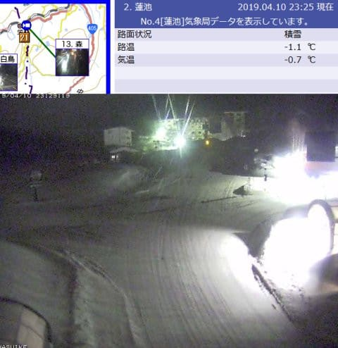

（[北信建設事務所HP](http://hokushin-camera.org/)より）

この雪は，いつまで続くのかな？？

この冷え冷え雪は，週末までもつのか，

すごい気になるところなので．

週末の前，11日（木）の天気図を見てみると…

うーむ．

11日は赤い0℃線は関東近辺まで

下がっており．

志賀高原は，水色の-3℃線が

かかっているので…

11日も冷えますね．朝は-5℃くらい．

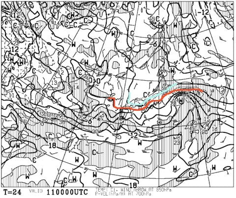

そして，地上天気図を見ると．

水色の降水域は志賀高原にかかっているので…

うむ．

11日木曜の朝まで，雪は降り続けますね…！

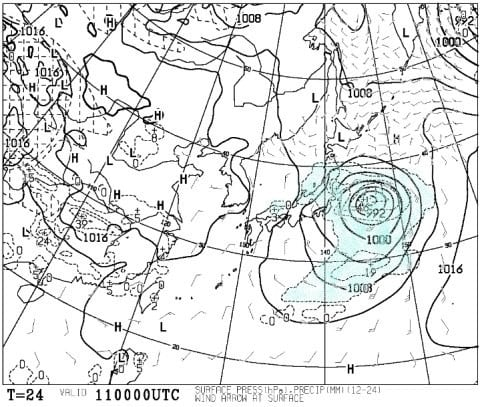

木曜の昼前には雪は止んじゃいそうですが．

でも，この日は昼間も気温は-3℃程度

までしか上がらなそうで．

この日も，冬に近いコンディションで

滑れそう…！

そして．

12日金曜の850hpa気温図を見ると．

うむ．

この日も，赤い0℃線は関東より

南にまで下がってますよ！！

志賀高原には，水色の-3℃線が

かかってますよ！

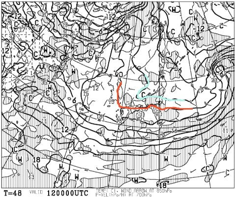

4月中旬とは思えないくらい

冷え冷えですね…

で．地上天気図を見ると．

志賀高原近辺には，降水域が全く

予想されていないので．

冷え冷えだけども，金曜は雪は

積もらなさそうですね…

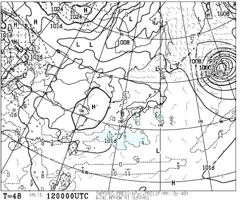

でも．

午後には晴れてきそうな金曜日．

結構コンディションも良く，金曜は

楽しめるかも…

そして．

13日の土曜日の850hpa気温図ですが．

この日も，0℃線はギリギリ志賀より

南にいてくれそうですね…

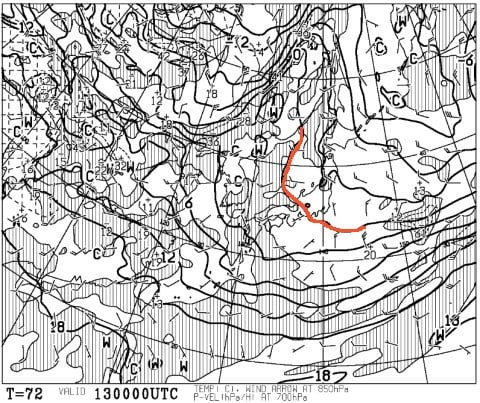

で．

地上天気図を見ると．

しっかり高気圧に覆われているので…

この日は晴れそう！

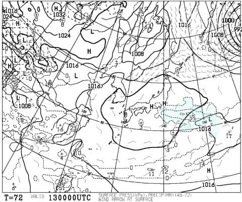

…でも．

昼間は気温がプラスに振れそうなので．

晴れると雪が緩んでいく…（涙）

この時期は，晴れてくれない方が

板が滑っていいかも…

で．

14日の日曜日の850hpa気温図ですが．

うーーむ．

赤い0℃線は，はるか北海道…（涙）

でも，これが普通の4月中旬の気温かな．

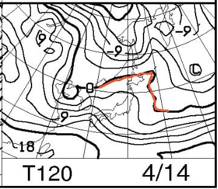

そして．

日曜の地上天気図を見ると．

うーーーむ．

降水域の網掛けは西日本を覆ってるけど．

志賀にはかかってないかな…

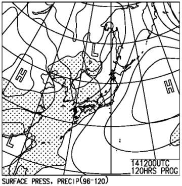

この日は，雲が多めながら．

夕方まで，雨になるようなことは

なさそうかな…

ってなことで．

まとめると．

11日木曜：朝まで雪降り．

　一日中冷えてマイナスをキープ．

　4月と思えないコンディション…

12日金曜：この日も4月と思えない冷え冷え！

　午後は晴れそう．晴れてもそれほど

　雪が緩まず，最高気温もギリギリ0℃を

　超えるかどうか．

　4月中旬としてはいい感じ！

13日土曜：おそらく，朝から晴れ！

　朝は放射冷却が入り，-5℃以下まで冷える．

　あさイチは硬めに締まった圧雪で，

　天気も良くて4月中旬としてはいい

　コンディション．

　昼に向かって気温は上がっていき，

　日差しもあって雪は緩むが，

　最高気温は0℃をわずかに上回る

　程度で，この時期としては低め．

　そのため，朝日が射さない西斜面の

　一の瀬なんかは，昼くらいまで

　しっかりいい雪をキープ．

　朝日が射す斜面は，昼ごろには

　柔らかく緩みそうだけど，ザブザブに

　なるほど緩まないかな…

　緩んだ斜面は午後は多少荒れるが，

　天気も良く4月中旬の週末としては

　いい感じになりそう．

14日日曜：朝は気温は-2℃程度か．

　午前中は晴れ．朝イチは昨日午後に

　緩んだ雪が固まった，結構固めのバーン．

　午前中に気温はプラスに

　上がり，日差しも相まって春らしい

　重い雪に…

　日が強く当たるバーンは，だんだん

　滑りが悪くなっていきそう

　午後は曇り始めるが，気温が高いので

　雪は緩んだまま．リフトストップまで

　気温が高いままなので，夕方には

　ゲレンデが荒れてくるか…

　典型的な春スキーの一日．

ってな感じでしょうか．

まぁ，土曜はこの時期としては

冷えそうで．

水曜から木曜にかけて降った雪が

それほど緩まず土曜までもちそうなので．

結構いい感じで楽しめるんじゃ

ないかな？

日曜はまぁ，この時期の平均的な

ゲレンデコンディションでしょう…

とりあえず．

雨が降ったりはしないし．

雪はたっぷりあるので．

まだまだスキーは楽しめますよ～！

## 💬 コメント一覧

### 💬 コメント by (naoちゃんねる)
**タイトル**: Unknown
**投稿日**: 2019-04-11 19:36:57

まだまだまだまだ天気予想とても気になってる１人ですよ～😄

しかし去年はこの時期でそんな状況でしたね😵

今年はホント異常で、スキーヤーにとっては嬉しい限りです💮

### 💬 コメント by (Rikoriko)
**タイトル**: Unknown
**投稿日**: 2019-04-11 20:42:29

こんばんは。週末の予報ありがとうございます。

志賀高原は火曜・水曜・木曜とずっと雪が降り続いてますよ〜。今日も４月とは思えないぐらい良い雪でした〜❤

熊の湯はガスで見えにくかったですが、濃霧の中、火曜日は武田竜さんや青木哲也さん、今日は渡辺一樹さんや栗山未来さん等の撮影会をされていました。

この時期はデモの方々が時々来られるので、オッカケしながら滑りをガン見してます（笑）

でもこんなにも雪が残っているというのに、日曜日には実家に帰ることになりました〜（涙）

今シーズンは土曜日が滑り納めになります。

突然Sさんのブログにお邪魔して勝手にコメントさせていただき申し訳ありませんでした。

それでは、来シーズンも的中率100%の天気予報を期待していますね〜。

くれぐれもお体大切に、あまり無理をされないようお気をつけくださいね。

### 💬 コメント by (まいる)
**タイトル**: Unknown
**投稿日**: 2019-04-11 22:33:56

Sさん、こんばんは。

今週末は、かぐらで滑ります。

どうやら今シーズン、志賀高原に行くことはなさそうです。

GWにも、かぐらに行くので、運が良ければ一緒に滑りましょう。

ところで、headのレビューもありますよね？

### 💬 コメント by (Skier_S)
**タイトル**: この4月，冷えてますね…
**投稿日**: 2019-04-12 02:24:09

＞naoちゃんねるさま

いやーー．

去年と，3年前はすごかったですよ．

3年前は3月中にオリンピックコースがクローズに

なりましたから…

それに比べれば，4月中旬の焼額で積雪220cmはかなり恵まれてます．

このままGWまで雪が降り続けてほしいんですが…←だからそれは異常気象だから

＞Rikorikoさま

あぁ…

今日も滑ってらしたのですね．

でも，今週で滑りおさめですか！？？

まだGWまで滑れますよ～！！！

でも，日曜はコンディション悪そうなので，

今週末なら土曜に切り上げるのが正解だと思います．

土曜はいつも通り焼額滑ってます～！

もし焼額にお越しになるなら，ぜひお会いしたいですね～…

＞まいるさま

あら．

今シーズンは志賀にもういらっしゃらないのですね…

かぐらもまだ雪はたっぷりありそうですね．

GWまでは志賀ですが，GW過ぎたらかぐらに通います．

試乗ですが，HEADも2種類乗りましたよ～！

